# I Backup vs restore là gì ?
### Backup là gì ?

-  Backup dữ liệu là hành động sao chép , lưu lại toàn bộ nội dung và các dữ liệu quan trong của 1 web , máy tính , máy chủ  và lưu trữ nội dung dữ liệu đó ở một hoặc nhiều thiết bị có chức năng lưu trữ khác để làm dữ liệu dự phòng. 
### Restore là gì
- Data backup là việc tạo ra các bản sao của dữ liệu gốc, cất giữ ở một nơi an toàn và lấy  ra sử dụng (restore) khi hệ thống gặp sự cố.

# II Backup và restore trên DirectAdmin

### Backup
- Ta truy cập vào DirectAdmin với quyền admin.
- 
- Tại Admin Tools ta chọn chức năng Admin Backup/Transfer.
- 
- Sau đó ta chọn Schedule để tiến hành các thao tác cho việc backup.
- 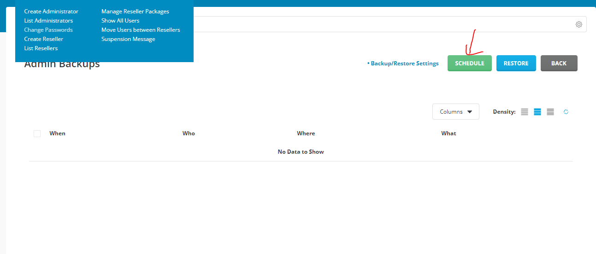
- Ta tích chọn các user muốn backup rồi chọn next step.
- 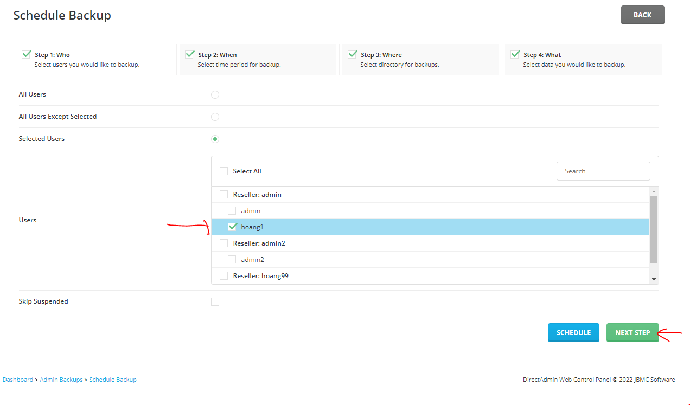
- Bước này ta chọn thời gian
- Mặc định ta để now để backup ngay lập tức.
- 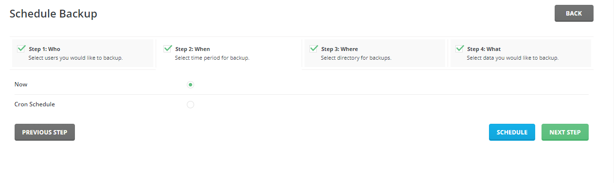
- Hoặc ta chọn cron schedule để lựa chọn thời gian. vd minute: số phút để tiến hành backup, hour h mỗi ngày , day of month ngày trong tháng ,....
- 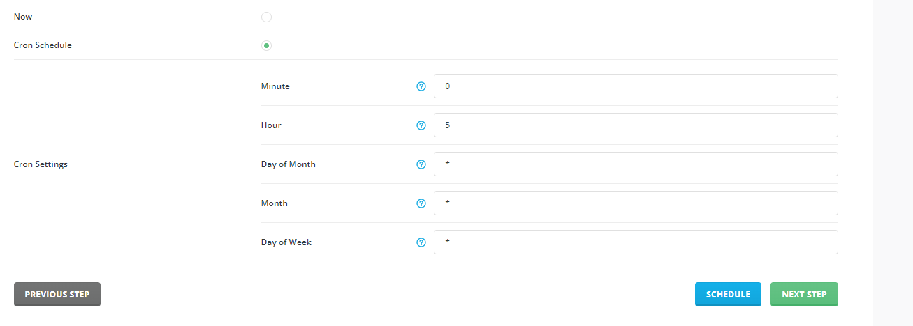
- Tại vd này ta tiến hành backup ngay lập tức.
- 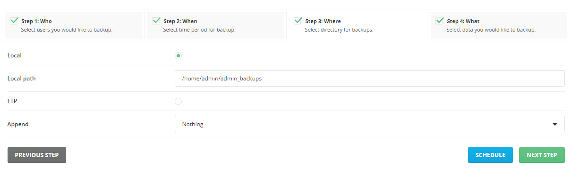
- Tại bước này ta dùng lưu ta có 2 tùy chọn lưu trực tiếp trên local hoặc 1 tài khoản ftp.
- 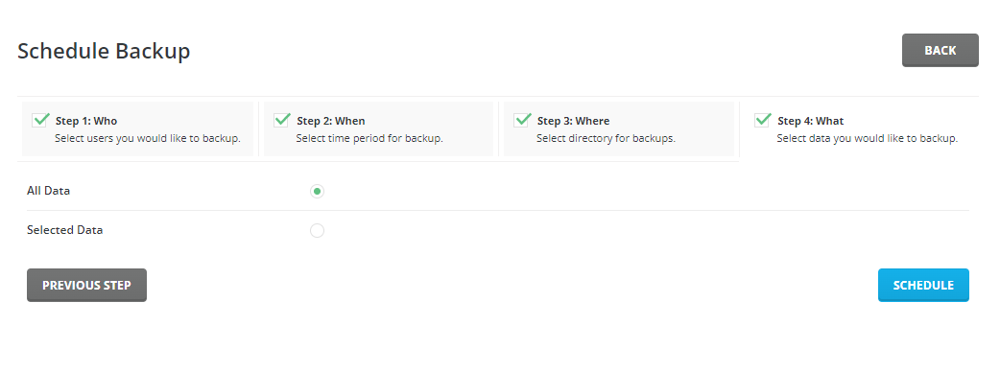
- 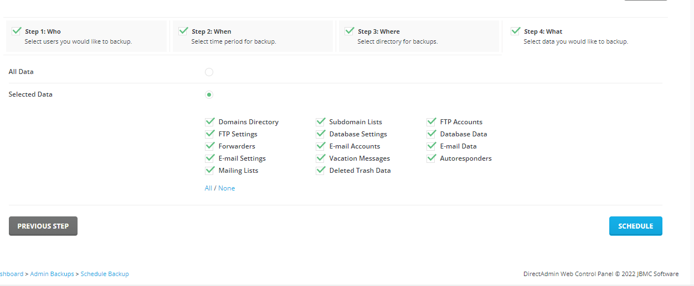
- Tại bước này ta chọn những dữ liệu để sao lưu mặc định sẽ chọn all data , trong trường hợp ta chỉ muốn lấy dữ liệu tùy chọn ta chọn selected data.

- Sau khi chọn xong ta chon schedule để hệ thống tiến hành backup , sau khi xong ta nhận được 1 tin nhắn thông báo.
- 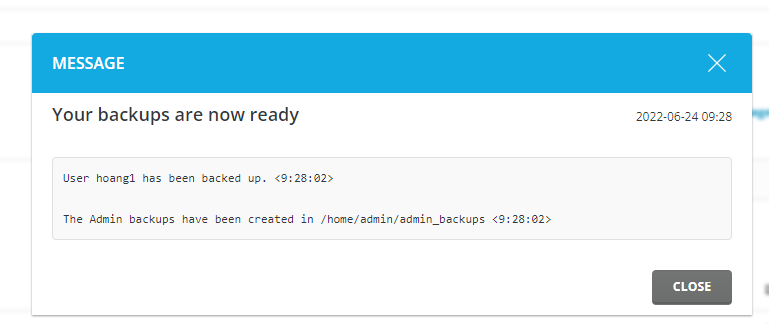

### Restore

- Tại Admin Tools ta vẫn chọn chức năng Admin Backup/Transfer và chọn restore.

- 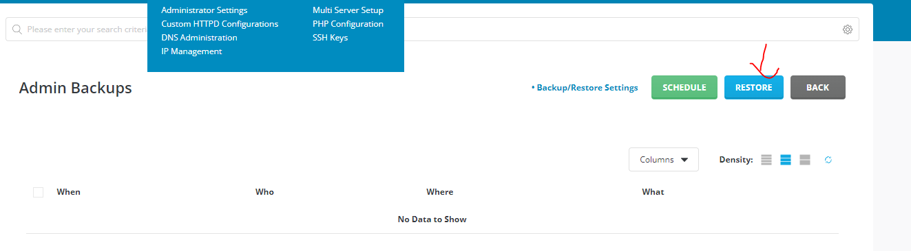

- Ta chọn đường dẫn đến file backup nằm ở đâu mặc định nó sẽ ở /home/admin/admin_backups
- 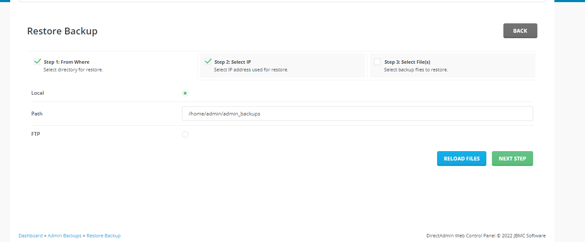
- Tiếp theo tại chọn ip 
- 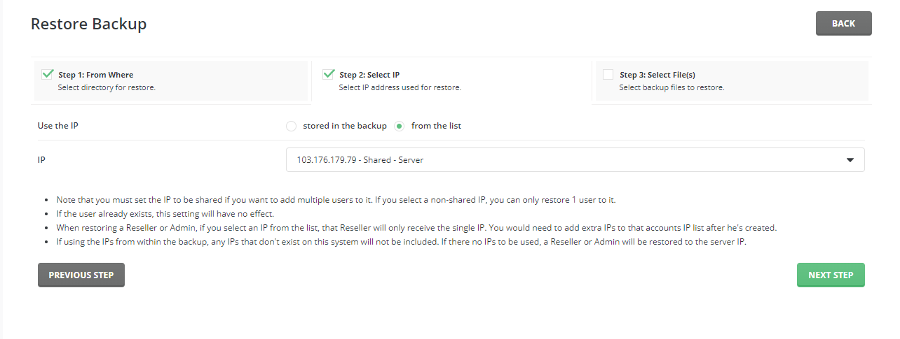
- Chọn user cần khôi phục, rồi chọn Restore.
- 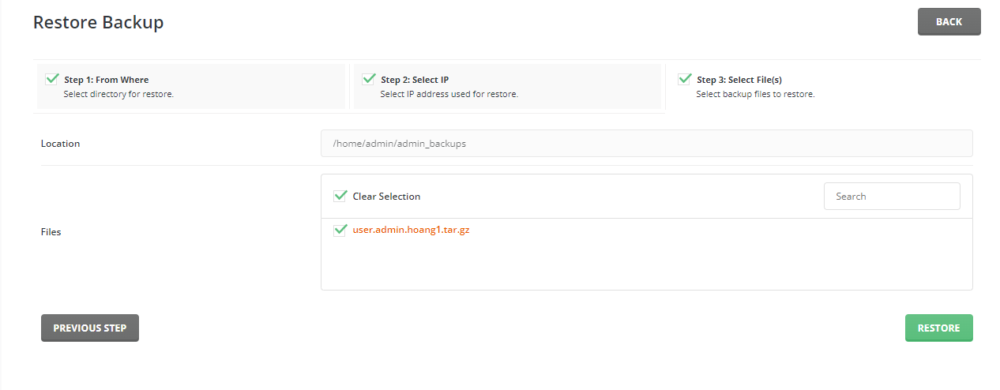
- 

