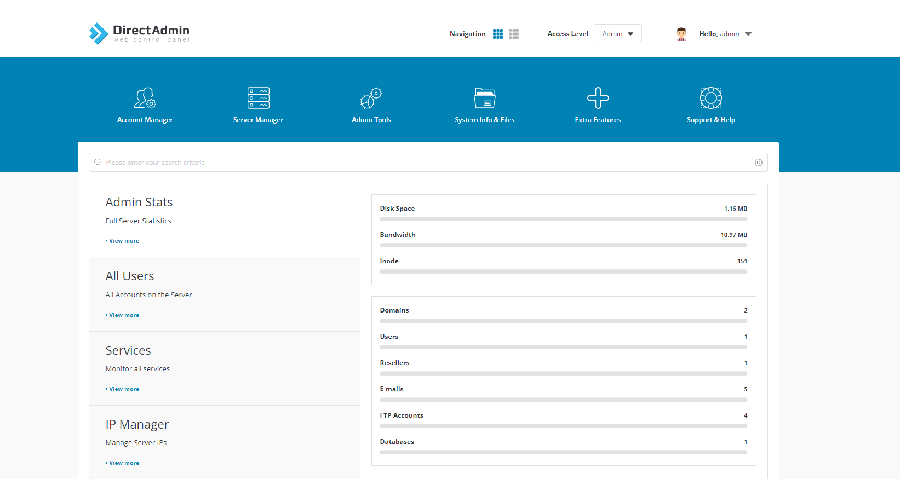

# I Backup vs restore là gì ?
### Backup là gì ?

-  Backup dữ liệu là hành động sao chép , lưu lại toàn bộ nội dung và các dữ liệu quan trong của 1 web , máy tính , máy chủ  và lưu trữ nội dung dữ liệu đó ở một hoặc nhiều thiết bị có chức năng lưu trữ khác để làm dữ liệu dự phòng. 
### Restore là gì
- Data backup là việc tạo ra các bản sao của dữ liệu gốc, cất giữ ở một nơi an toàn và lấy  ra sử dụng (restore) khi hệ thống gặp sự cố.

# II Backup và restore trên DirectAdmin
- Ta truy cập vào DirectAdmin với quyền admin
- 
- Tại Admin Tools ta chọn chức năng Admin Backup/Transfer
- 

