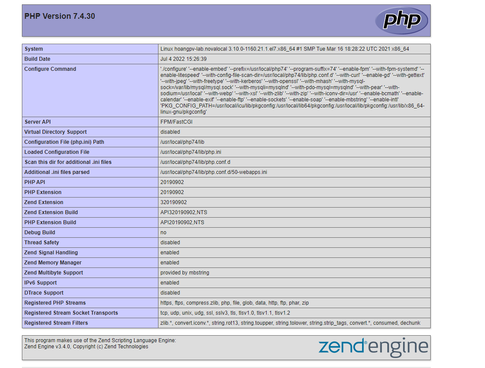

# CustomBuild là gì 
CustomBuild là công cụ quản lý phần mềm của DirectAdmin. Nó chủ yếu được chạy qua dòng lệnh cho đến năm 2014, khi một plugin được phát triển để cho phép người dùng quản lý phần mềm của 

# Build PHP
### 1 Ta truy cập vào thư mục custombuild

- cd /usr/local/directadmin/custombuild

### 2 Tạo 4 php mode :
- ./build set php1_mode php-fpm
- ./build set php2_mode php-fpm
- ./build set php3_mode php-fpm
- ./build set php4_mode php-fpm

### 3 Gán các phiên bản php cho từng mode

- ./build set php1_release 5.6
- ./build set php2_release 7.2
- ./build set php3_release 7.3
- ./build set php4_release 7.4

### 4 Chạy dịch vụ
- ./build php n

### 5 Chạy lại cấu hình

- ./build rewrite_confs

- 

### 6 Thay đổi các phiên bản kiểm tra kết quả 

- Ta vào FileManager » /domains/lmhlmh9x.xyz/public_html tạo file info.php

- 

- Sau đó truy cập http://lmhlmh9x.xyz/info.php để xem thông tin 

- 
- Ta thấy trang web đã chạy php 5.6
- Ta thay đổi các phiên bản php để kiểm tra tiếp

- 
- 
- 
- 

