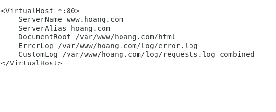
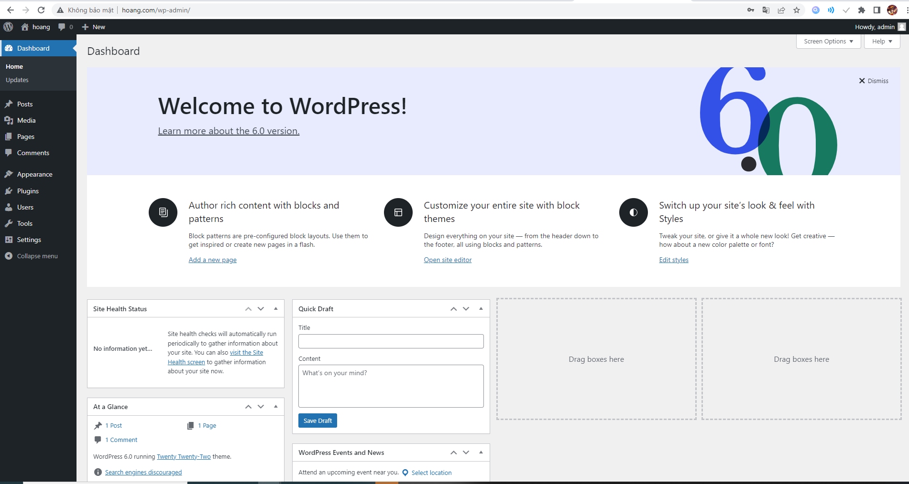

- Bước 1:  Cài đặt apache
- Cập nhập httpd package index:
+ yum update httpd
- Cài đặt :
+ yum install httpd
- cài đặt tường lửa trêm server và mở cổng 80:
+ sudo firewall-cmd --permanent --add-service=http
- tải lại firewall
+ sudo firewall-cmd --reload
- khởi động apache:
+ systemctl start httpd
- cấu hình Vhost: giúp thiết lập một tên miền cho riêng mình
- tạo folder cho tên miền hoang.com:
+ sudo mkdir -p /var/www/hoang.com/html
- tạo 1 folfer bổ sung để lưu trư file log cho web:
+ sudo mkdir -p /var/www/hoang.com/log
- chỉ định quyền sở hữu folder html với biến $USER:
+ sudo chown -R $USER:$USER /var/www/hoang.com/html
- Để đảm bảo trang web có quyền mặc định:
+ sudo chmod -R 755 /var/www
- tạo 1 thư mục  sites-available để lưu trữ virtual server,tạo thêm 1 thư mục sites-enabled (là nơi chứa các symbolic link cho các virtual host là muốn publish):
+ sudo mkdir /etc/httpd/sites-available /etc/httpd/sites-enabled
- chỉnh lại cấu hình rồi thêm một dòng lệnh sau:
+ sudo nano /etc/httpd/conf/httpd.conf
- thêm dòng lệnh vào cuối file:
+ IncludeOptional sites-enabled/*.conf
- tạo file vhost :
+ sudo nano /etc/httpd/sites-available/hoang.com.conf
- 

- các file virtual host đã được tạo thành công. Tiếp theo hãy kích hoạt chúng để Apache biết để phục vụ khách truy cập. Do đó,  cần tạo một liên kết cho virtual host trong directory sites-enabled:
+ sudo ln -s /etc/httpd/sites-available/hoang.com.conf /etc/httpd/sites-enabled/hoang.com.conf
- Do đã thiết lập một custom log directory nên có thể sẽ có lỗi xảy ra khi khởi động Apache. Nên ta phải cập nhật các chính sách của SELinux để Apache ghi lại và có thể có khả năng bảo mật tốt hơn: 
+ sudo setsebool -P httpd_unified 1
- có thể thay đổi loại directory từ directory /var/www/hoang.com/log sang httpd_log_t. Điều này giúp Apache tạo và kết nối các log lại với nhau:
sudo semanage fcontext -a -t httpd_log_t "/var/www/hoang.com/log(/.*)?"
- để các thay đổi vẫn giữ nguyên sau mỗi lần khởi động, sử dụng lệnh restorecon:
sudo restorecon -R -v /var/www/hoang.com/log
- Bước 2: Cài đặt MySQL
- chạy các lệnh sau để cài mysql:
+ wget http://repo.mysql.com/mysql-community-release-el7-5.noarch.rpm
+ rpm -ivh mysql-community-release-el7-5.noarch.rpm
+ yum install mysql-server
+ systemctl start mysqld
- tạo database cho wordpress
- mysql -u root -p
- Tạo user và database:  
+ create database demo ;
+ create user 'lmh9x'@'localhost' identified by 'ho@ng1999';
+ use wp;ussr
+ grant all privileges on demo to 'hoang9x'@'localhost';
+ flush privileges;
- Bước 3 : Cài đặt PHP
- yum install php php-mysql php-gd php-pear –y
- Bước 4 : Cài đặt  wp
+ Truy cập vào thư mục hmtl:
cd /var/www/hoang.com/html
- tải và giải nén file  cài wordpress
+ wget https://wordpress.org/latest.tar.gz
+ tar xzvf latest.tar.gz
- Cấu hình wordpress để kết nối với MySQL:
+ mv wordpress/* /var/www/hoang.com/html
+ mv wp-config-sample.php wp-config.php
- sửa file cấu hình:
+ nano wp-config.php
+ define('DB_NAME', 'wp');    
+ define('DB_USER', 'lmh9x');    
+ define('DB_PASSWORD', 'ho@ng1999');      
+ define('DB_HOST', 'localhost');  
lưu file cấu hình rồi ra trình duyệt kiểm tra

- 