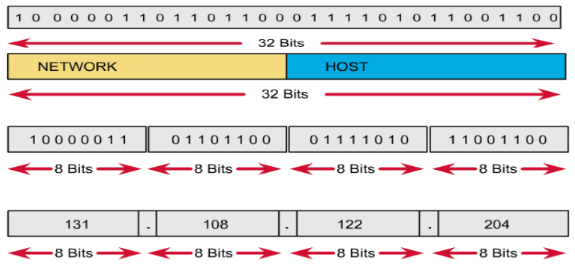
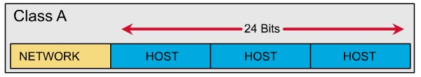

# I. IPv4
## 1.1 Khái niệm
- Địa chỉ IP là 1 dãy số được gán cho mỗi thiết bị kết nối với mạng máy tính sử dụng giao thức IP để liên lạc. IP hoạt động như 1 định danh giúp một thiết bị trở nên cụ thể trên 1 mạng cụ thể
- IPv4 là phiên bản IP được sử dụng rộng rãi để xác định các thiết bị trên mạng bằng hệ thống định địa chỉ.
- Cấu trúc:
- Địa chỉ IP gồm 32 bit nhị phân, chia thành 4 cụm 8 bit (gọi là các octet). Các octet được biểu diễn dưới dạng thập phân và được ngăn cách nhau bằng các dấu chấm
- Địa chỉ IP được chia thành 2 phần : phần mạng và phần host: 

 - 
 - 1.2 Các lớp địa chỉ IP
 - Lớp A:
 - 
 - Lớp A: 
 - Địa chỉ lớp A sử dụng 1 octet đầu làm phần mạng, 3 octet sau làm phần host . 
 - Bit đầu của một địa chỉ lớp A luôn giữ là 0 . Lớp A có 2^7 -2 hosy từ: 1.0.0.0 đến 126.0.0.0
 - Lớp B :
 - Địa chỉ lớp B sử dụng 2 octet đầu làm phần mạng , 2 octet sau làm phần host.

 - 2 bit đầu của 1 địa chỉ lớp B luôn được giữa là 10. Lớp B có 2^14 host từ : 128.0.0.0 đến 191.255.0.0
 - Lớp C :Địa chỉ lớp C sử dụng ba octet đầu làm phần mạng, một octet sau làm phần host.
- 3 bit đầu của lớp C luôn được giữ là 110.Lớp C có 2 ^21 host từ : 192.0.0.0 đến 223.255.255.0
- Lớp D :
-    Địa chỉ:
224.0.0.0 -> 239.255.255.255
-    Dùng làm địa chỉ multicast.
- Lớp E : từ 240.0.0.0 trở đi được dùng mục đích dự phòng.
## II. IPv6
## 2.1 Khái niệm 
- IPv6 là một phiên bản của giao thức liên mạng (IP) nhằm mục đích nâng cấp giao thức liên mạng phiên bản 4 (IPv4) hiện đang truyền dẫn cho hầu hết lưu lượng truy cập Internet nhưng đã hết địa chỉ.
- Cấu trúc :
- IPv6 có cấu trúc gồm 128 bit, và phân thành 8 nhóm. Mỗi nhóm gồm 16 bit, giữa các nhóm có sự phân chia bởi dấu “:”.

 