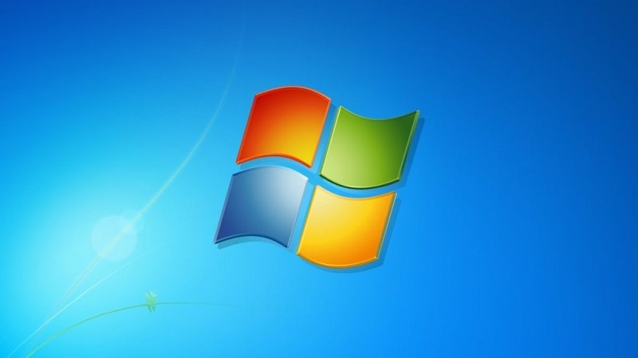
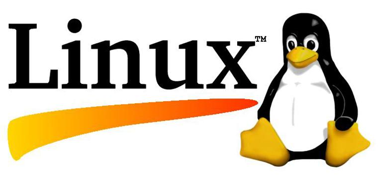

# I lý thuyết về các hệ điều hành
## Tìm hiểu
- 1.1  Hệ điều hành là gì ?
- Hệ điều hành là một phần mềm dùng để điều hành, quản lý toàn bộ tất cả thành phần (bao gồm cả phần cứng và phần mềm) của thiết bị điện tử.
- Có vai trò trung gian trong việc giao tiếp giữa người sử dụng và thiết bị.
- 1.2 Chức năng của hệ điều hành ?
- Là nơi để quản lý thông tin phần cứng, bao gồm như: Quản lý bộ nhớ, quản lý CPU, quản lý mạng, quản lý thiết bị và quản lý hệ thống tập tin. Cung cấp cho người dùng giao diện phù hợp, để có thể sử dụng các phần mềm trên máy tính. Hệ điều hành sẽ tối ưu hóa quá trình hoạt động của máy tính bao gồm cả các công đoạn thao tác hoặc nhập liệu.

## Một số hệ điều hành phổ biến 
- 2.1 Hệ điều hành windows
- Hệ điều hành windows là gì? Windows luôn là hệ điều hành được nhiều người sử dụng nhất từ trước đến nay, được phát hành đầu tiên vào năm 1980 bởi Microsoft và gần đây nhất là Windows 10 (ra mắt vào 2015).

- 
- Windows 10 và Windows 7 là hai bản được sử dụng nhiều nhất. Windows 7 chú trọng đến tích hợp nhiều tính năng nổi bật và có giao diện đẹp mắt. Hiện nay, Windows 7 đã có 3 phiên bản đó là bản Ultimate, bản Professional và bản Windows 7 home, với mỗi phiên bản đều có các tính năng khác nhau. 

- Giao diện người dùng của Windows 10 được thiết kế tối ưu hóa và tính năng bảo mật cũng được cải thiện cao hơn so với Windows 7.
- Ưu điểm: ​Phổ biến, dễ sử dụng, tính ổn định cao và có đầy đủ tính năng để phục vụ cho công việc cũng như giải trí.
- Nhược điểm: Không phải miễn phí, bạn cần phải mua bản quyền để sử dụng.
- 2.2 Hệ điều hành linux
- Hệ điều hành Linux là một hệ điều hành mở, bạn có thể sửa đổi, làm bất cứ điều gì trên Linux. Tương tự với Windows và macOS, Linux chính là tập hợp nhiều phần mềm là máy chủ, ngôn ngữ lập trình, hệ thống quản trị cơ sở dữ liệu, môi trường làm việc desktop (GNOME và KDE), các ứng dụng văn phòng (OpenOffice, LibreOffice). Linux còn là phần mềm có tính bảo mật cao, tránh được nhiều nguy cơ xâm hại. dính độc, virus. 
- Ưu điểm: Miễn phí, bảo mật cao, khả năng linh hoạt tốt và hoạt động “mượt” ngay cả với máy tính có cấu hình yếu.
- Nhược điểm: Ít ứng dụng hỗ trợ trên Linux, mất thời gian để làm quen với Linux nếu trước đó bạn đã quen dùng các hệ điều hành khác.
- 

