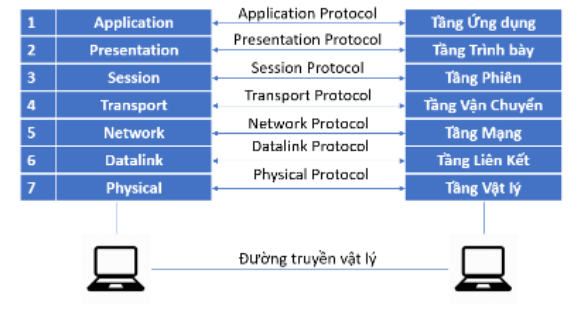
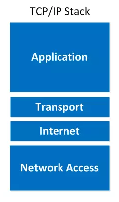
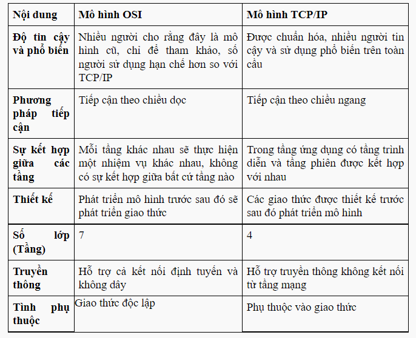

# I. Mô hình OSI
# 1.1 Mô hình OSI là gì ?
- Mô hình OSI (Open system interconnection – Mô hình kết nối các hệ thống mở) là một thiết kế dựa vào nguyên lý tầng cấp, lý giải một cách trừu tượng kỹ thuật kết nối truyền thông giữa các máy vi tính và thiết kế giao thức mạng giữa chúng. Mô hình này được phát triển thành một phần trong kế hoạch OSI (Open Systems Interconnection) do ISO và IUT-T khởi xướng. Nó còn được gọi là Mô hình bảy tầng của OSI.

- 

# 1.2 Chức năng của từng tầng
- 1.2.1 Physical Layer (tầng vật lý)
  +  Physical Layer là tầng thấp nhất trong mô hình 7 lớp OSI. Các thực thể tầng giao tiếp với nhau qua một đường truyền vật lý. Tầng vật lý xác định các thủ tục, chức năng về điện, quang, cơ để kích hoạt và duy trì các kết nối vật lý giữa các hệ thống mạng.
  +   Cung cấp các cơ chế về hàm, điện, thủ tục,…nhằm kết nối các phần tử của mạng thành một hệ thống bằng các phương pháp vật lý. Đảm bảo các yêu cầu về chuyển mạch hoạt động, tạo ra các đường truyền thực cho các chuỗi bit thông tin.
- 1.2.2 Datalink (tầng liên kết)
  +  Tầng liên kết dữ liệu có chức năng chính là thực hiện thiết lập các liên kết, duy trì hay hủy bỏ liên kết dữ liệu. Kiểm soát lỗi và kiểm soát lưu lượng.
  +  Thông tin được chia thành các khung, truyền các khung tuần tự và xử lý các thông điệp xác nhận được gửi về từ máy thu. Tháo gỡ các khung thành chuỗi bit thành các khung thông tin.
  - 1.2.3 Network (tầng mạng)
  + Lớp mạng Network là lớp có trách nhiệm quyết định xem dữ liệu sẽ đến máy nhận như thế nào. Lớp này nắm những thành phần như việc định địa chỉ, định tuyến, và các giao thức logic
  - 1.2.4 Transport (tầng vận chuyển)
  + Tầng vận chuyển chịu trách nhiệm chuyển dữ liệu giữa các thiết bị đầu cuối hoặc máy chủ (host).Tầng này lấy dữ liệu từ mỗi ứng dụng và tích hợp tất cả dữ liệu đó vào trong một luồng. Nó cũng chịu trách nhiệm cho việc cung cấp vấn đề kiểm tra lỗi và thực hiện khôi phục dữ liệu khi cần thiết. Bản chất Tầng vận chuyển chịu trách nhiệm cho việc bảo đảm tất cả dữ liệu được truyền từ máy gửi đến máy nhận.
  - 1.2.5 Session (tầng phiên)
  + Khi dữ liệu đã được biến đổi thành định dạng chuẩn, máy gửi đi sẽ thiết lập một phiên – session với máy nhận. Đây chính là tầng sẽ đồng bộ hoá quá trình liên lạc của hai máy và quản lý việc trao đổi dữ liệu. Tầng phiên này chịu trách nhiệm cho việc thiết lập, quản lý và chấm dứt session với máy từ xa.
  - 1.2.6 Presentation (tầng trình bày)
  + Tầng này lấy dữ liệu đã được cung cấp bởi tầng ứng dụng, biến đổi chúng thành một định dạng chuẩn để lớp khác có thể hiểu được định dạng này
  - 1.2.7 Application (tầng ứng dụng)
  + Tầng ứng dụng là tầng gần với người sử dụng nhất. Nó cung cấp phương tiện cho người dùng truy nhập các thông tin và dữ liệu trên mạng thông qua chương trình ứng dụng .
  # II . Mô hình TCP/IP
  # 2.1 Mô hình TCP/IP là gì ?
  - TCP/ IP (Transmission Control Protocol/ Internet Protocol - Giao thức điều khiển truyền nhận/ Giao thức liên mạng), là một bộ giao thức trao đổi thông tin được sử dụng để truyền tải và kết nối các thiết bị trong mạng Internet. TCP/IP được phát triển để mạng được tin cậy hơn cùng với khả năng phục hồi tự động.

- 
# 2.2 Chức năng của từng tầng
- 2.2.1 Network Access ( tầng vật lý )
+ Nó là sự kết hợp của tầng Data Link và Physical trong mô hình OSI ,bao gồm các giao thức chỉ hoạt động trên một liên kết - thành phần mạng kết nối các nút hoặc các máy chủ trong mạng 
- 2.2.2 Internet ( tầng mạng )
+ Có nhiệm vụ xử lý các gói và kết nối các mạng độc lập để vận chuyển các gói dữ liệu qua các ranh giới mạng.
- 2.2.3 Transport ( tầng vận chuyển )
+ Chịu trách nhiệm duy trì liên lạc đầu cuối trên toàn mạng. TCP xử lý thông tin liên lạc giữa các máy chủ và cung cấp điều khiển luồng, ghép kênh và độ tin cậy.
- 2.2.4 Application (tầng ứng dụng)
+ Cung cấp các ứng dụng với trao đổi dữ liệu được chuẩn hóa, giao tiếp dữ liệu giữa 2 máy khác nhau thông qua các dịch vụ mạng khác nhau (duyệt web, chat, gửi email,...).

## III.Phân biệt ý của 2 mô hình mối tương quan
# 3.1 Sự giống nhau 
- Chia sẻ kiến trúc chung
 + Cả 2 mô hình đều là mô hình logic và có kiến trúc tương tự vì cả 2 mô hình đều được xây dựng dựa trên các lớp
-  Xác định tiêu chuẩn 
+ Cả 2 lớp đều có các tiêu chuẩn xác định và chúng cũng cung cấp khuôn khổ được sử dụng để thực hiện các tiêu chuẩn và thiết bị
- Quy trình khắc phục sự cố được đơn giản hóa
+ Cả 2 mô hình đã đơn giản hóa quá trình khắc phục sự cố bằng cách chia nhỏ chức năng phức tạp thành các thành phần đơn giản hơn
- Các tiêu chuẩn được xác định trước
+ Các tiêu chuẩn và giao thức đã được xác định trước, những mô hình này không xác định lại chúng, chỉ tham khảo hoặc sử dụng lại chúng. Ví dụ, các tiêu chuẩn Ethernet đã được IEEE xác định trước khi phát triển các mô hình 
- Cả 2 đều có chức năng tương tự của các lớp Transport và Network 
+ Chức năng được thực hiện giữa lớp Presentation và lớp Network tương tự như chức năng được thực hiện ở lớp Transport
# 3.2 Sự khác nhau 

 # 3.3 Kết luận 
 - Mô hình TCP/IP đáng tin cậy hơn, TCP/IP được sử dụng cho kết nối đầu cuối để truyền dữ liệu qua internet . TCP/IP mạnh mẽ , linh hoạt , hữu hình và cũng gợi ý cách dữ liệu nên được gửi qua web. . Lớp vận chuyển của Mô hình TCP/IP kiểm tra xem dữ liệu đã đến theo thứ tự chưa, nó có lỗi hay không, các gói bị mất có được gửi hay không, xác nhận có được nhận hay không,....

