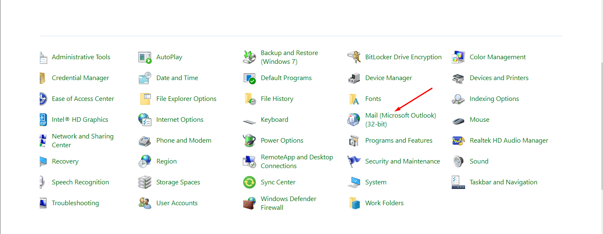
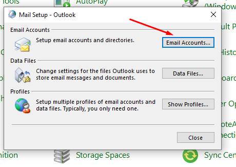
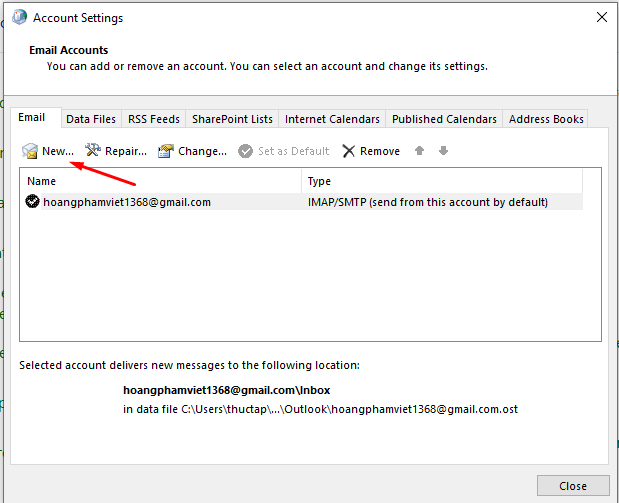
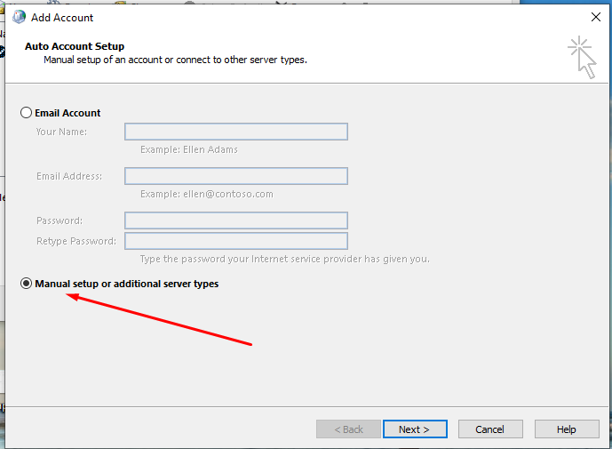
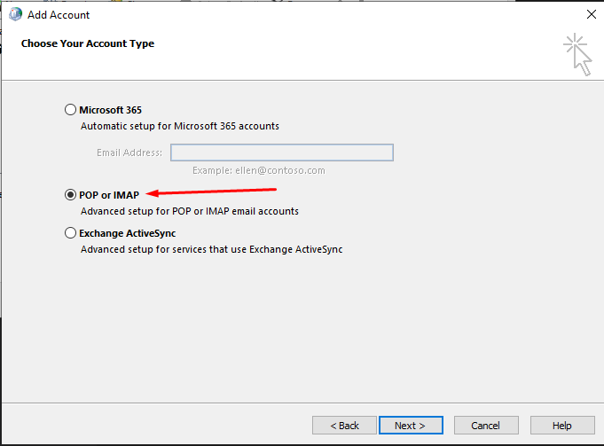
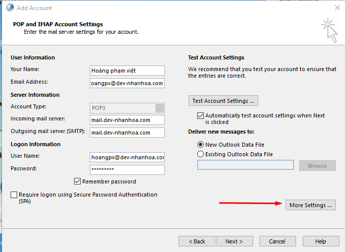
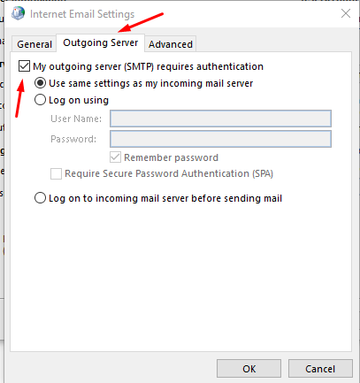
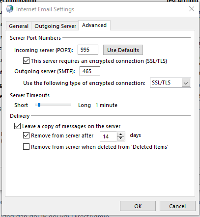

## Các bước cài đặt 
- Tìm kiếm control panel của máy

 

- Ta vào Mail ( Microsoft Outlook) (32 bit)

 

- Chọn email accounts để thêm tài khoản

 

- Ta chọn new để thêm tài khoản

 

- Sau đó ta chuyển sang manual sau đó ấn tiếp next

 

- Ta chọn chế POP or IMAP

 

- Sau đó ta điền thông tin cần thiết như hình rồi chọn more settings

 

- Chọn sang outgoing rồi tích chọn như hình

 

- Chọn sang advanced tùy chỉnh thông số như hình rồi ấn ok

 

 
- 

