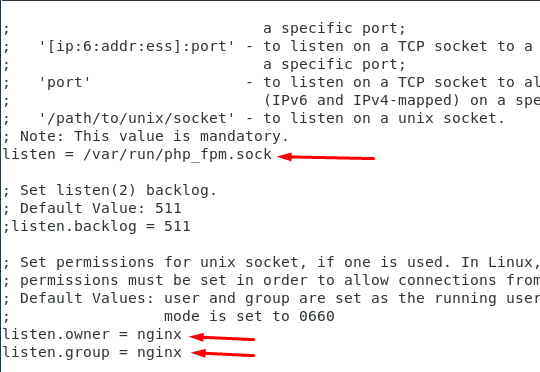

# Cài đặt php-fpm  trên nginx là gì ?

## Bước 1 : Cài đặt Nginx
- Vì NGINX không có sẵn repository của CentOS vì vậy chúng ta phải cài repository EPEL​ với câu lệnh sau:
 - yum install epel-release -y
 - Cài đặt nginx:
 - yum install nginx -y
- Sau khi cài xong ta khởi động nginx :
- systemctl start nginx 
- Kiểm tra trạng thái hoạt động của nginx:
- systemctl status nginx 
- 
- Mặc định centos 7 sẽ sử dụng firewalld , nên ta cần mở port dịch vụ :
- firewall-cmd --permanent --add-service=http
- firewall-cmd --reload
## Bước 2 : Cài đặt PHP-FPM
- Cài đặt kho Remi (Remi là kho lưu trữ gói phổ biến cung cấp các bản phát hành PHP mới nhất cho các máy chủ CentOS.)
- yum -y install yum-utils
- rpm -Uvh http://rpms.remirepo.net/enterprise/remi-release-7.rpm
- Sau khi cài đặt xong remi xong, ta chọn phiên bản PHP mà cần cài đặt. 
- yum-config-manager --enable remi-php80
- Ta cần module của remi-80 của PHP, ở đây ta cài mode php-fpm
- yum install -y php php-fpm
- Theo mặc định PHP FPM sẽ chạy dưới sạng user apache nên ta chuyển thành nginx. Ta sẽ chỉnh sửa lại file cấu hình của php-fpm
- nano /etc/php-fpm.d/www.conf
- 
- 
- Sau đó ta khởi động lại php-fpm:
## Bước 3 : Ta sẽ cấu hình nginx, tạo file default.conf để cấu hình
- nano /etc/nginx/conf.d/default.conf

- Ta dán đoạn sau vào file:
- server {
    listen  80;
    server_name  localhost;

    root   /var/www/html/;
    index index.php index.html index.htm;

    location / {
        try_files $uri $uri/ =404;
    }
    error_page 404 /404.html;
    error_page 500 502 503 504 /50x.html;

    location = /50x.html {
        root /usr/share/nginx/html;
    }

    location ~ \.php$ {
        try_files $uri =404;
        fastcgi_pass unix:/var/run/php_fpm.sock;
        fastcgi_index index.php;
        fastcgi_param SCRIPT_FILENAME $document_root$fastcgi_script_name;
        include fastcgi_params;
    }
}

- 
- Sau đó ta khởi động lại nginx :
- systemctl restart nginx
- Ta tạo 1 trang php dùng để kiểm tra phiên bản php và module php-fpm sau khi tạo :
- echo "<?php phpinfo();?>" > /var/www/html/info.php
- 
- Nginx đang chạy PHP-FPM mà ta có thể dễ dạng nhận thấy ở mục Server API là FPM/FastCGI.

