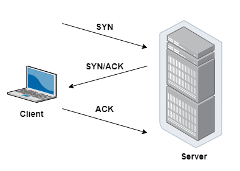
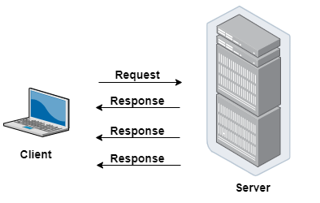
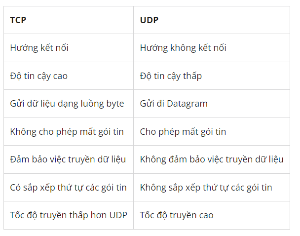

# I. TCP là gì
## 1.1 Khái niệm
-  TCP  là giao thức tiêu chuẩn trên Internet đảm bảo trao đổi thành công các gói dữ liệu giữa các thiết bị qua mạng. TCP là giao thức truyền tải cơ bản cho nhiều loại ứng dụng, bao gồm máy chủ web và trang web, ứng dụng email, FTP và các ứng dụng ngang hàng.
- TCP hoạt động với giao thức Internet (IP) để chỉ định cách dữ liệu được trao đổi trực tuyến. IP chịu trách nhiệm gửi từng gói đến đích của nó, trong khi TCP đảm bảo rằng các byte được truyền theo thứ tự mà chúng được gửi mà không có lỗi hoặc thiếu sót nào. Hai giao thức kết hợp với nhau được gọi là TCP/IP.
## 1.2 Cơ chế hoạt động
- TCP hoạt động theo tiến trình bắt tay 3 bước :
- 
- Máy khách gửi cho máy chủ một gói SYN — một yêu cầu kết nối từ port nguồn của nó đến port đích đến của máy chủ.
- Máy chủ phản hồi bằng gói SYN/ACK, xác nhận việc nhận được yêu cầu kết nối.
- Máy khách nhận gói SYN/ACK và trả lời bằng gói ACK của chính nó.
- Sau khi kết nối được thiết lập, TCP hoạt động bằng cách chia nhỏ dữ liệu đã truyền thành các segment (phân đoạn), mỗi segment được đóng gói thành một gói dữ liệu và được gửi đến đích của nó.
## II. UDP là gì 
## 2.1 Khái niệm
- UDP  là một trong những giao thức cốt lõi của giao thức TCP/IP. Dùng UDP, chương trình trên mạng máy tính có thể gửi những dữ liệu ngắn được gọi là datagram tới máy khác. UDP không cung cấp sự tin cậy và thứ tự truyền nhận mà TCP làm; các gói dữ liệu có thể đến không đúng thứ tự hoặc bị mất mà không có thông báo. Tuy nhiên UDP nhanh và hiệu quả hơn đối với các mục tiêu như kích thước nhỏ và yêu cầu khắt khe về thời gian. Do bản chất không trạng thái của nó nên nó hữu dụng đối với việc trả lời các truy vấn nhỏ với số lượng lớn người yêu cầu.
## 2.2 Cơ chế hoạt động
- 
- Giao thức UDP hoạt động tương tự như TCP, nhưng nó bỏ qua quá trình kiểm tra lỗi. Khi một ứng dụng sử dụng giao thức UDP, các gói tin được gửi cho bên nhận và bên gửi không phải chờ để đảm bảo bên nhận đã nhận được gói tin, do đó nó lại tiếp tục gửi gói tin tiếp theo. Nếu bên nhận bỏ lỡ một vài gói tin UDP, họ sẽ mất vì bên gửi không gửi lại chúng. Do đó thiết bị có thể giao tiếp nhanh hơn.

## III Phân biệt giữa TCP và UDP
- Giống nhau : đều là giao thức mạng TCP/IP đều kết nối các máy với nhau và có thể gửi dữ liệu cho nhau 
- Khác nhau :

- Nên sử dụng giao thức nào : điều này phụ thuộc vào những gì một ứng dụng cần , các ứng dụng muốn sửa lỗi và phát triển hơn thì sử dụng TCP nhưng 1 số ứng dụng cần tốc độ giảm chi phí thì sử dụng UDP.

