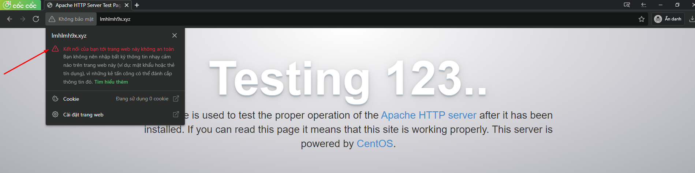
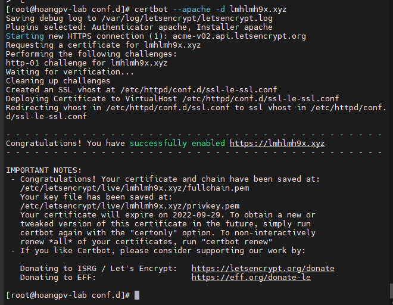
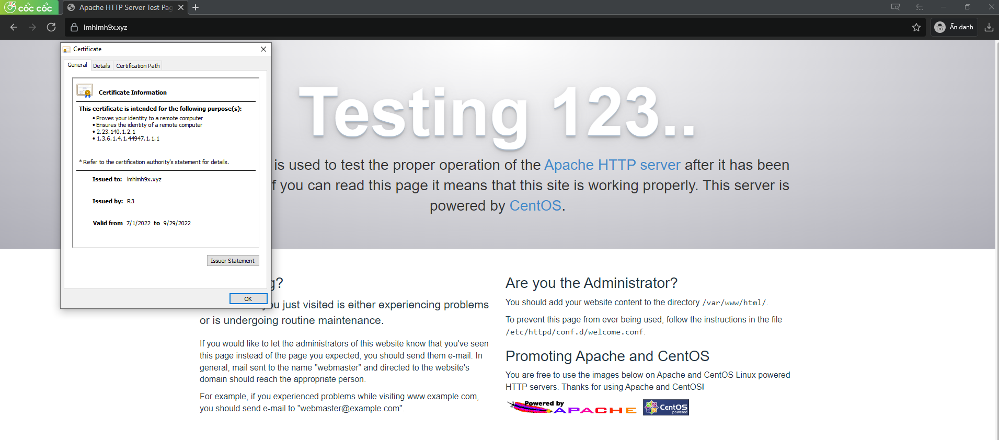
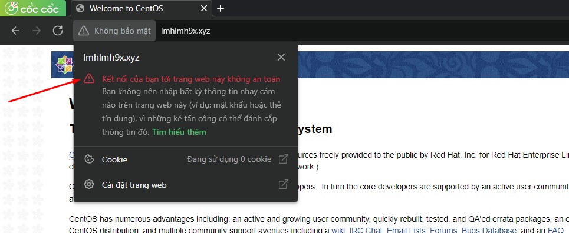
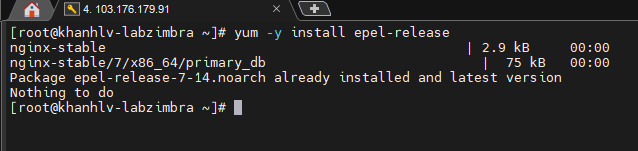
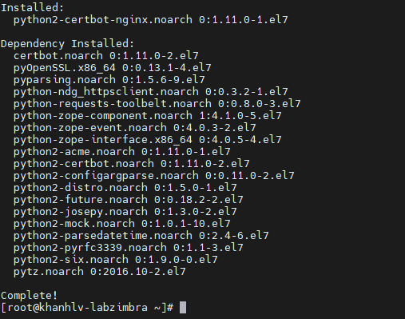
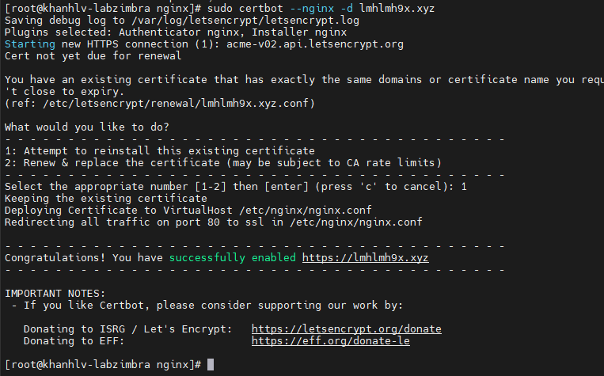
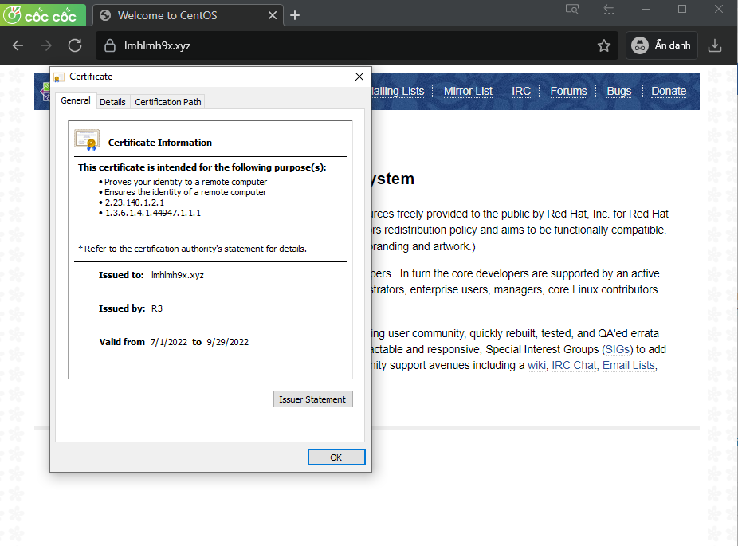

# Cài đặt SSL Cài đặt SSL Let's Encrypt trên apache
## Ta cài đặt apache 

- Kiểm tra thấy trang web chưa được cài chứng chỉ ssl

## Tiến hành cài đặt SSL

### Bước 1 Cài đặt Certbot Let's Encrypt Client:
- Để thêm kho lưu trữ CentOS 7 :  

- yum install epel-release

- Sau khi kích hoạt , cài đặt tất cả các gói cần thiết bằng lệnh :

- yum install certbot python2-certbot-apache mod_ssl

### Bước 2 Ta lấy chứng chỉ
- Bây giờ Certbot đã được cài đặt, ta chó thể yêu cầu chứng chỉ SSL cho tên miền của mình.  
- Việc sử dụng certbot máy khách Let's Encrypt để tạo Chứng chỉ SSL cho Apache sẽ tự động hóa nhiều bước trong quy trình. Máy khách sẽ tự động lấy và cài đặt chứng chỉ SSL mới hợp lệ cho các miền bạn cung cấp dưới dạng tham số.

- Để thực hiện cài đặt tương tác và lấy chứng chỉ chỉ bao gồm một tên miền, hãy chạy certbot lệnh với:

- sudo certbot --apache -d lmhlmh9x.xyz

- Khi quá trình cài đặt kết thúc thành công , ta sẽ thấy thông báo như sau :

- 

### Bước 3 kiểm tra trạng thái chứng chỉ 

- 

### Bước 4 thiết lập gia hạn tự động cho chứng chỉ

- Chứng chỉ  Let's Encrypt có giá trị trong 90 ngày, nhưng ta nên gia hạn chứng chỉ sau mỗi 60 ngày để hạn chế sai sót. 
- Chỉnh sửa crontab để tạo một công việc mới sẽ chạy gia hạn hai lần mỗi ngày. 
- sudo crontab -e
- Ta thêm dòng sau và lưu lại :  
- 0 0,12 * * * python -c 'import random; import time; time.sleep(random.random() * 3600)' && certbot renew

- 

- 

- 

- 

- 

#  Cài đặt SSL Cài đặt SSL Let's Encrypt trên Nginx

## Ta cài đặt Nginx 

- 

- Ta kiểm tra thấy trang web chưa được cài chứng chỉ SSL

## Tiến hành cài đặt SSL

### Bước 1 Cài đặt Certbot 

- Cài đặt EPEL repository

- yum -y install epel-release

- 

- Tiếp theo cài đặt certbot-nginx bằng câu lệnh sau:

- yum -y install certbot-nginx

- 

### Bước 2: Cài đặt SSL Let’s Encrypt

- sudo certbot --nginx -d lmhlmh9x.xyz

- 

- Thông báo như vậy là đã cài đặt thành công SSL thông qua Certbot.

### Bước 3 : Kiểm tra chứng chỉ
 - Cách 1 : kiểm tra trình duyệt  

- 

### Bước 4 : Cập nhập tự động

- Các bạn chạy câu lệnh sau để mở Cronjob :
- crontab -e

- Copy nội dung bên dưới paste vào Crontab.Sau đó lưu và đóng Cronjob
-  59 23 * * * /usr/bin/certbot renew –quiet

