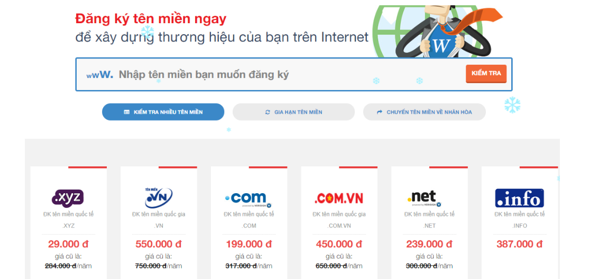

# I. Giới thiệu  về công ty
## 1.1 Giới thiệu chung
- Được thành lập năm 2002 do nhu cầu tất yếu hội nhập của nền kinh tế, hiện tại Nhân Hòa đang cung cấp dịch vụ cho hơn 100.000 khách hàng trong và ngoài nước. Chúng tôi luôn nỗ lực sáng tạo không ngừng nhằm xây dựng công ty thành một tổ chức hùng mạnh, hiện đại và văn hóa với mong muốn mở rộng hợp tác với các đối tác trong và ngoài nước tạo nền tảng cho những bước tiến bền vững.

- Trải qua 20 năm thành lập và phát triển, Nhân hòa đã được tạo sự tin tưởng, tin cậy trong lòng khách hàng. Với hàng trăm đại lý trên toàn quốc, chúng tôi luôn nỗ lực đem đến sự hài lòng về sản phẩm dịch vụ và giải pháp công nghệ tốt nhất cho tất cả mọi người.

- Không chỉ gặt hái được những thành công trong hoạt động kinh doanh, với phương châm lấy chữ “Nhân” làm tôn chỉ, tập thể lãnh đạo, nhân viên Nhân Hòa đã xây dựng được một môi trường văn hóa doanh nghiệp lành mạnh. Ngôi nhà Nhân Hòa không chỉ là nơi các thành viên lao động, sáng tạo mà còn là nơi gắn kết, sẻ chia mọi tâm tư, nguyện vọng.
## 1.2 Giới thiệu chi tiết
- Lịch sử hình thành và phát triển
- Năm 2002 : Thành lập công ty Nhân Hòa. Đại lý tên miền quốc tế chính thức của RessellerClub
- Năm 2002-2004 : Khách hàng lớn nhất của nhà cung cấp dịch vụ máy chủ The Planet tại Việt Nam
- Năm  2005 : Top 3 nhà cung cấp dịch vụ tên miền & web hosting tại Việt Nam
- Năm 2007 : Thành lập chinh nhánh tại Hồ Chí Minh.
- Năm 2010 : Nhận Giải thưởng thương hiệu uy tín 
- Năm 2012 : Năm thứ 3 nhân giải thưởng Thương Hiệu Uy Tín . Ra mắt sản phẩm Web4s
- Năm 2013 : Trở thành nhà đăng ký tên miền chính thức của ICANN VÀ VNNIC
- Năm 2014 : Nhận giải thưởng Sao Khuê cho dịch vụ Web4S
- Năm 2015-2016 : Giải thưởng cho nhà đăng ký tăng trưởng tốt nhất của VNNIC 2 năm liên tiếp
- Năm 2016 : Ra mắt sản phẩm dịch vụ thoại trên nền tảng IP-CLOUNDCALL
- Năm 2018 : Sản phẩm điện toán đám mây trên nền tảng nguồn mở OpenStack Thành lập công ty 4S
- Năm 2019 : Hệ sinh thái điện toán đám mây phục vụ chuyển đổi số. Ra mắt thương hiệu VFONE. Partner Google Gsuite tại Việt Nam . Hóa đơn điện tử HOADON.BIZ
- Năm 2021 : Thành lập chi nhánh Vinh - Nghệ An. Ra mắt hợp đồng điện tử ESOC .TOP 10 doanh nhiệp cung cấp hạ tầng số, bảo mật, an toàn thông tin VINASA.
## 1.3 Tầm nhìn - Sứ mệnh - Giá trị cốt lõi - Chiến lược
-Tầm nhìn: Trở thành doanh nghiệp cung cấp dịch vụ, giải pháp tổng thể và nền tảng hàng đầu trong lĩnh vực Công nghệ thông tin.

- Sứ mệnh: Mang lại giá trị giúp doanh nghiệp phát triển bền vững, đi đầu về công nghệ nhằm thúc đầy nền Công nghệ thông tin phát triển.
- Giá trị cốt lõi:
- Tận tâm: Lấy khách hàng & đối tác làm trung tâm cho mọi hành động.
- Sáng tạo: Đổi mới, tạo ra những sản phẩm và giá trị mới.
- Cam kết: Thực hiện lời nói đi đôi với hành động.
- Văn hoá và trải nghiệm: Chuyên nghiệp hoá nhân sự, xây dựng nền tảng văn hoá công ty vững chắc.
- Chiến lược: Phát triển bền vững,  nền tảng văn hoá với con người làm cốt lõi, tiên phong về công nghệ và luôn đổi mới sáng tạo.
# II. Các dịch vụ của nhân hòa
## 2.1 Đăng ký tên miền : 
 - 2.1.1 Đăng ký tên miền
Cung cấp các loại tên miền với các mức giá khác nhau : .xyz, .vn, .com, .com.vn, .net, .info...
 
- Nguyên lý đăng ký tên miền:
- Tên miền không được vượt quá 63 ký tự, bao gồm cả phần .com, .net, .org ...
- Tên miền chỉ gồm các ký tự trong bảng chữ cái (a-z), các số (0-9) và dấu trừ (-).
- Các khoảng trắng và các ký tự đặc biệt trong tên miền khác đều không hợp lệ.
- Không thể bắt đầu bằng hoặc kết thúc tên miền bằng dấu trừ (-).
- Tên miền càng ngắn càng tốt, dễ nhớ, không gây nhầm lẫn, khó viết sai.
- Tên miền phải liên quan đến tên chủ thể và lĩnh vực hoạt động.
- Chủ động nộp phí duy trì trước khi tên miền hết thời hạn sử dụng, tự chịu trách nhiệm khi tên miền bị mất do hết hạn sử dụng mà không đóng phí.

 