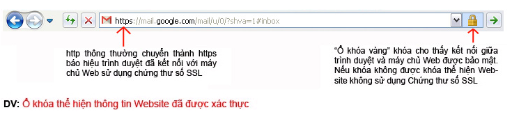
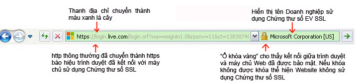
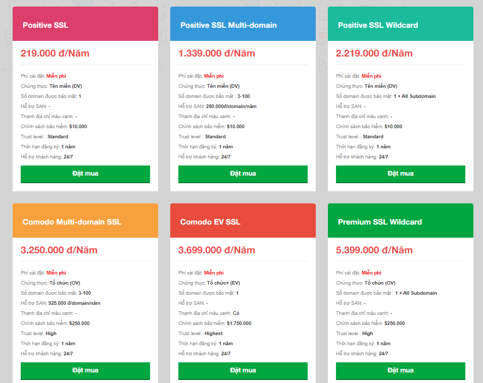
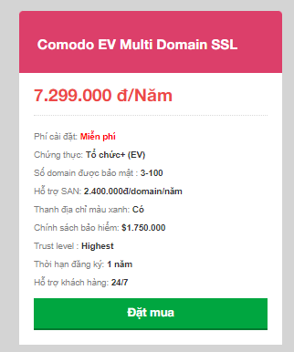
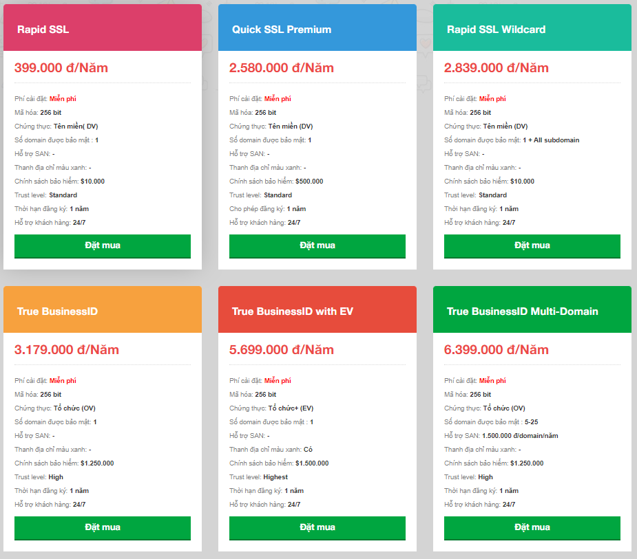
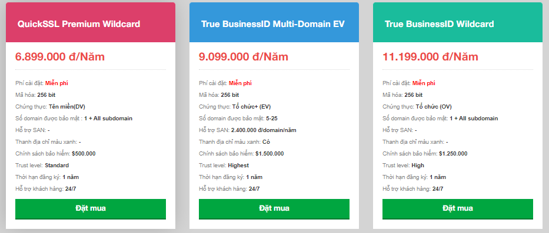
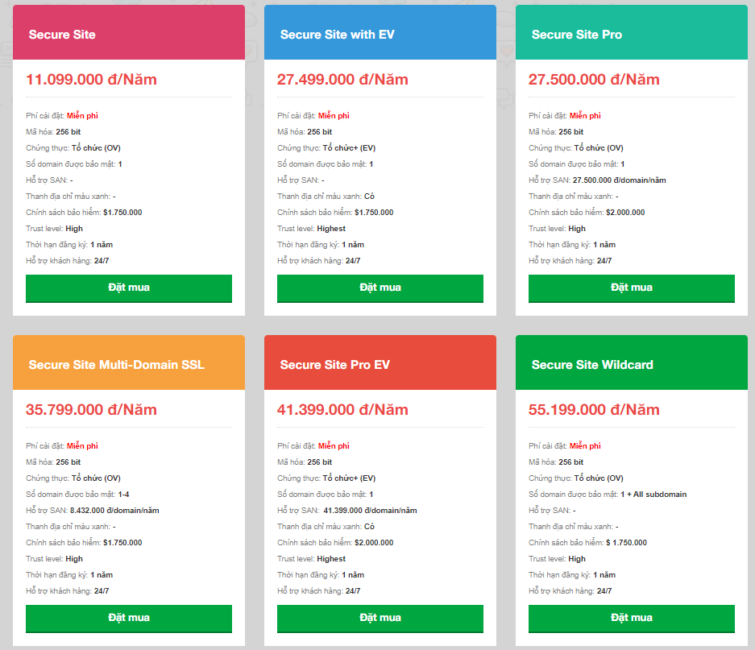
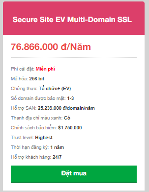

# I. Giới thiệu  về công ty
## 1.1 Giới thiệu chung
- Được thành lập năm 2002 do nhu cầu tất yếu hội nhập của nền kinh tế, hiện tại Nhân Hòa đang cung cấp dịch vụ cho hơn 100.000 khách hàng trong và ngoài nước. Chúng tôi luôn nỗ lực sáng tạo không ngừng nhằm xây dựng công ty thành một tổ chức hùng mạnh, hiện đại và văn hóa với mong muốn mở rộng hợp tác với các đối tác trong và ngoài nước tạo nền tảng cho những bước tiến bền vững.

- Trải qua 20 năm thành lập và phát triển, Nhân hòa đã được tạo sự tin tưởng, tin cậy trong lòng khách hàng. Với hàng trăm đại lý trên toàn quốc, chúng tôi luôn nỗ lực đem đến sự hài lòng về sản phẩm dịch vụ và giải pháp công nghệ tốt nhất cho tất cả mọi người.

- Không chỉ gặt hái được những thành công trong hoạt động kinh doanh, với phương châm lấy chữ “Nhân” làm tôn chỉ, tập thể lãnh đạo, nhân viên Nhân Hòa đã xây dựng được một môi trường văn hóa doanh nghiệp lành mạnh. Ngôi nhà Nhân Hòa không chỉ là nơi các thành viên lao động, sáng tạo mà còn là nơi gắn kết, sẻ chia mọi tâm tư, nguyện vọng.
## 1.2 Giới thiệu chi tiết
- Lịch sử hình thành và phát triển
- Năm 2002 : Thành lập công ty Nhân Hòa. Đại lý tên miền quốc tế chính thức của RessellerClub
- Năm 2002-2004 : Khách hàng lớn nhất của nhà cung cấp dịch vụ máy chủ The Planet tại Việt Nam
- Năm  2005 : Top 3 nhà cung cấp dịch vụ tên miền & web hosting tại Việt Nam
- Năm 2007 : Thành lập chinh nhánh tại Hồ Chí Minh.
- Năm 2010 : Nhận Giải thưởng thương hiệu uy tín 
- Năm 2012 : Năm thứ 3 nhân giải thưởng Thương Hiệu Uy Tín . Ra mắt sản phẩm Web4s
- Năm 2013 : Trở thành nhà đăng ký tên miền chính thức của ICANN VÀ VNNIC
- Năm 2014 : Nhận giải thưởng Sao Khuê cho dịch vụ Web4S
- Năm 2015-2016 : Giải thưởng cho nhà đăng ký tăng trưởng tốt nhất của VNNIC 2 năm liên tiếp
- Năm 2016 : Ra mắt sản phẩm dịch vụ thoại trên nền tảng IP-CLOUNDCALL
- Năm 2018 : Sản phẩm điện toán đám mây trên nền tảng nguồn mở OpenStack Thành lập công ty 4S
- Năm 2019 : Hệ sinh thái điện toán đám mây phục vụ chuyển đổi số. Ra mắt thương hiệu VFONE. Partner Google Gsuite tại Việt Nam . Hóa đơn điện tử HOADON.BIZ
- Năm 2021 : Thành lập chi nhánh Vinh - Nghệ An. Ra mắt hợp đồng điện tử ESOC .TOP 10 doanh nhiệp cung cấp hạ tầng số, bảo mật, an toàn thông tin VINASA.
## 1.3 Tầm nhìn - Sứ mệnh - Giá trị cốt lõi - Chiến lược
-Tầm nhìn: Trở thành doanh nghiệp cung cấp dịch vụ, giải pháp tổng thể và nền tảng hàng đầu trong lĩnh vực Công nghệ thông tin.

- Sứ mệnh: Mang lại giá trị giúp doanh nghiệp phát triển bền vững, đi đầu về công nghệ nhằm thúc đầy nền Công nghệ thông tin phát triển.
- Giá trị cốt lõi:
- Tận tâm: Lấy khách hàng & đối tác làm trung tâm cho mọi hành động.
- Sáng tạo: Đổi mới, tạo ra những sản phẩm và giá trị mới.
- Cam kết: Thực hiện lời nói đi đôi với hành động.
- Văn hoá và trải nghiệm: Chuyên nghiệp hoá nhân sự, xây dựng nền tảng văn hoá công ty vững chắc.
- Chiến lược: Phát triển bền vững,  nền tảng văn hoá với con người làm cốt lõi, tiên phong về công nghệ và luôn đổi mới sáng tạo.
# II. Các dịch vụ của nhân hòa
## 2.1 Đăng ký tên miền : 
 - 2.1.1 Đăng ký tên miền
Cung cấp các loại tên miền với các mức giá khác nhau : .xyz, .vn, .com, .com.vn, .net, .info...
 - 
- Nguyên lý đăng ký tên miền:
- Tên miền không được vượt quá 63 ký tự, bao gồm cả phần .com, .net, .org ...
- Tên miền chỉ gồm các ký tự trong bảng chữ cái (a-z), các số (0-9) và dấu trừ (-).
- Các khoảng trắng và các ký tự đặc biệt trong tên miền khác đều không hợp lệ.
- Không thể bắt đầu bằng hoặc kết thúc tên miền bằng dấu trừ (-).
- Tên miền càng ngắn càng tốt, dễ nhớ, không gây nhầm lẫn, khó viết sai.
- Tên miền phải liên quan đến tên chủ thể và lĩnh vực hoạt động.
- Chủ động nộp phí duy trì trước khi tên miền hết thời hạn sử dụng, tự chịu trách nhiệm khi tên miền bị mất do hết hạn sử dụng mà không đóng phí.
- 2.1.2 Kiểm tra tên miền 
- Giúp kiểm tra tên miền đã có hay chưa, đề xuất những tên miền chưa được sử dụng và mức giá tương ứng
- 2.1.3 Chuyển đổi tên miền 
- Chuyển đổi nhà cung cấp là thủ tục thay đổi nơi đăng ký cũng như đơn vị quản lý tên miền của bạn. Khi chuyển đổi nhà cung cấp sang Nhân Hòa, bạn sẽ hoàn toàn hài lòng với hệ thống quản lý nhanh chóng, an toàn và đáng tin cậy.
- Tên miền còn thời gian duy trì trên 30 ngày.
- Tên miền đăng ký được sau 60 ngày mới có thể chuyển qua nhà đăng ký khác.
- Yêu cầu Nhà đăng ký cũ mở khóa tên miền và cung cấp mã xác thực tên miền (authencode).
- Cung cấp thông tin authencode và bản khai chuyển đổi Nhà đăng ký có xác nhận của chủ thể cho Nhân Hòa.
- Gửi mẫu chuyển đổi nhà đăng ký đến Nhân Hòa làm thủ tục chuyển đổi. Lấy biên bản tiếp nhận hồ sơ.
- Chủ động theo dõi việc chuyển đổi đến khi việc chuyển đổi hoàn thành.
- Được cung cấp Password & Controlpanel quản lý tên miền
- Hỗ trợ đầy đủ các chức năng thay đổi các record như 1 tên miền quốc tế hoàn toàn miễn phí thông qua CP https://zonedns.com
- 2.1.4 Giữ chỗ tên miền :
- Dịch vụ giữ chỗ tên miền (Backorder domain) của Nhân Hòa là dịch vụ giúp khách hàng lựa chọn và đăng ký lại những tên miền sắp tự do. Khi một tên miền đã hết hạn và chủ thể không gia hạn nữa, tên miền sẽ bị tạm ngưng 25 ngày và chờ trả về trạng thái tự do là trạng thái cho phép đăng ký tên miền. Dịch vụ backorder domain của Nhân Hòa sẽ theo dõi và đăng ký ngay lập tức tên miền cho khách hàng khi tên miền chuyển sang trạng thái tự do.
- 2.1.5 Khóa tên miền :
- Domain Locking hay Khóa tên miền là dịch vụ bảo vệ tên miền cấp cao nhất - tuyệt đối an toàn, tránh khỏi những nguy cơ và tác động không mong muốn như: lộ mật khẩu, mất thông tin email, bị hacker xâm nhập, do sự bất cẩn vô tình hay cố ý của nhân viên hay chính mình làm thay đổi ảnh hưởng tới hoạt động của tên miền.
- Tên miền được bảo vệ bằng dịch vụ Khóa tên miền khi kiểm tra công cụ Whois sẽ có thêm các trường thông tin trạng thái sau:
    + serverDeleteProhibited
   + serverUpdateProhibited
   + serverTransferProhibited
## 2.2 Hosting :
- Sinh viên
- Cá nhân
- Cá nhân plus
- Doanh nghiệp
- Thương mại điện tử
- Chuyên Nghiệp

- 2.2.1 hosting windows
Đặc tính kĩ thuật:
- Windows hosting Hỗ trợ nhiều ngôn ngữ lập trình với các phiên bản khác nhau.
- Miễn phí tạo, quản lý hộp thư điện tử (Email) theo tên miền riêng.
- Miễn phí tạo tên miền con (Subdomain).
- Sử dụng nhiều tên miền cho 1 website.
- Quản lý nhiều website trên cùng 1 tài khoản hosting.
- Quản lý đăng nhập, giám sát thông số băng thông và dung lượng.
- Sao lưu dự phòng và khôi phục dữ liệu.
Thông số: 
- Hệ điều hành :	Windows server 2012/2016
- Ngôn ngữ hỗ trợ	: .NET(v1.1,2.0,3.5,4.0,4.6) / PHP 5.x-7.x / ASP
- Cơ sở dữ liệu :	Microsoft Access / MSSQL Server 2012 / MySQL Server / Hỗ trợ ODBC/ OLEDB
- Hệ thống email :	WebMail / Email Forwarding / Email Alias/ Catch-all Account / Antivirus / Anti Spam
- Tính năng truy cập :	FTP Account / WebBase Control Panel / WebBase File Manager
- Bảng điều khiển	: Plesk Onyx (17) / Plesk Obsidian (18)
- Tính năng khác	: Hotlink Protection/ Protected Directories/ Webprotect/ Sub domain/ Parked Domain/ Add on Domain/ Bandwidth Status / Disk Usage Viewer/ Error Log/ Customer Error Pages / MIME Type Manager/ Redirect Manager/ Backup Manager/ Database Backup/ DataWeb Backup/ FrontPage Extensions
- 2.2.2 hosting linux :
- Giống Wordpress Hosting, Hosting Linux hỗ trợ nhiều ngôn ngữ lập trình với các phiên bản khác nhau.
- Miễn phí tạo, quản lý hộp thư điện tử (Email) theo tên miền riêng.
- Miễn phí tạo tên miền con (Subdomain).
- Sử dụng nhiều tên miền cho 1 website.
- Quản lý nhiều website trên cùng 1 tài khoản hosting linux nhằm giảm chi phí thuê hosting.
- Quản lý đăng nhập, giám sát thông số băng thông và dung lượng.
- Sao lưu dự phòng và khôi phục dữ liệu
Thông số :
- Hệ điều hành	Cloudlinux 6/7/8
- Ngôn ngữ hỗ trợ	Multi PHP (PHP 5.x/7.x) / Perl / Python
- Cơ sở dữ liệu	MySQL Server / Postgre SQL
- Hệ thống email doanh nghiệp	WebMail / Email Forwarding / Email Alias/ Catch-all Account / Antivirus / Anti Spam
- Tính năng truy cập	FTP Account / WebBase Control Panel / WebBase File Manager
- Bảng điều khiển :cPanel
- Web Server :LiteSpeed
- Bảo mật :Bảo mật nhiều lớp với công nghệ Cloudlinux và giải pháp bảo mật Imunify360 tiên tiến
- Tính năng khác:	Hotlink Protection/ Protected Directories/ Webprotect/ Sub domain/ Parked Domain/ Add on Domain/ Bandwidth Status / Disk Usage Viewer/ Error Log/ Customer Error Pages / MIME Type Manager/ Redirect Manager/ Backup Manager/ Database Backup/ DataWeb Backup/ FrontPage Extensions
- 2.2.3 hosting  WordPress :
 - TỐI ƯU HÓA CHO WORDPRESS: 
Hệ thống Wordpress Hosting của Nhân Hòa sử dụng 100% ổ cứng SSD Enterprise, kết hợp với LiteSpeed Webserver/ Memcached/ Redis giúp tối ưu hóa tốt nhất cho Wordpress.
- AN TOÀN DỮ LIỆU GẦN NHƯ TUYỆT ĐỐI: 
Dữ liệu của khách hàng được sao lưu liên tục hằng ngày trong 15 ngày gần nhất. Ngoài ra khách hàng có thể chủ động sao lưu dữ liệu bất kỳ lúc nào chỉ với 1 click chuột.
- TỶ LỆ UPTIME DỊCH VỤ TỚI 99,9% :
Hệ thống vận hành trên nền tảng điện toán đám mây ưu việt, khắc phục triệt để các tồn tại của các giải pháp lưu trữ thông thường, đảm bảo thời gian online gần như tuyệt đối.
- HỖ TRỢ TỪ CHUYÊN GIA :
Đội ngũ chuyên gia hàng đầu về dịch vụ luôn túc trực 24/7/365 hỗ trợ khách hàng trong suốt quá trình sử dụng.
- Các dịch vụ :

- Tính năng nổi bật :
- 100% ổ cứng SSD Enterprise
- Backup 15 ngày liên tiếp
- Quản trị với Cpanel tốt nhất
- 1-Click WordPress Installation
- Tối ưu tốc độ với Litespeed/ Memcached
- Chống Local Attack với Cloudlinux
- Bảo mật dữ liệu với SSL
- Quét mã độc với Imunify360
- Hỗ trợ Multi PHP
## 2.3  Dịch vụ SSL:
1. SSL là gì?
- SSL là viết tắt của từ Secure Sockets Layer. Đây là một tiêu chuẩn an ninh công nghệ toàn cầu tạo ra một liên kết giữa máy chủ web và trình duyệt. Liên kết này đảm bảo tất cả dữ liệu trao đổi giữa máy chủ web và trình duyệt luôn được bảo mật và an toàn.
- SSL đảm bảo rằng tất cả các dữ liệu được truyền giữa các máy chủ web và các trình duyệt được mang tính riêng tư, tách rời. SSL là một chuẩn công nghệ được sử dụng bởi hàng triệu trang web trong việc bảo vệ các giao dịch trực tuyến với khách hàng của họ.
a. SSL làm việc như thế nào ?

b. Những gì xảy ra khi một máy tính kết nối với một Website đã được chứng thực ?

c. Trình duyệt làm thế nào để kiểm tra một SSL là có thực hay không ?

- Khi Website gửi cho trình duyệt một chứng chỉ SSL, trình duyệt sẽ gửi chứng chỉ này đến một máy chủ lưu trữ các chứng chỉ số đã được phê duyệt.

- Về mặt kỹ thuật, SSL sử dụng mã hóa công khai. Kỹ thuật này giúp cho Website và trình duyệt tự thỏa thuận (bước 4 ở hình trên) một bộ khóa sẽ dùng trong suốt quá trình trao đổi thông tin sau đó. Bộ khóa sẽ thay đổi theo mỗi trong lần giao dịch kế tiếp, một người khác sẽ không thể giải mã ngay cả khi có được dữ liệu của máy chủ lưu trữ chứng chỉ số nói trên.

2. Tại sao nên sử dụng SSL?
Bạn đăng ký domain để sử dụng các dịch vụ website, email v.v... -> luôn có những lỗ hổng bảo mật -> hacker tấn công -> SSL bảo vệ website và khách hàng của bạn.

Bảo mật dữ liệu: dữ liệu được mã hóa và chỉ người nhận đích thực mới có thể giải mã.

Toàn vẹn dữ liệu: dữ liệu không bị thay đổi bởi tin tặc.

Chống chối bỏ: đối tượng thực hiện gửi dữ liệu không thể phủ nhận dữ liệu của mình.

3. Lợi ích khi sử dụng SSL?
- Bạn đăng ký domain để sử dụng các dịch vụ website, email v.v… -> luôn có những lỗ hổng bảo mật -> hacker tấn công -> SSL bảo vệ website và khách hàng của bạn.
- Bảo mật và mã hóa các thông điệp trao đổi giữa trình duyệt và server.
- Bảo mật các giao dịch giữa khách hàng và doanh nghiệp, các dịch vụ truy nhập hệ thống.
- Bảo mật webmail và các ứng dụng như Outlook Web Acess, Exchange, và Office Communication Server.
- Bảo mật các ứng dụng ảo hóa như Citrix Delivery Platform hoặc các ứng dụng điện toán mây.
- Bảo mật dịch vụ FTP.
- Bảo mật truy cập Control panel
- Bảo mật các dịch vụ truyền dữ liệu trong mạng nội bộ, file sharing, extranet.
- Bảo mật VPN Access Servers, Citrix Access Gateway.
- Nâng cao hình ảnh, thương hiệu và uy tín doanh nghiệp
- Nâng cao thứ hạng website trên kết quả tìm kiếm Google (SEO)
- Tạo lợi thế cạnh tranh, tăng niềm tin của khách hàng đối với website, tăng số lượng giao dịch, giá trị giao dịch trực tuyến của khách hàng. Website không được xác thực và bảo mật sẽ luôn ẩn chứa nguy cơ bị xâm nhập dữ liệu, dẫn đến hậu quả khách hàng không tin tưởng sử dụng dịch vụ.

4. DV-SSL:
- Domain Validation (DV): chứng thư số SSL chứng thực cho Domain Name - Website . Khi 1 Website sử dụng DV SSL thì sẽ được xác thực tên domain , website đã được mã hoá an toàn khi trao đổi dữ liệu

5. OV-SSL:
- Organization Validation (OV): chứng thư số SSL chứng thực cho Website và xác thực doanh nghiệp đang sở hữu website đó
6. EV-SSL:
- Extended Validation (EV): cho khách hàng của bạn thấy Website đang sử dụng chứng thư SSL có độ bảo mật cao nhất và được rà soát pháp lý kỹ càng.
- Với thanh đại chỉ sang màu xanh với hiển thị đầy đủ thông tin của công ty, cung cấp một cấp độ cao hơn tin tưởng vào website của bạn.

7. Wildcard SSL:
 -  (Wildcard SSL Certificate): sản phẩm lý tưởng dành cho các cổng thương mại điện tử. Các website dạng này thường có thể tạo ra các trang e-store dành cho các chủ cửa hàng trực tuyến, mỗi e-store là một sub domains và được chia sẻ trên một địa chỉ IP duy nhất. Khi đó, để triển khai giải pháp bảo bảo mật giao dịch trực tuyến (khi đặt hàng, thanh toán, đăng ký & đăng nhập tài khoản,...) bằng SSL, chúng ta có thể dùng duy nhất một chứng chỉ số Wildcard cho tên miền chính của website và dùng chung một địa chỉ IP duy nhất để chia sẻ cho tất cả mọi sub domains.

8. Các dịch vụ SSL của Nhân Hòa:

 - 8.1 Comodo SSL:

 
 

 - 8.2 Geotrust SSL:
 
 

 -8.3 Digicert SSL:
 
 

 ## 2.4 Dịch vụ email
-  Dịch vụ Email Hosting :
- Dịch vụ Email hosting của Nhân Hòa được cung cấp trên nền tảng máy chủ mạnh mẽ và độc lập, được cấu hình tối ưu cho dịch vụ mail, cùng với giải pháp chống spam và chống virus hiệu quả, đảm bảo cho hoạt động giao dịch email của khách hàng luôn ổn định và nhanh chóng. Giao diện người dùng với đầy đủ các tính năng và dễ sử dụng, cho phép người dùng check mail trên cả Outlook và webmail. Mặt khác control panel quản trị chuyên nghiệp cho phép người quản trị thiết lập các tùy biến một cách chi tiết đến từng người dùng và email đi-đến. Email Hosting của Nhân Hòa là giải pháp tối ưu cho các tổ chức, doanh nghiệp muốn có một hệ thống email chuyên nghiệp, tin cậy và hiệu quả.
- Các tính năng chính của dịch vụ: 
- Thiết lập địa chỉ email theo tên miền riêng.
- Control Panel quản lý chuyên nghiệp.
- Giao diện người dùng dễ sử dụng.
- Cho phép check mail trên Outlook và Webmail (POP3/SMTP/Webmail).
- Tùy ý thiết lập dung lượng cho từng Mail Box.
- Cho phép cài đặt Catch All/ Mail offline.
- Sao lưu dữ liệu định kỳ hàng tuần.
- Thiết lập chế độ cho email đi-đến.
- Kiểm soát lưu lượng email đi-đến.
- Tính năng e-mail tự động hồi âm (Email Autoresponders).
- Anti Spam/ Anti Virus/ Anti Bombmail.
- Nâng cấp/ mở rộng dễ dàng không gián đoạn dịch vụ.
- Dịch vụ Email Server :
- Dịch vụ Email server của Nhân Hòa là giải pháp email chuyên nghiệp vận hành trên một máy chủ độc lập, với địa chỉ IP riêng và control panel quản trị riêng. Bên cạnh việc kế thừa các tính năng của Email Hosting, dịch vụ Email server còn có nhiều ưu điểm vượt trội về năng lực xử lý dữ liệu, không gian lưu trữ, và khả năng tùy biến trong quản trị dịch vụ. Dịch vụ Email server phù hợp với các tổ chức/ doanh nghiệp có nhu cầu giao dịch email lớn hoặc muốn xây dựng một hệ thống email chuyên nghiệp, độc lập, bảo mật và tin cậy.
- Các tính năng chính của dịch vụ:
- Cài đặt trên một máy chủ độc lập.
- Sử dụng một IP riêng  đảm bảo độ tin cậy cho email.
- Dung lượng lưu trữ vượt trội (100 GB).
- Cho phép cài đặt nhiều tên miền riêng (Domain Addon).
- Không giới hạn số lượng người dùng (Email account).
- Được cài đặt chứng thực SSL  tăng độ bảo mật cho email.
- Chứng thực SPF/ Domainkeys/ DKIM  tăng độ tin cậy cho email.
- Có giao diện dành cho thiết bị di động.
- Hỗ trợ quản trị dịch vụ 24/7.

- Các dịch vụ Email:
- UMail là dịch vụ email theo tên miền giúp doanh nghiệp có thể kết nối, tương tác với khách hàng/ đối tác một cách dễ dàng, nhanh chóng và chuyên nghiệp hơn.
Với UMail, doanh nghiệp có ngay một hệ thống quản lý tập trung email nhân viên, đồng thời tăng cường khả năng bảo mật với các cơ chế chống virus/ spam hiện đại.
- Các tính năng :
- Nâng tầm thương hiệu :
- Khẳng định thương hiệu từ nay email của bạn sẽ chuyên nghiệp hơn với dạng tên miền riêng abc@tencongty.com (vd info@umail.vn) chứ không còn đơn điệu như trước đây.
- Bảo mật an toàn: 
Email người dùng được mã hóa trong suốt quá trình truyền tải. Ngoài ra UMail thay đổi cổng kết nối POP3/ IMAP bằng SSL/ TLS giúp nâng cao tính năng bảo mật.
- Di chuyển email dễ dàng :
UMail với tùy chọn di chuyển qua máy chủ IMAP/ POP giúp bạn có thể chuyển đổi dễ dàng tất cả email cũ sang UMail để có những trải nghiệm đỉnh cao.
- Hỗ trợ kỹ thuật 24/7: 
- Đội ngũ kỹ thuật UMail giàu kinh nghiệm, chuyên nghiệp luôn sẵn sàng hỗ trợ 24/7, mang đến bạn sự tin tưởng, yên tâm khi sử dụng .

  

 

 
 

 