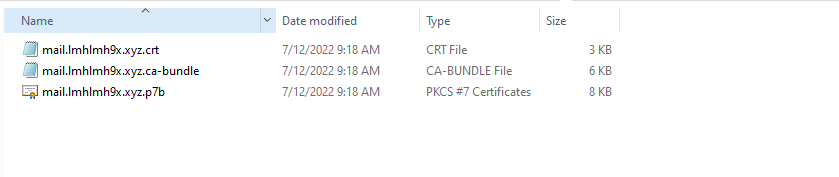

# I Đầu tiên ta vào trang ssls.com đăng ký tài khoản để lấy chứng chỉ ssls có phí được dùng thử 30 ngày.
- Sau khi đăng ký tài khoản và xác thức ta sẽ tải file 

# II Cài đặt 
- cd /opt/zimbra/ssl/zimbra/commercial/
-  Tạo file commercial.crt 
