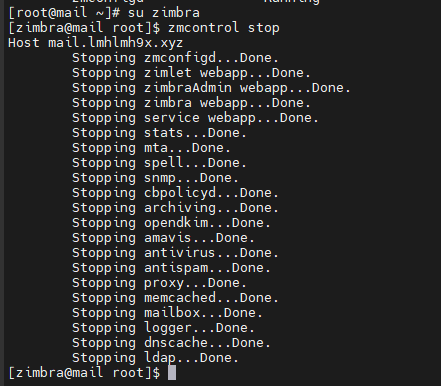
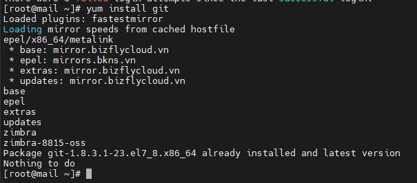
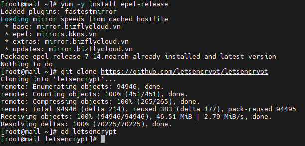

# Cài đặt
- Đầu tiên ta ssh vào hệ thống và dừng tất cả các dịch vụ
- su zimbra
- zmcontrol stop
- 
- Như hình ta thấy tất cả các dịch vụ đã được dừng lại.
- Tiếp đó ta cài đặt git server, ta cần phải vào root để tải
- yum install git -y
- 
- Sau đó ta sẽ Download Let's Encrypt
- yum -y install epel-release
- git clone https://github.com/letsencrypt/letsencrypt
- cd letsencrypt
- 
-  Chạy auto chứng chỉ Let's Encrypt cho tên miền lmhlmh9x.xyz
- ./letsencrypt-auto certonly --standalone -d mail.lmhlmh9x.xyz