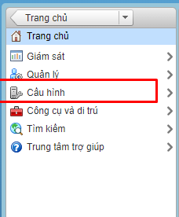
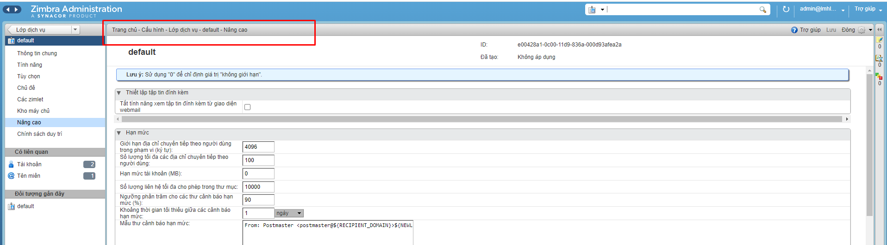
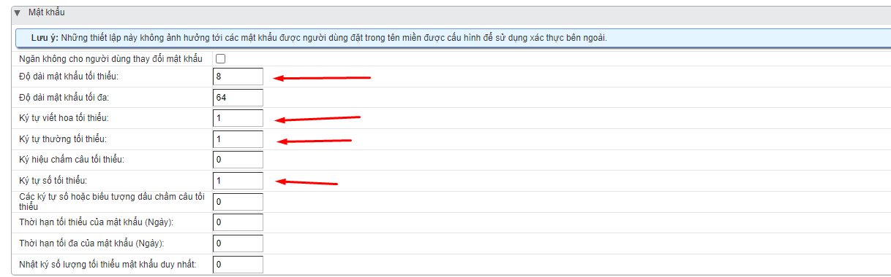
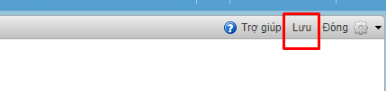

# Mật khẩu
- Mặc định khi cài đặt xong email server zimbra việc thiết lập chính sách về mật khẩu cho account email khi tạo mới trong hệ thống ở mức cơ bản, yếu chỉ thiết lập 2 tham số độ dài mật khẩu tối thiểu: 6, độ dài mật khẩu tối đa: 64. Việc thiết lập lại chính sách về mật khẩu là rất cần thiết giúp nâng cao độ an toàn cho các account email, tránh tình trạng scan password dẫn tới spam đựa hệ thống email vào backlist.
- Ta sẽ thiết lập chính sách mật khẩu 
- Ta chọn phần cấu hình: 

- 
- Ta truy cập như trong hình
- 
- Ta thêm chính sách mật khẩu vd như 
- Tối thiểu phải có 8 kí tự , 1 kí tự viết hoa, 1 kí tự thường, 1 kí tự số
- 
- Sau đó ta lưu lại , như vậy đã hoàn tất.
- 

