# Thêm 1 user mới
- Đầu tiên ta đăng nhập vào trang quản trị admin
- 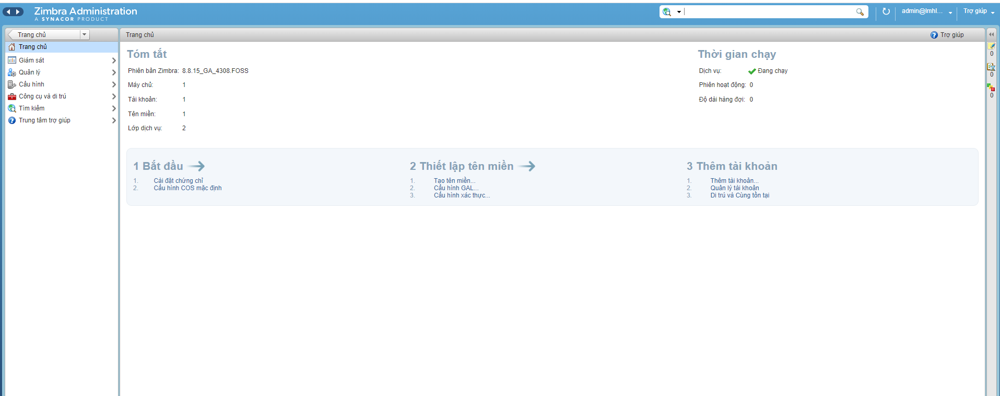
- Chọn vào phần quản lý 
- 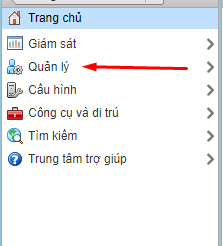
- Ta chọn vào biểu tượng bánh răng cưa và chọn vào mục mới để thêm user
- 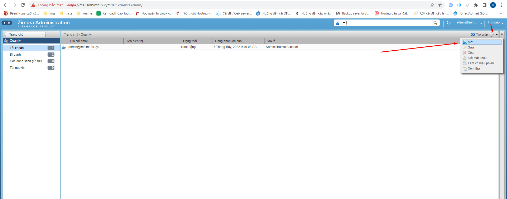
- 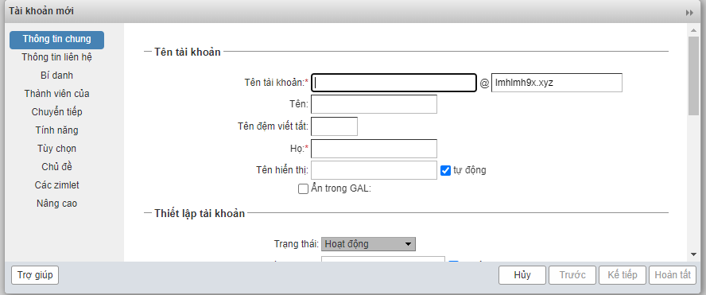
- Tại đây ta sẽ điền các thông tin 
- 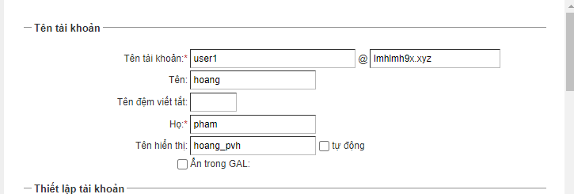
- Thiết lập mật khẩu
- 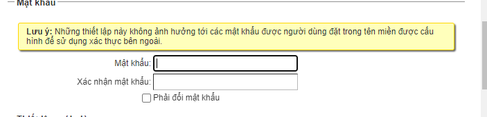
- Sau đó ta chọn hoàn tất để tạo tài khoản
- 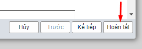
- Ta thấy người dùng mới đã tạo thành công
- 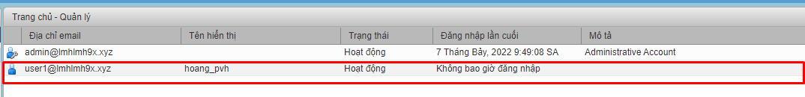
# Tạo 1 nhóm người dùng

- Tại trình quản lý ta chọn các danh sách gửi thư cũng chọn biểu tượng bánh răng cưa và chọn mục mới tạo group

- 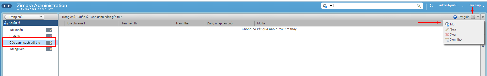

- Ta sẽ điền thông tin cho group muốn tạo , tên hiển thị . Ở mục thêm thành viên ta sẽ tìm kiếm thành viên muốn thêm và chọn thêm rồi ấn hoàn tất.

- 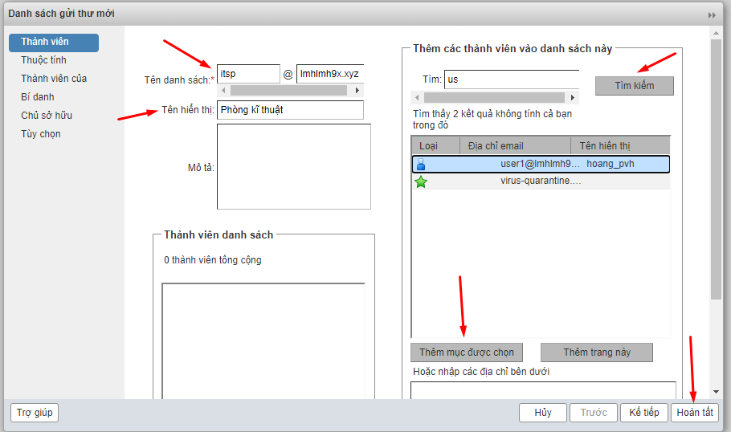
- 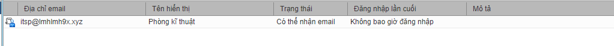
- Kiểm tra thấy user đã được thêm thành công
- 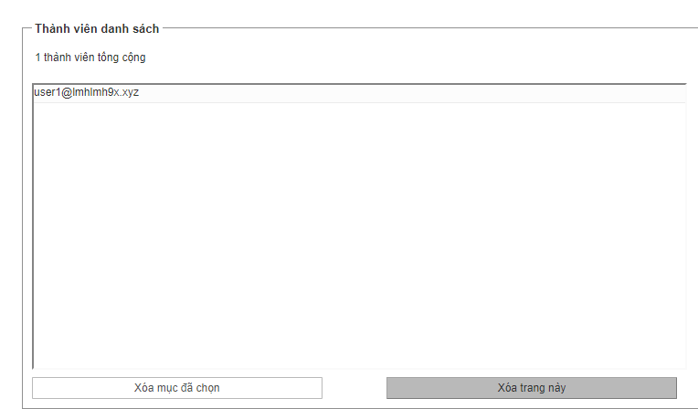

 
