# I Các lệnh thường dùng trong zimbra email
## 1. Kiểm tra logs nhật lý liên quan để gửi và nhận thư 
- ### 1  Check logs user zimbra 
- Logs này là logs của người nhận mail 
- /opt/zimbra/libexec/zmmsgtrace -r​​ 'hoangphamviet@gmail.com'
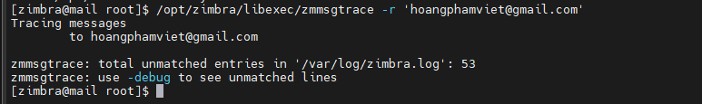

 
- ### 2 Nếu ta có nhiều tệp logs, sử dụng '/var/log/zimbra*' sẽ tìm kiếm tất cả các tệp nhật ký trong thư mục đó:
- 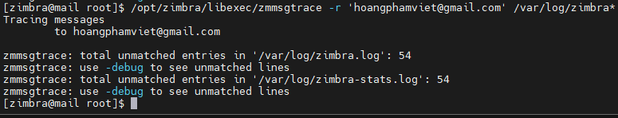

- ### 3  Kiểm tra nhật ký 
- /opt/zimbra/libexec/zmmsgtrace -s hoangphamviet@lmhlmh9x.xyz
- Kiểm tra nhật ký gửi nhận mail từ 1 mail trong mail server zimbra  
- 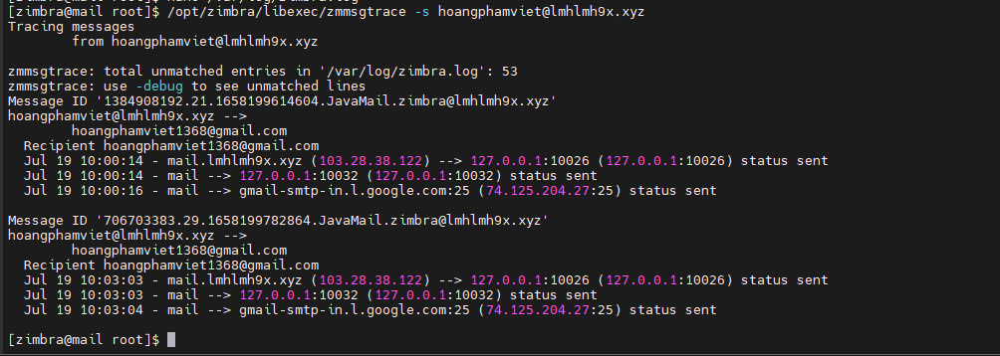
- ta thấy được thời gian gửi thư từ mail server đến 1 mail khác

## 2. Check logs zimbra 
- tail -100f /var/log/zimbra.log
- 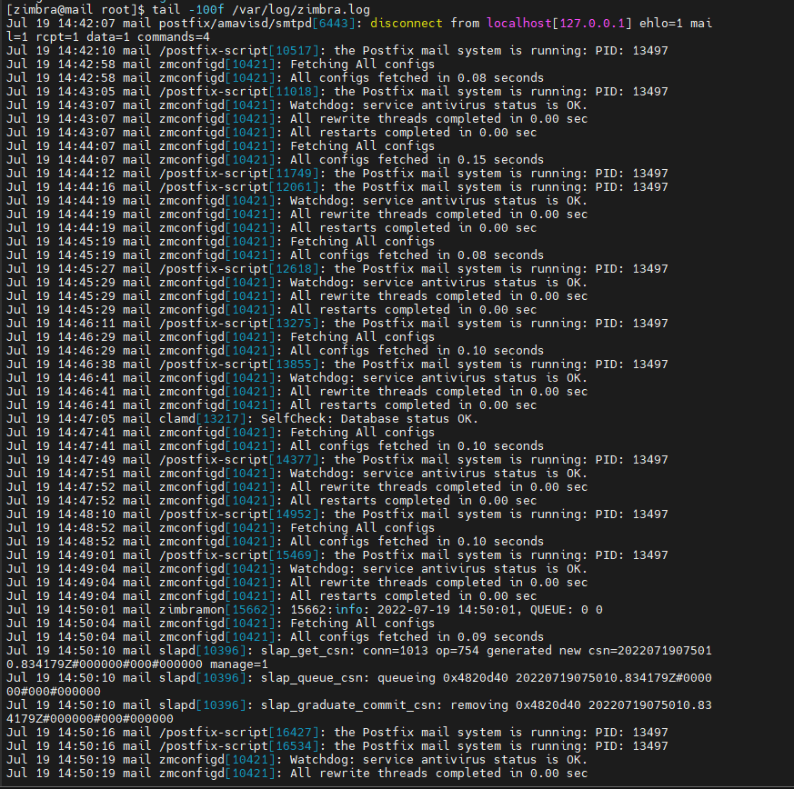

## 3. Cấu hình giới hạn dung lượng tối đa email được phép gửi và nhận
- Kiểm tra dung lượng Email đang mặc định có thể gửi đến và gửi đi​​

- 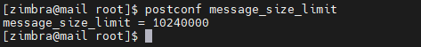

- Tăng hoặc giảm kích thước Email có thể nhận hoặc gửi đi. Trường hợp này ta tăng lên  25MB

- 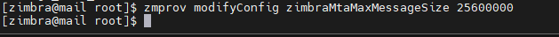
- Ta kiểm tra lại 
- 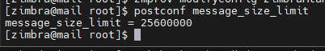
## 4 .  Đổi tên Domain​​ Email Zimbra

- zmprov --ldap rd olddomain.com newdomain.com
- 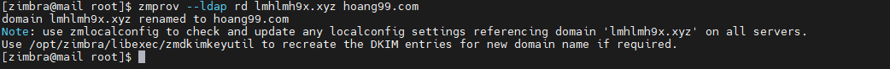

## 5 . Kiểm tra cấu hình cài đặt trong zimbra 
- zmlocalconfig
- 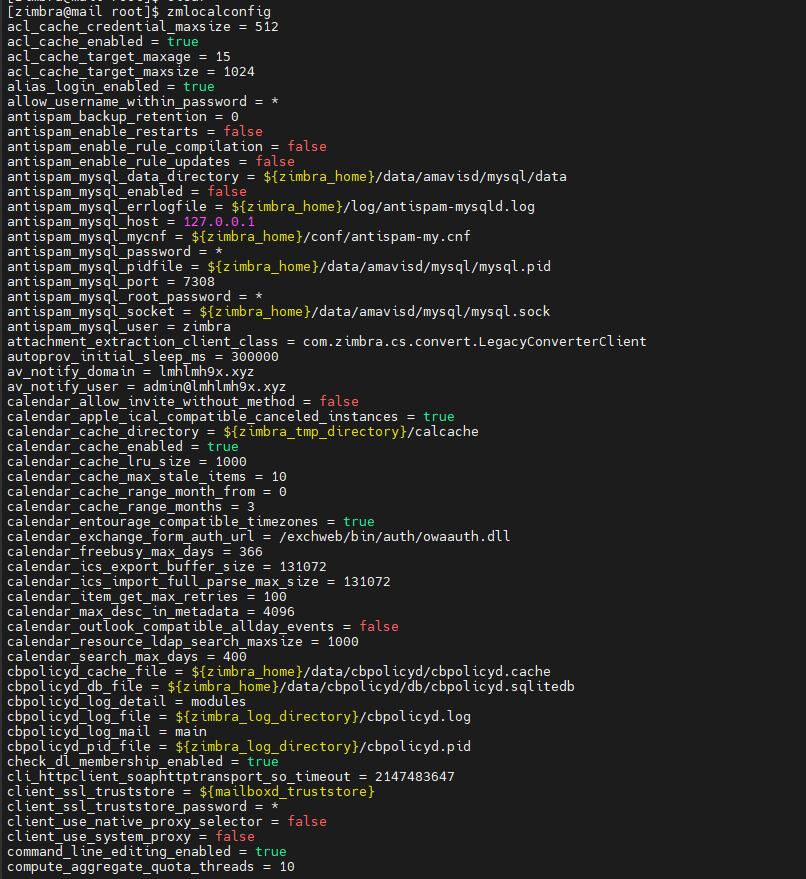

## 6 . Kiểm tra thông tin database

- DB của​​ Zimbra được sử​​ dụng bởi mysql, mỗi user email là 1 Database
- Zimbra tự động gán tài khoản zimbra vào nhóm hộp thư khi tài khoản được tạo. Nhóm hộp thư tương ứng với cơ sở dữ liệu nằm trong / opt / zimbra / db / data như mboxgroup1, mboxgroup2, ... vv. Có tối đa 100 nhóm hộp thư trên mỗi máy chủ hộp thư.
- Nhóm hộp thư cho tài khoản zimbra dựa trên số id hộp thư. (MailboxId dành riêng cho cửa hàng, mặt khác zimbraId dành cho toàn hệ thống). Ta có thể xác định id hộp thư cho một tài khoản :
-  zmprov getMailboxInfo hoangphamviet@hoang99.com

- 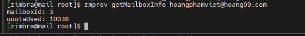
- ta thấy tài khoản có số id là 3 

- xem bảng mail_item trong cơ sở dữ liệu nhóm hộp thư, đặc biệt là các cột ngày, kích thước, người gửi và chủ đề
- 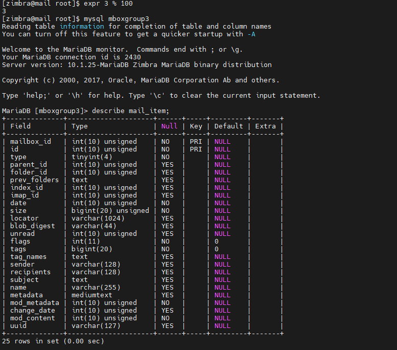

