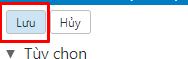

# I Cách tạo Whitelist / Blacklist trên Zimbra Webmail
- Đầu tiên ta đăng nhập vào zimbra
- 
- Ta chọn vào phần tùy chọn xong tiếp đến chọn vào thư
- 
- Ta kéo xuống dưới vào phần tùy chọn thư rác
- 
- Tại đây ta có 2 tùy chọn chặn và cho phép nhận từ các mail
- 
- Sau khi muốn chặn hoặc cho phép mail nào đó ta ghi tên và ấn thêm muốn bỏ thì chọn xóa . 
- Sau đó ta lưu lại để hoàn tất thay đổi 
- 

