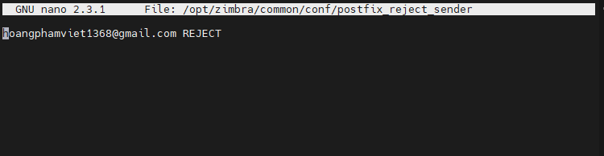

# Chặn mail
- Đầu tiên ta tạo 1 file chứa các mail , domail muốn chặn mail đến zimbra 
- nano /opt/zimbra/common/conf/postfix_reject_sender
- ta điền danh sách mail or domail muốn chặn với cấu trúc như trong hình 

- 
- zmprov ms mail.lmhlmh9x.xyz​​ +zimbraMtaSmtpdSenderRestrictions "check_sender_access lmdb:/opt/zimbra/common/conf/postfix_reject_sender"

- Câu lệnh này nghĩa là ta sẽ giới hạn người gửi , kiểm tra quyền truy cập đến mail.lmhlmh9x.xyz từ danh sách trong file postfix_reject_sender vừa tạo .
- /opt/zimbra/common/sbin/postmap /opt/zimbra/common/conf/postfix_reject_sender
- zmmtactl restart
- khởi động lại dịch vụ
-  zmprov ms mail.lmhlmh9x.xyz zimbraMtaSmtpdSenderRestrictions "actual_value, check_sender_access lmdb:/opt/zimbra/common/conf/postfix_reject_sender"
- Tiếp theo ta cấp quyền cho file chứa danh sách 
- 
- chown zimbra:zimbra /opt/zimbra/common/conf/postfix_reject_sender
- chmod 644 /opt/zimbra/common/conf/postfix_reject_sender
- ta chạy các quyền với tư cách là người dùng Zimbra.
- postmap /opt/zimbra/common/conf/postfix_reject_sender
- Sau đó ta khởi động lại các dịch vụ 
- 
- Ta sẽ tiến hành kiểm tra 
- 
- Ta viết 1 thư gửi đến mail của zimbra
- Ta thấy thông báo không gửi được thư
- 
