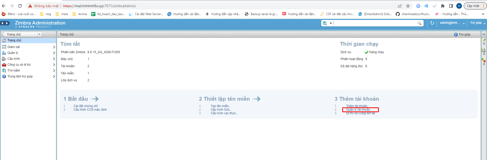
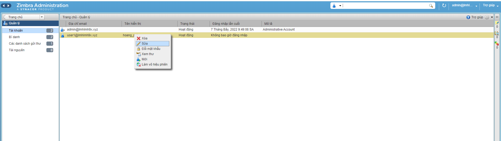
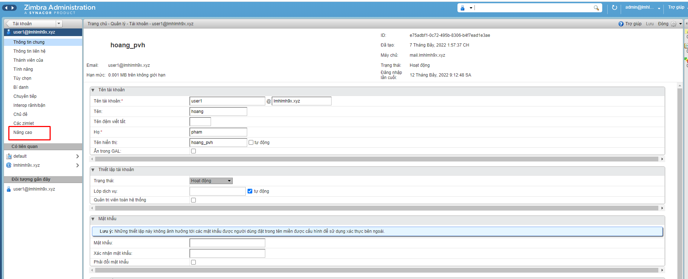
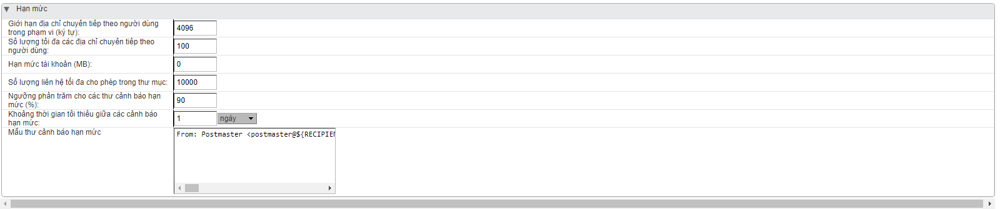

# I  Khi tạo một account email trong email server zimbra hệ thống sẽ tự động phân chia quota cho mỗi account theo mặc định. Trong thực tế việc thiết lập quota cho account khác nhau với giá trị khác nhau là cần thiết tùy thuộc vào nhu cầu sử dụng của account đó.
- Đầu tiên ta vào trang chủ -> phần quản lý tài khoản 
- 
- Chọn tài khoản muốn thay đổi quota , Click chọn chuột phải -> Sửa
- 
- Tại phần menu bên trái ta chọn tùy chọn nâng cao
- 
- Tại đây ta sẽ thay đổi các tùy chỉnh cho phù hợp với nhu cầu của tài khoản
- 
- Giới hạn địa chỉ chuyển tiếp theo người dùng trong phạm vi (ký tự)
- Số lượng tối đa các địa chỉ chuyển tiếp theo người dùng
- Hạn mức tài khoản (MB) (0 là không có giới hạn)
- Số lượng liên hệ tối đa cho phép trong thư mục
- Ngưỡng phần trăm cho các thư cảnh báo hạn mức (%)
- Khoảng thời gian tối thiểu giữa các cảnh báo hạn mức
- Mẫu thư cảnh báo hạn mức.
- Sau đó ta lưu các thay đổi và thành công.
