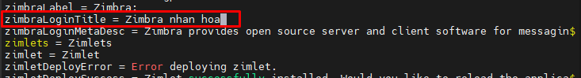
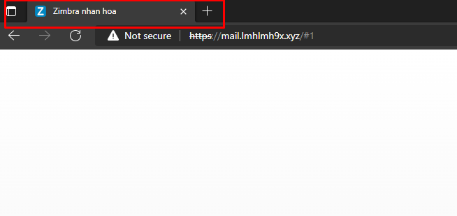
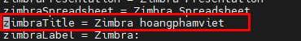
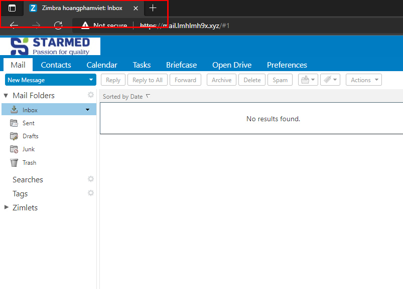

# Thay đổi title
## 1 Thay đổi title web login client
- Ta chỉnh sửa file /opt/zimbra/jetty/webapps/zimbra/WEB-INF/classes/messages/ZmMsg.properties
- nano /opt/zimbra/jetty/webapps/zimbra/WEB-INF/classes/messages/ZmMsg.properties. 
- Tìm từ zimbraLoginTitle ở dòng 3749 sửa giá trị thành title mong muốn (tiếng Anh hoặc tiếng Việt không dấu) .

- 
- Ta kiểm tra như trong ảnh là thành công
- 

## 2 Thay đổi title web mail client 
- Khi login vào giao diện web email để tiến thành gửi/nhận thư title trên thành trình duyệt sẽ hiển thị dạng Zimbra: bạn có thể chỉnh sửa theo ý muốn
-  Ta chỉnh sửa file /opt/zimbra/jetty/webapps/zimbra/WEB-INF/classes/messages/ZmMsg.properties
- nano /opt/zimbra/jetty/webapps/zimbra/WEB-INF/classes/messages/ZmMsg.properties.
- Tìm từ zimbraTitle ở dòng 3747 sửa giá trị thành title mong muốn (tiếng Anh hoặc tiếng Việt không dấu).
- 
- Ta kiểm tra lại 
- 

