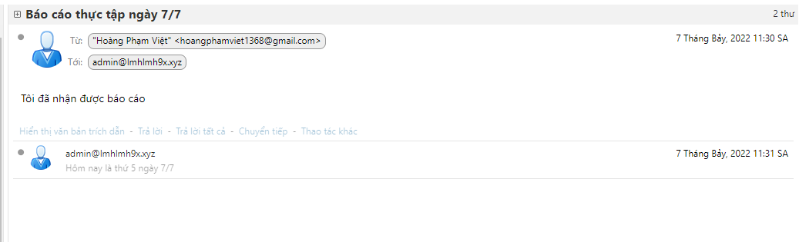

# I Kiểm tra dịch vụ zimbra đã được chạy
- service zimbra status

- 
- ta thấy tất cả các dịch vụ đều được chạy thành công
- Tiếp theo ta sẽ tạo ddaayaf đủ các bản ghi mx,ptr,sdf,dkim,dmarc
- Thêm bản ghi A: Tên mail loại bản A giá trị 103.28.38.97
- 
- Thêm bản ghi MX: Tên @ loại bản ghi MX giá trị mail.lmhlmh9x.xyz
- 
- Thêm bản ghi SPF: Tên @ loại bản ghi TXT giá trị v=spf1 mx ip4:103.28.38.97 include:spf.lmhlmh9x.xyz ~all
- 
- Thêm bản ghi DMARC : Tên  _dmarc loại bản ghi TXT với giá trị v=DMARC1;p=none;pct=100;rua=mailto:postmaster@lmhlmh9x.xyz
TTL:300
- 
- Tiếp theo với bản ghi DKIM các thông số lấy từ mail server
- Active dkim cho domain lmhlmh9x.xyz
- su - zimbra
- /opt/zimbra/libexec/zmdkimkeyutil -a -d lmhlmh9x.xyz
- 
- Get dkim record
- /opt/zimbra/libexec/zmdkimkeyutil -q -d lmhlmh9x.xyz
- 
- ta chú ý thông tin là tên bản ghi
- 
- loại bản ghi TXT với giá trị
- 
- Ta sẽ copy đoạn này và xóa hết những khoảng trắng
- 
- Ở đoạn này ta xóa khoảng trắng và cả 2 dấu " " để chúng nối lại với nhau\
- 
# II Kiểm tra cài đặt thành công
- Ta tiến hành gửi thư từ zimbra đến mail cá nhân

- 
- Kiểm tra gửi , ta thấy mail đã được gửi thành công
- 

- Kiểm tra nhận, ta gửi mail lại từ mail cá nhân

- 
 
- 
- Như vậy là đã thành công

