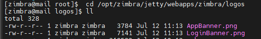
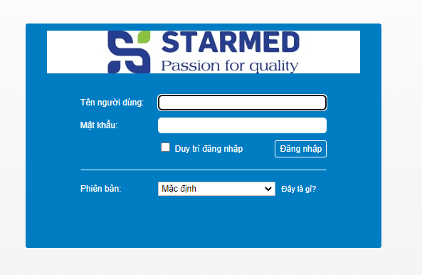
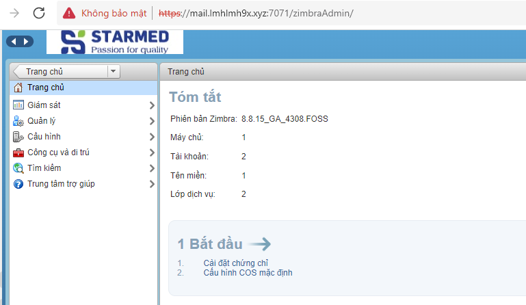

#  Ta tạo file lưu trữ logo
- mkdir /opt/zimbra/jetty/webapps/zimbra/logos/ 
- Ta chọn ảnh muốn làm logo cho vào thư mục logos
- 
- AppBanner.png: Logo bên trong giao diện đăng nhập
- LoginBanner.png: Logo bên ngoài màn hình đăng nhập
- Thay đổi logo
- zmprov md lmhlmh9x.xyz zimbraSkinLogoURL https://mail.lmhlmh9x.xyz
- zmprov md lmhlmh9x.xyz zimbraSkinLogoLoginBanner /logos/LoginBanner.png
- zmprov md lmhlmh9x.xyz zimbraSkinLogoAppBanner /logos/AppBanner.png
- zmmailboxdctl restart
- Kiểm tra kêt quả 
- 
- 
- Logo giao diện đã được đổi như này là thành công.

