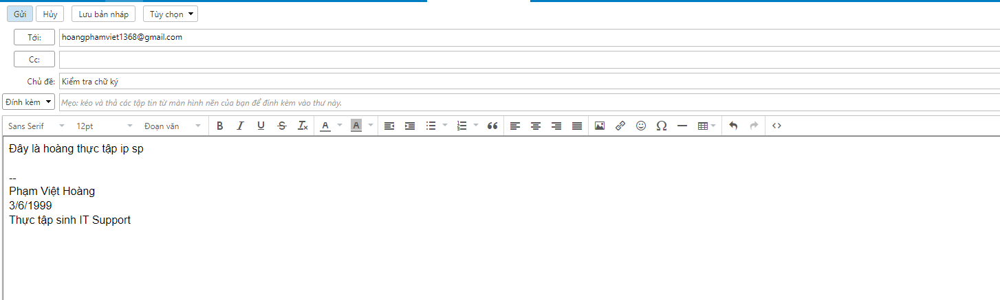

# I Thiết lập chữ kí
- Mặc định khi khởi tạo account email zimbra sẽ không thiết lập chữ ký, một số nhu cầu của các nhân, tổ chức về việc thiết lập chữ ký cho email, yêu cầu này có thể thực hiện được đối với các account email zimbra.

- Ta đăng nhập vào 1 user đã tạo 
- 

- Ta truy cập vào tùy chọn , vào phần chữ ký
- 
- Tại đây ta điền thông tin như tên chữ ký , nội dung, vị trí 
- 
- Thiết lập việc sử dụng chữ ký trong trường hợp nào: Trả lời thư mới, chuyển tiếp thư, hiển thị chữ ký ở vị trí trong thư => Lưu lại
- 
# II Kiểm tra sử dụng chữ ký
- Ta tiến hành gửi mail đến 1 mail cá nhân xem chữ ký được hoạt động  :
- 
- Mail gửi đi đã nhận chữ ký như hình thành công:
- 

