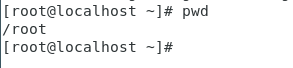
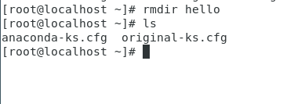
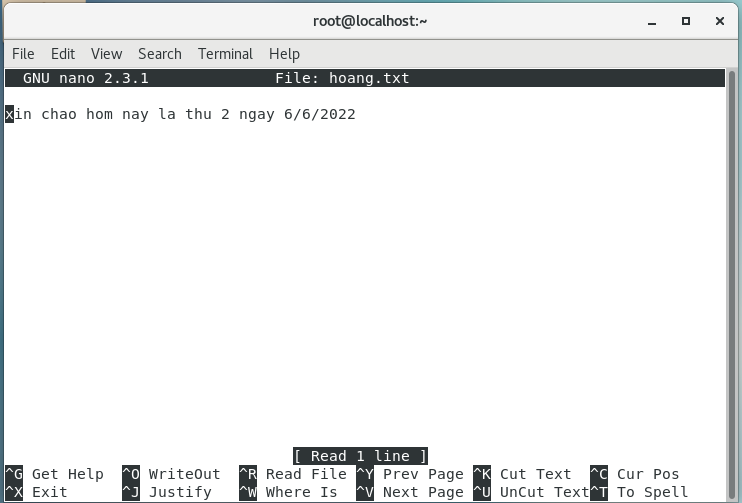
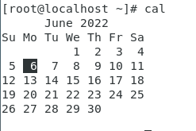

# Những lệnh liên quan đến hệ thống
## 1.exit : thoát khỏi cửa sổ dòng lệnh
## 2. reboot : khởi động lại hệ thống 
## 3. halt : tắt máy
+ phải ở quyền root
+ không nên dùng, bị treo máy
##  4. startx: khởi động chế độ xwindows từ cửa sổ terminal.
## 5.mount: gắn hệ thống tập tin từ một thiết bị lưu trữ vào cây thư mục chính.
## 6.unmount : ngược với lệnh mount
## 7. ps: kiểm tra tiến trình đang chạy

## 8. kill: dừng tiến trình khi tiến trình bị treo. Chỉ có người dùng super-user mới có thể dừng tất cả các tiến trình còn người dùng bình thường chỉ có thể dừng tiến trình mà mình tạo ra. 
## 9. top : xem các tiến trình đang chạy

 
 # Những lệnh thao tác lệnh với tập tin
 # 1.ls: lấy danh sách tất cả các file và thư mục trong thư mục hiện hành
 
 
 # 2.pwd : xuất đường dẫn của thư mục làm việc
  

# 3. cd : thay đổi mục làm việc đến một thư mục mới
# 4. mkdir : tạo thư mục mới
 

# 5. rmdir : xóa thư mục rỗng  
 

# 6. mv : đổi tên hay di chuyển tập tin, thư mục.
 
 

# 7. touch tạo tệp tin 
 

# 8. rm : xóa 1 tệp tin

 

# 9. nano : khởi động trình soạn thảo văn bản
 

# 10.cat: xem nội dung của tệp tin
 

# 11. date: xem ngày, giờ hệ thống.
 

# 12. cal: xem lịch hệ thống.
 
 

