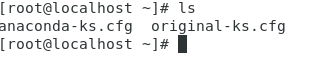
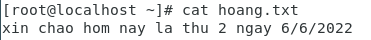
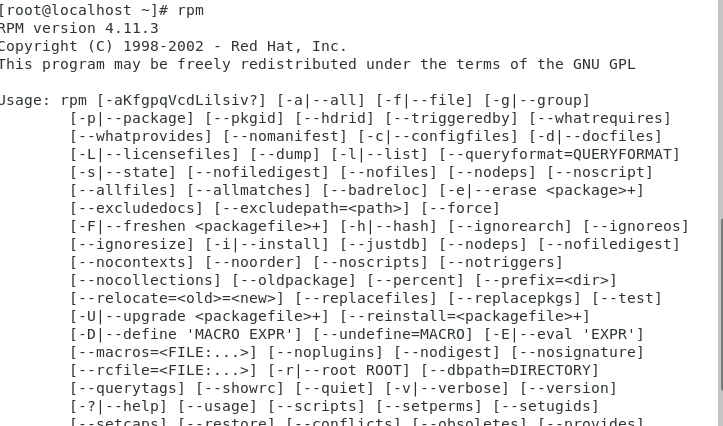

# I Những lệnh liên quan đến hệ thống
- exit : thoát khỏi cửa số dòng lệnh.
- logout: tương tự exit
- reboot : khởi động lại hệ thống
- halt : tắt máy
# II Lệnh thao tác trên thư mục ,tập tin
- ls : lấy danh sách các file và thư mục trong thư mục hiện hành
+ 
- pwd : xuất đường dẫn của thư mục làm việc
+ 
- cd: thay đổi thư mục làm việc đến một thư mục mới
- mkdir + tên thư mục : tạo thư mục mới
+ 
- rmdir : xóa thư mục
+ rmdir + tên thư mục : xóa thư mục rông
+ rm -r + tên thư mục : xóa thư mục chứa các thư mục con và tập tin (có xác nhận cho từng đối tượng)
+ rm -rf + tên thư mục: xóa thư mục chứa các thư mục con và tập tin (không cần xác nhận)
- cp : copy một hay nhiều tập tin đến thư mục mới
- mv : đổi tên hoặc di chuyển tập tin , thư mục
- touch + tên tập tin : tạo 1 tập tin
- nano + tên tập tin : khởi động trình soạn thảo văn bản nano
+ 
+ 
+
- cat + tên tập tin: xem nội dung của 1 tập tin
+ 
- rm : xóa tập tin
+ rm + tên tập tin: xóa 1 tập tin
+ rm + tên tập tin1 + tên tập tin2 : xóa nhiều tập tin
+ rm /a/b/tên tập tin : xóa theo đường dẫn
+ rm -i : xóa có xác nhận
+ rm -f : xóa không xác nhận

# III Lệnh khi làm việc trên terminal
- clear : xóa trắng cửa số dòng lệnh
- date : xem ngày giờ hệ thống
+ 
- cal : xem lịch hệ thống 
+ 
# III Lệnh quản lý hệ thống
- rpm: kiểm tra gói đã cài đặt hay chưa, hoặc cài đặt một gói, hoặc sử dụng để gỡ bỏ một gói.
+ 
- ps : kiểm tra hệ thống tiến trình đang chạy
+ 
+ PID : id của tiến trình
+ TTY : thông tin terminal mà người dùng đăng nhập
+ TIME : lượng CPU tình bằng phút giây mà tiến trình đó chạy
+ CMD : câu lệnh để thực hiện process đó
# IV các lệnh về quản lý user 
- useradd : tạo một người dùng mới
- passwd : cập nhập mật khẩu với user vừa tạo
+ 
- cat /etc/passwd : xem danh sách user
+ 
+ Mỗi hàng sẽ có 7 phần được ngăn cách nhau bởi dấu hai chấm
+ Tên tài khoản.
+ Mật khẩu đã được mã hóa (x có nghĩa là mật khẩu được lưu trong file /etc/shadow).
+ Số ID người dùng 
+ Số ID nhóm của người dùng 
+ Tên đầy đủ của người dùng 
+ Thư mục chính của người dùng.
+ Shell đăng nhập (mặc định là /bin/bash).
- userdel : xóa người dùng đã tạo
- groupadd : tạo một nhóm người dùng mới
- groupdel : xóa nhóm người dùng
-gpasswd : thay đổi mật khẩu cho người dùng

 

 

