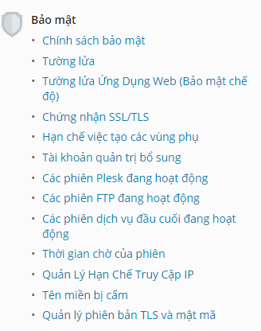
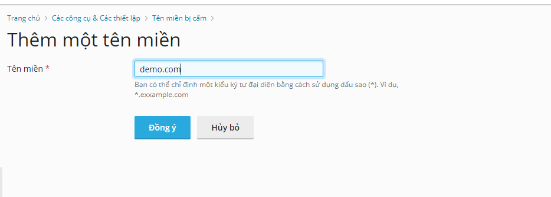

# Tìm hiểu về về plesk 
### Ta chuyển sang giao diện nhà cung cấp dịch vụ
- 

### Ta chọn trình quản lý máy chủ
- Các công cụ và các thiết lập
- 

- 

### Bảo mật

- 

### 1.1 Chính sách bảo mật

- 

- 

- Chính sách an toàn để tăng cường nó giúp bảo vệ nâng cao cho các dữ liệu nhạy cảm 

- FTP an toàn : Nó giúp ta có thể chọn các loại kết nối được cho phép.

- Độ mạnh mật khẩu: nó cho phép ta thay độ mạnh yếu của mật khẩu, sự phức tạp của mật khẩu.
- 

- Chính sách bộ xử lý tùy chỉnh : kích hoạt này để ngăn khách không ghi đè trình xử lý IIS được xác định ở cấp độ máy chủ thông qua tập tin web.config

- 

### 1.2 Tường lửa 
- Danh sách các giao diện mạng
- 
- Các quy tắc tường lửa cho giao thức ICMP
- 
- Các quy tắc tường lửa : ta quản lý tên các quy tắc , mô tả quy tắc đó.
- 
- Ta có thể chỉnh sửa quy tắc: 
- 
- Thêm các quy tắc
- 
- 
- Tên đặt tên quy tắc chọn các loại hồ sơ , chọn hồ sơ cho hoặc từ chối, chọn cổng để truy cập , giao thức TCP hoặc UDP, thêm địa chỉ IP .
### 1.3 Tường lửa cho web 

- 

- 

- 

- tại đây ta chọn hủy quy tắt bảo mật hạn chế với 1 số web .
- 
### 1.4 Hạn chế việc tạo ra các vùng phụ
- 

- 

- Tại đây, ta tiến hành các cài đặt cho hệ thống vd đặt tên miền ,tính toán dung lượng sử dụng không gian đĩa, lưu lương truy cập,.....
### 1.5 Tạo thêm tài khoản để quản trị
- 

- 

- 

### 1.6 Theo dõi các phiên Plesk , phiên FTP , các phiên dịch vụ đầu cuối đang hoạt động,...

- 
- 
- 
- 

### 1.7 Thời gian chờ của phiên

- 
- 

### 1.8 Quản lý hạn chế truy cập IP
- Ta có thêm các địa chỉ ip vào danh sách hạn chế

- 
- 

- tùy chỉnh các thiết lập cho phù hợp

- 
- 

### 1.9 Tên miền bị cấm

- 

- Chức năng này cho phép ta có thể quản lý danh sách các tên miền bị cấm.Khi ta bật chức năng này lên , người dùng sẽ không thể tạo các tên miền trong danh sách.
- 
- Ta có thể thêm tên miền vào danh sách

- 
- 
- tên miền sau khi thêm.

