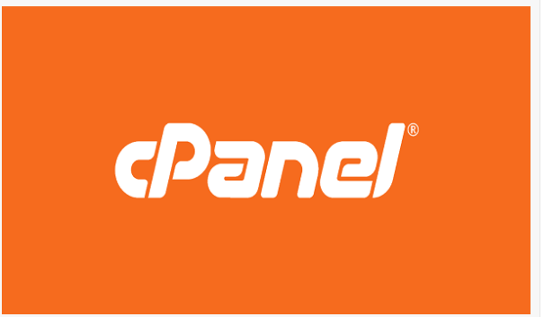

# I cPanel là gì ?
### - cPanel là hệ thống quản lý dành riêng cho Server lưu trữ Website. Phần mềm này cung cấp nhiều tính năng mạnh mẽ và tạo cho quản trị viên khả năng can thiệp sâu và chính xác hơn đối với các thiết lập quy định khả năng khai thác tài nguyên máy chủ.

# Các tính năng của cPanel
### - cPanel cung cấp hầu hết các tính năng quan trong nhà quản trị web. 1 số tính năng nổi bật :
- Cài đặt , quản lý ứng dụng: Người dùng có thể cài đặt ứng dụng, mã nguồn đơn giản và nhanh chóng (WordPress, Drupal, Joomla,…)
- Quản lý File: cPanel giúp tạo và quản lý tài khoản FTP, bảo mật thư mục, backup, thêm , sửa , xóa , nén, đổi tên ,... các tập tin.
- Quản lý Domain : cPanel giúp thêm, sửa , xóa, chuyển hướng, tạo Subdomain,...
- Quản lý cơ sở dữ liệu: hỗ trợ tích hợp phpMyAdmin, hỗ trợ tạo và quản lý Database 
MySQL và PostgreSQL.
- Bảo mật : quản lý SSL/TLS, quản lý truy cập SSH đến server và Whitelist/Blacklist truy cập.
- Thống kê và Logs

#  Ưu điểm và nhược điểm 
## Ưu điểm

- Dễ dàng sử dụng : cPanel có giao diện đơn giản và tài liệu hướng dẫn trên màn hình.Dễ dàng tiếp cận với người mới. cPanel còn có khả năng tự theo dõi, phát hiện dịch vụ gặp sự cố để khởi động lại dịch vụ đó.
- Phản hồi nhanh chóng:
nhanh chóng phản hồi với người dùng. Trong thiết kế File Manager, phần mềm này cho phép người dùng upload, sửa, thêm, xóa,… nhanh chóng, dễ dàng trên host.
- Tính bảo mật cao và công nghệ tiên tiến : phần mềm này có khả năng tự cập nhật, update những công nghệ hiện đại sớm nhất 
- cPanel có thể chạy trên cả điện thoại di động: cPanel có thể chạy trên cả di động, cho nên, quản trị hệ thống có thể quản lý WHM và cPanel qua điện thoại di động

## Nhược điểm 

- cPanel có nhiều tính năng không cần thiết gây lãng phí tài nguyên.
- cPanel không đính kèm trong các gói Hosting miễn phí, nếu muốn sử dụng chương trình này thì người dùng phải đầu tư tài chính.

