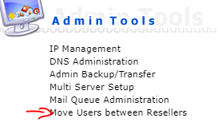
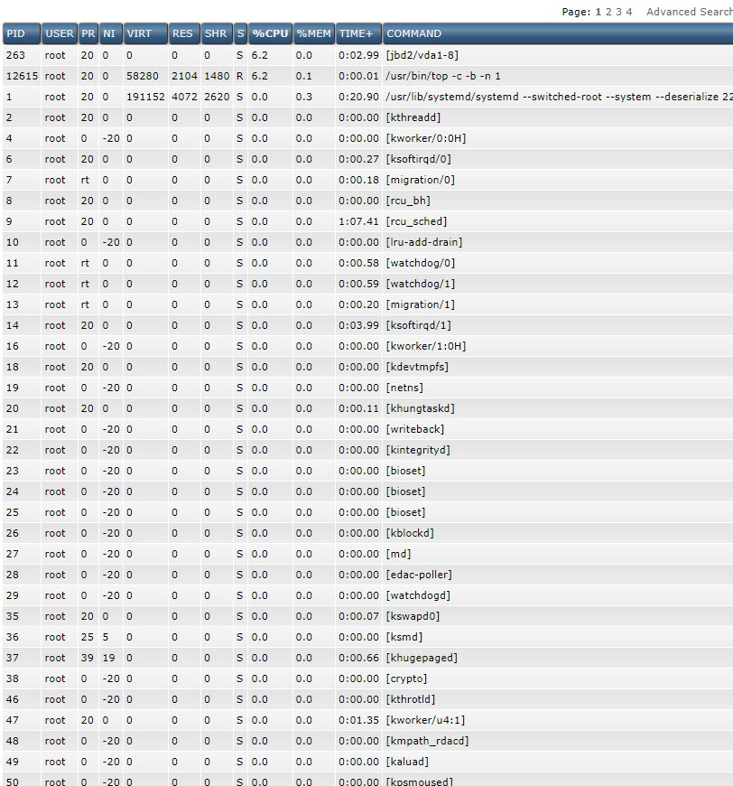

# I DirectAdmin là gì ?
### DirectAdmin là 1 trong những bản điều khiển (hay còn gọi control panel) dành cho những người quản trị web hosting được sử dụng phổ biến hiện nay với giao diện đơn giản, trực quan , dễ dàng sử dụng. 
###  DirectAdmin cung cấp cho người dùng nhiều tính năng như quản lý domain, subdomain, DNS, FTP, cơ sở dữ liệu, tạo email theo tên miền , tạo SSH key, bảo mật SSL,..., dễ dàng upload và quản lý các file với File Manager .

### DirectAdmin chạy tốt trong Linux và các bản phân phối chính của nó CentOS, Ubuntu, Debian, Red Hat,.... Hệ điều hành dựa trên Windows sẽ không được hỗ trợ.

# Ưu điểm và Nhược điểm
### Ưu điểm 
- Giao diện trực quan , sử dụng dễ dàng 
- Gói đăng ký giả cả phù hợp.
- Hỗ trợ : Ngoài sự hộ trỡ của nhà cung cấp dịch vụ lưu trữ, bạn có thể nhận được sự trợ giúp trực tiếp của kỹ thuật của  DirectAdmin
- Tính ổn định, phục hồi sự cố tự động
- Tốc độ xử lý nhanh , ít tiêu tốn tài nguyên
- Hỗ trợ nhiều phân cấp user
- Manual configuration: Directmin admin cung cấp hầu hết tính năng thông qua giao diện website, nhưng người dùng cũng có thể config thủ công bằng cách sử dụng command line.
### Nhược điểm
- Khả năng thêm các chức năng: các tính năng còn hạn chế so với các phần mềm khác
- Khả năng chỉnh sửa file: DirectAdmin không tương thích với dòng font unicode nên rất khó để sửa khi file sử dụng các ngôn ngữ không phải là tiếng Anh.
- Cộng đồng người dùng ít: Bạn sẽ khó tìm được các câu trả lời hướng dẫn cho DirectAdmin khi gặp một vấn đề nâng cao, khó khăn nào đó vì không có quá nhiều cộng động sử dụng DirectAdmin.
- Giao diện khá nâng cao với người dùng: Người dùng mới có thể gặp khó khăn trong việc tìm kiếm tính năng cần sử dụng. Directadmin được phân chia thành nhiều cấp, và nó mất thời gian để xác định vị trí tính năng mình cần.

# II Tìm hiểu về các chức năng của DirectAdmin
### Các chức năng của Admin 

- 

- Access Level tại cấp độ truy cập ta chọn vào cấp độ Admin

###  1. Server Management
### 1.1 Create Admin :
- Tạo thêm tài khoản admin mới
- 
- Ta sẽ điền các thông tin như tài khoản, mật khẩu , mail  sau đó ấn submit để tạo
- 
- Sau đó ta thấy tài khoản được tạo thành công
- 
- Ta có thể xem danh sách tài khoản đã tạo.
- 
- 
- Ta có thể xem các thông số tài nguyên của tài khoản.
- 
- Ta xem được các thông tin tài nguyên như : băng thông , dung lượng ổ đĩa, tên miền, tài khoản người dùng,mail,....
- 
- Chức năng modify ta sẽ cấu hình tài nguyên của tài khoản:
- 
- 
- Sau khi cấu hình xong ta ấn save để lưu.
- Xóa tài khoản 
- 
- Xem tài nguyên , dữ liệu tài khoản đã sử dụng
- 
- 
- Suspended(cấm) tài khoản
- 
- Tại chế độ select ta chọn tài khoản muốn suspended, reason chọn lý do và ấn suspend
- 
- 
- Thay đổi mật khẩu 
- 
- Điền thông tin tài khoản , mật khẩu mới muốn đổi.
- 
- Quản lý các ticket
- 
- 
- Quản lý các tài khoản đại lý 
- 
- Trước muốn tạo tài khoản đại lý ta phải tạo các gói Manage Reseller Packages 
- 
- Tùy chỉnh cấu hình các gói tài nguyên cho đại lý rồi ta chọn save để lưu lại.
- 
- 
- Tạo tài khoản đại lý điền đầy đủ các thông tin tài khoản, email, mật khẩu, domain, chọn gói tài nguyên
- 
- 
###  2. Admin Tools
- 
- IP Management thêm địa chỉ IP
- 
- 
- DNS Administration quản lý các bản ghi
- 
- Ta thấy được các domain trong server , nhấn vào domain bất kì ta có thể chỉnh sửa được các bản ghi của domain đó.
- 
- vd ta thêm bản ghi a 
- 
- 
- Move Users between Resellers di chuyển các tài khoản người dùng với các đại lý
- 
- 
- System Information xem các thông tin hệ thống bao gồm : tổng bộ nhớ, các phiên bản đang được chạy, tốc độ xử lý,....
- 
- Service Monitor dịch vụ giám sát, các dịch vụ đang được chạy , trạng thái, bộ nhớ sử dụng, ta có thể bật , tắt , khởi động lại các dịch vụ 
- 
- Log viewer xem các file lỗi các phần mềm , dịch vụ trong hệ thống 
- 
- File Editor chỉnh sửa trực tiếp các file cấu hình
- 
- Process Monitor theo dõi các tiến trình.
- 
###  3. Extra Features
- 
- Complete Usage Statistics xem thống kế chi tiết băng thông , ổ đĩa sử dụng,...
- 
- Custom HTTPD Configurations xem và chỉnh sửa file cấu hình vhost 
- 
- 
- PHP Configuration cấu hình PHP
- 
- Brute Force Monitor
 theo dõi các ip đăng nhập vào tài khoản quản trị số lần đăng nhập thất bại.
- 
- ConfigServer Security & Firewall cấu hình và chức năng sử dụng tường lửa
- 
- 
- 
- Tại đây ta có thể sử dụng các chức năng của tường lửa csf , cấu hình,... thực hiện trực tiếp trên giao diện ...
- Administrator Settings tùy chỉnh thông tin admin, cài đặt quản trị viên: thông báo cho các quản trị viên khi có dịch vụ gặp sự cố,...Cài đặt máy chủ: tên máy chủ, thời gian chờ,...bảo vệ khôi phục mật khẩu bị mất tự động, các danh sách ip bị chặn, xóa ip ra khỏi danh sách, email giới hạn mail hàng ngày có mỗi người dùng,....
- 
- 
- Licensing / Updates thông tin giấy phép,..
- 
- Plugin Manager
- 

 

