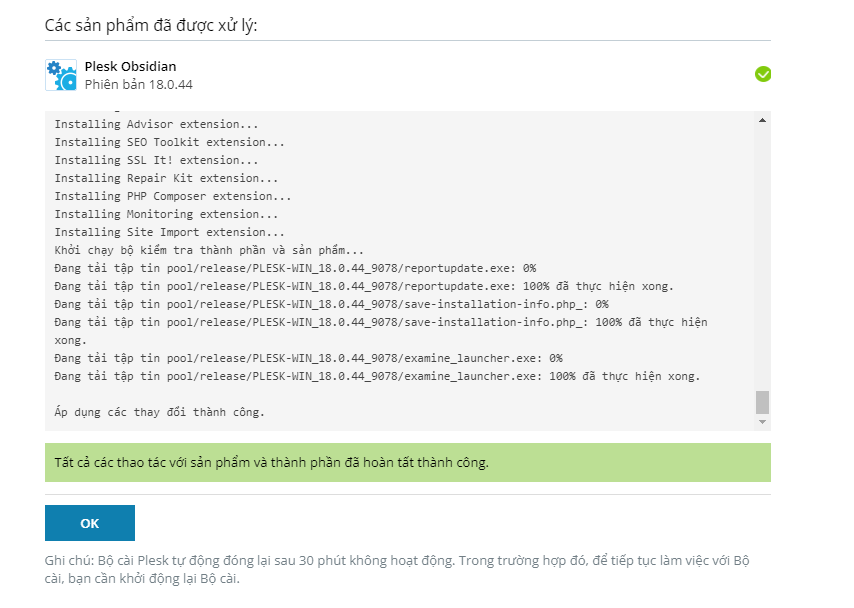

# Tìm hiểu về Plesk 
## Plesk là gì ?
### - Plesk là một phần mềm quản lý hosting trên windows và linux, hỗ trợ các dịch vụ về website , tên miền (domain), cơ sở dữ liệu, email, DNS,...

## Ưu điểm và nhược điểm 

### Ưu điểm 
- Dễ dàng sử dụng trên cả hai nền tảng hệ điều hành window và linux.
- Có độ ổn định và tin cậy cao
- Có đầy đủ các tính năng hữu ích từ cơ bản đến nâng cao, hỗ trợ việc quản lý hosting và website.
- Giao diện đơn giản , thân thiện với người dùng.
- Tính linh hoạt và tiện dụng cao. Phần mềm Plesk là hệ thống quản lý hosting  có tích hợp thiết kế web , thanh toán tự động và giao diện storefront SaaS.
- Dễ dàng thiết lập nhiều hosting cùng 1 lúc dễ dàng dựa trên cấu hình định sẵn.
- Có thể tạo ra nhiều tài khoản FTP kết hợp với cấu trúc web linh hoạt.

### Nhược điểm
- Mối lo ngại về bảo mật: Mặc dù Plesk đã làm rất tốt trong việc tiếp nhận và sửa chữa các lỗ hổng bảo mật , nhưng điểm mấu chốt là có 1 lịch sử lo ngại về bảo mật.
- Vấn đề sao lưu và khôi phục: Plesk làm tốt hơn nhiều thứ so với các đối thủ cạnh tranh nhưng lại thua ở các chức năng quan trọng này. Tùy chọn sao lưu và khôi phục cần nhiều dung lượng đĩa trống và hầu hết các trường hợp thì các tệp lớn phải được chuyển sang máy chủ phụ.
- Phức tạp: Không giống như Cpanel , việc cài đặt các tập lệnh không phải là dễ dàng. Do đó đối với người mới có thể gặp chút khó khăn cần làm quen.

# II Cài đặt Plesk trên windows server

### B1 tải bộ cài đặt tự động trên trang “http://autoinstall-win.pp.parallels.com/plesk-installer.exe”

### B2 mở file  “plesk-installer” vừa được tải về ở trên và chạy file cài đặt.

### B3 hệ thống sẽ tự mở trang web cài đặt Plesk hoặc ta có thể truy cập trực tiếp “http://localhost:8447” để vào trang cài đặt, sau đó ta nhập thông tin tài khoản mật khẩu để đăng nhập.

### B4 Chọn cài đặt hoặc gỡ bỏ Plesk , chọn khởi tạo mật khẩu cho trình cài đặt

### B5 Sau đó ta tiến hành cài đặt , rồi ấn ok hoàn tất

### B6 Sau đó ta đăng nhập vào hệ thống, điền 1 số thông tin

### B7 Sau khi hoàn tất , ta thấy giao diện như sau

# III Một số thao tác chức năng của Plesk

### 1 Thêm người dùng

- Tại giao diện ta chọn vào người dùng

- Chọn tạo người dùng

- Điền thông tin cho tài khoản

- Ấn đồng ý để xác nhận

- Ta thấy tài khoản sẽ được tạo thành công

### 2 Thêm tên miền, tạo 1 trang web

- Ta chọn vào trang web và tên miền

- Chọn vào thêm miền

- Lựa chọn 1 trong 5 phương pháp tạo trang web , ở đây ta lựa chọn tạo trang với wordpress

- Chọn tên miền tạm thời nếu chưa có tên miền đăng ký và chọn thêm tên miền

- Đợi quá trình cài đặt diễn ra

- Chọn cài đặt

- Sau đó ta xem được trang wp vừa tạo

