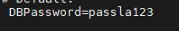

# Cài đặt zabbix
- Bước chuẩn bị:
- sudo systemctl disable firewalld
- sudo systemctl stop firewalld
- sed -i 's/SELINUX=enforcing/SELINUX=disabled/g' /etc/sysconfig/selinux
- sudo setenforce 0
- Cài đặt database và 1 số gói phụ trợ :
- yum update -y
- yum install php php-devel php-bcmath php-pear php-gd php-mbstring php-mysql php-xml -y
- Cài đặt MySQL 5.6
- yum install wget
- wget http://repo.mysql.com/mysql-community-release-el7-5.noarch.rpm
- rpm -ivh mysql-community-release-el7-5.noarch.rpm
- yum install mysql-server -y
- systemctl start mysqld
- systemctl enable mysqld
- đặng nhập vào mysql
- mysql -u root -p
- Tạo database và phần quyền : 
- create database zabbix character set utf8 collate utf8_bin;
- Tạo user và pass 
-  grant all privileges on zabbix.* to zabbix@localhost identified by 'passla123';

- flush privileges;

- exit;
- Cài đặt gói Zabbix cần thiết:
- rpm -Uvh https://repo.zabbix.com/zabbix/4.4/rhel/7/x86_64/zabbix-release-4.4-1.el7.noarch.rpm
- yum install zabbix-server-mysql -y
- yum install zabbix-web-mysql -y
-  Import database Zabbix  : 
- zcat /usr/share/doc/zabbix-server-mysql*/create.sql.gz | mysql -uzabbix -p zabbix
-  Config database trong file /etc/zabbix/zabbix_server.conf
- nano /etc/zabbix/zabbix_server.conf
- /etc/zabbix/zabbix_server.conf
- Sau đó ta chỉnh lại các cấu hình như trong hình DBHost=localhost DBName=zabbix, DBUser=zabbix, DBPassword=passla123
- 
- 
- 
- 
- Cấu hình PHP cho Zabbix:
- nano /etc/httpd/conf.d/zabbix.conf
- Điền vào giá trị Timezone phù hợp với khu vực của bạn
- 
- Khởi động lại dịch vụ:
- systemctl restart zabbix-server
- systemctl restart httpd
- systemctl enable zabbix-server httpd
- Truy cập vào địa chỉ http://<IP_Zabbix_Server>/zabbix/

- 
- Ta chọn Next Step, điền thông tin cần thiết database
- 
- 
- 
- 

- Sau khi hoàn tất ta tiền hành đăng nhập với tài khoản admin mặc định của zabbix: 
Admin / zabbix
- Giao diện của zabbix
- 
