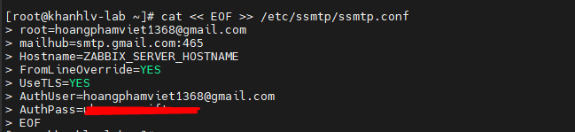
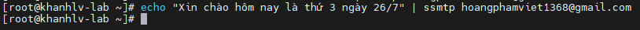
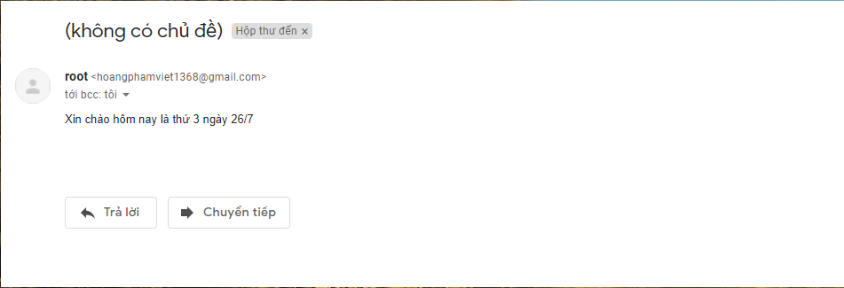
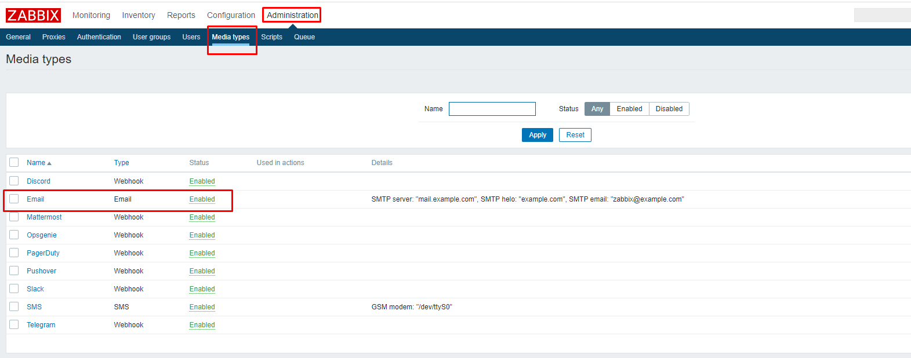
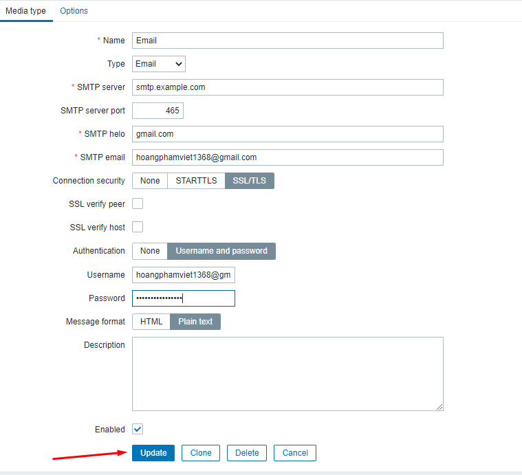
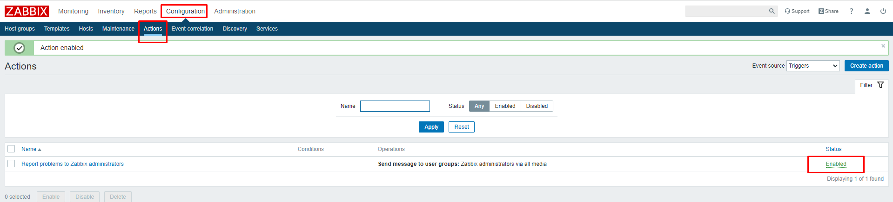
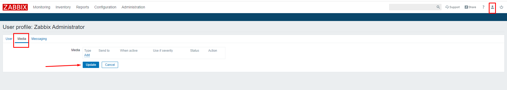
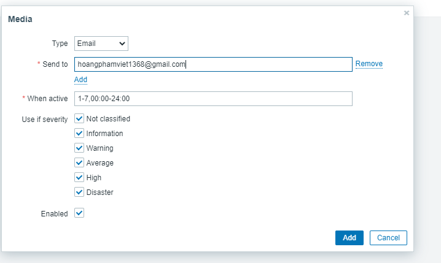
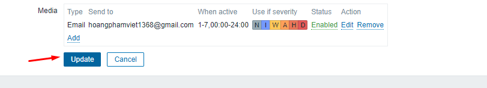
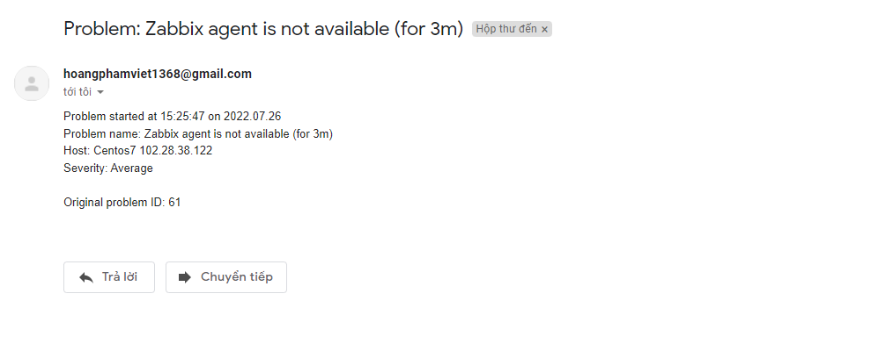

# Cấu hình zabbix gửi cảnh báo qua mail
## Việc gửi cảnh báo tình trạng của hệ thống là một điều không thể thiếu với mỗi công cụ monitor hiện nay. Chúng ta có rất nhiều hình thức để gửi cảnh báo qua các phương tiện truyền thông và email là một trong số những phương tiện truyền thông phổ biến nhất.
## Cài đặt 
- Đầu tiên ta sẽ cài đặt SSMTP ( SSMTP là một phần mềm nhỏ gọn giúp phân phối email từ local tới bất kì địa chỉ mail nào ở bên ngoài.)
- Cài đặt phần mềm SSMTP:
- sudo yum update -y
- sudo yum install ssmtp mailx -y

- Cấu hình các tham số SSMTP
- Ta thêm các tham số như sau vào trong file cấu hình SSMTP như trong hình 
- 

- Bật tính năng cho phép các truy cập kém an toàn ( vì google không cho phép bật chức năng này nữa nên ta sẽ phải cài đặt thêm mật khẩu ứng dụng mới dùng được chức năng truy cập kém an toàn)
- Test thử gửi mail bằng dịch vụ SSMTP : 
- echo "Xin chào hôm nay là thứ 3 ngày 26/7" | ssmtp <GMAIL_ADDRESS>
- 
- Ta kiểm tra 
- 
- Cấu hình trên Zabbix Server
- Sau khi đã cấu hình xong dịch vụ SSMTP, ta tiến tới cấu hình trên Zabbix Web
- Đăng nhập vào Zabbix Web
- Ta truy cập các tùy chọn như trong hình : 
- 
- Tiến hành cấu hình mail cảnh báo như hình
- 
- Sau đó chọn update
- Enable Config Action
- 
- Ta tiến hành thêm user
- 
- 
- Sau khi add ta ấn update
- 
- Ta tiến hành add thêm host vào zabbix server , máy chủ sẽ cảnh báo về mail 
- 
- 

