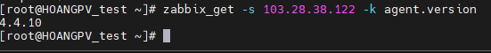
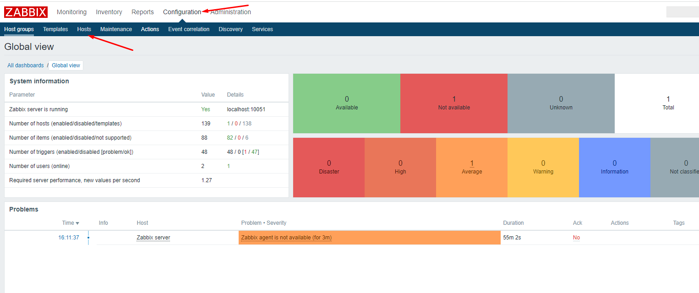
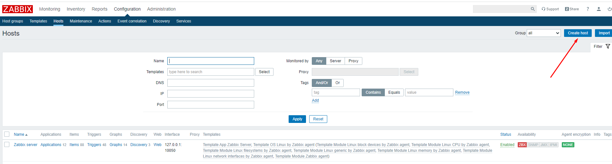
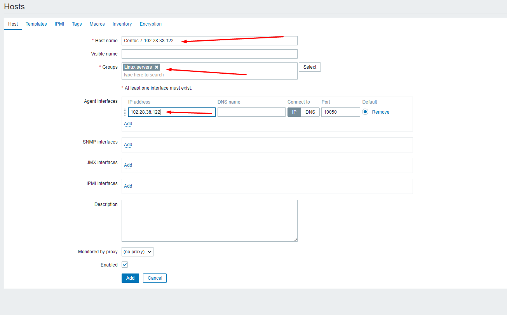
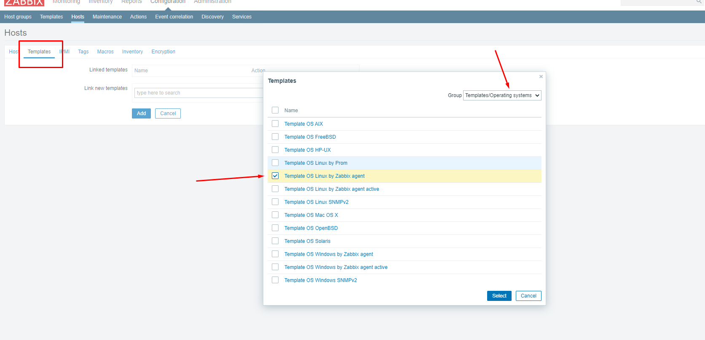
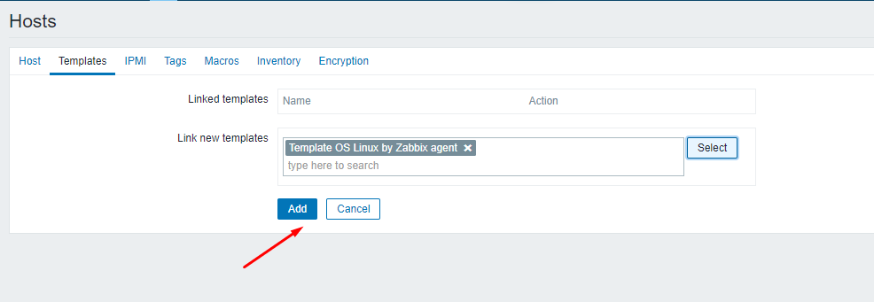
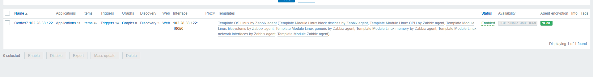

# Giám sát server CentOS 7 bằng zabbix-agent
- Trong hệ thống thực tế việc giám sát hệ thống hay monitor là rất cần thiết. Để hỗ trợ việc giám sát này, Zabbix đã phát triển phần mềm agent trên các nền tảng OS và trong đó CentOS 7 là một trong những nền tảng được hỗ trợ.
- Tải về Zabbix-Agent:
- rpm -Uvh https://repo.zabbix.com/zabbix/4.4/rhel/7/x86_64/zabbix-agent-4.4.0-1.el7.x86_64.rpm
- Cài đặt:
- yum install zabbix-agent -y
- Cấu hình Zabbix-Agent:
- Sửa lại file cấu hình /etc/zabbix/zabbix_agentd.conf theo các tham số sau:
- Server=103.28.38.122
- ServerActive=103.28.38.122
- Cấu hình firewalld
- firewall-cmd --zone=public --add-port=10050/tcp --permanent
- firewall-cmd --reload
- Khởi động lại dịch vụ:
- systemctl enable zabbix-agent
- systemctl restart zabbix-agent
- Kiểm tra cài đặt 
- 
- Thêm host CentOS7 lên Zabbix-Server:
- Bước 1: Đăng nhập vào dashboard Zabbix-Server
- Configuration -> Host
- 
- Trong màn Configuration, ta chọn Create Host:
- 
- Điền các thông tin như tên, địa chỉ ip, nhóm
- 
- Trong tab Template, ta chọn template để gán cho host cần giám sát. Ở đây CentOS ta chọn Template OS Linux.
- Ta chọn Template như trong hình 
- 
- Sau đó ta ấn add
- 
- Như vậy ta thêm host thành công
- 

