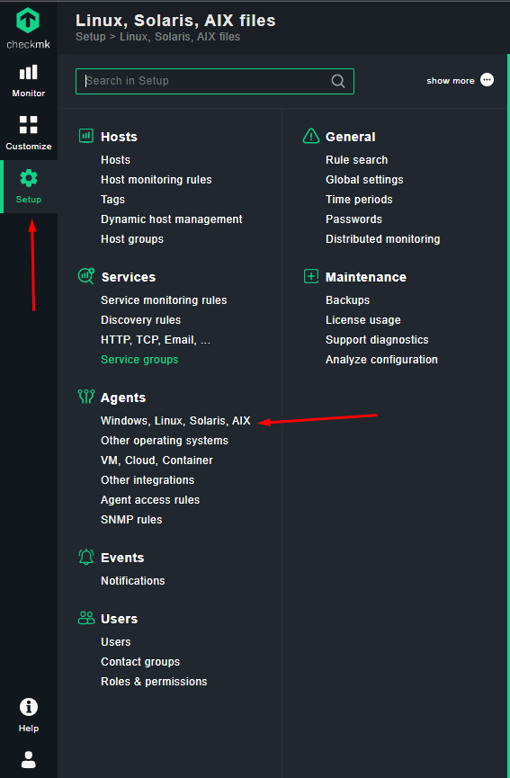
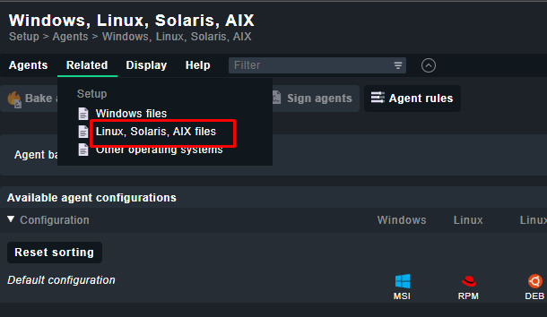
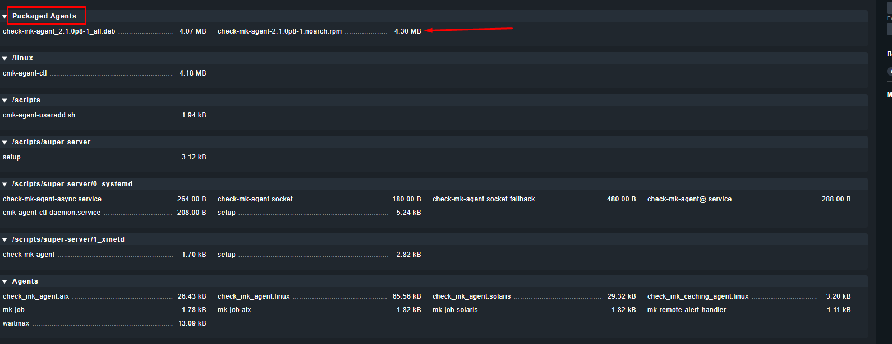

# Ta cài đặt agent trên máy chủ cần giám sát để thu thập những metrics (số liệu) về checkmk servers.
- Đầu tiên ta vào giao diện web
truy cập như trong hình 
- 
- Tiếp theo đó ta vào mục Related chọn Linux,Solaris, AIX files
- 
- Tại phần Packaged Agents ta sẽ tải gói check-mk-agent ta sẽ tải bản có đuôi .rpm dành cho các host sử dụng RHEL
- 
