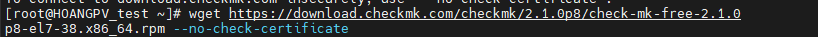
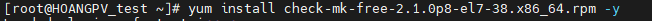
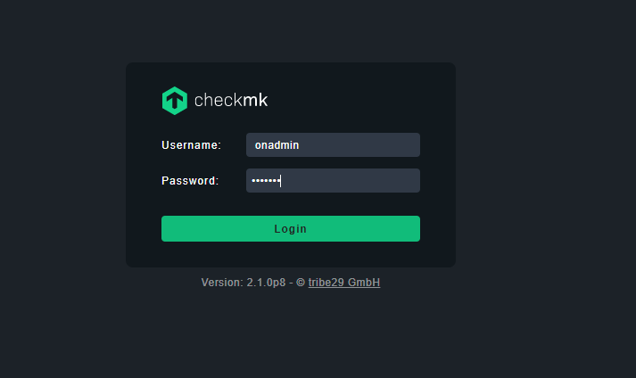
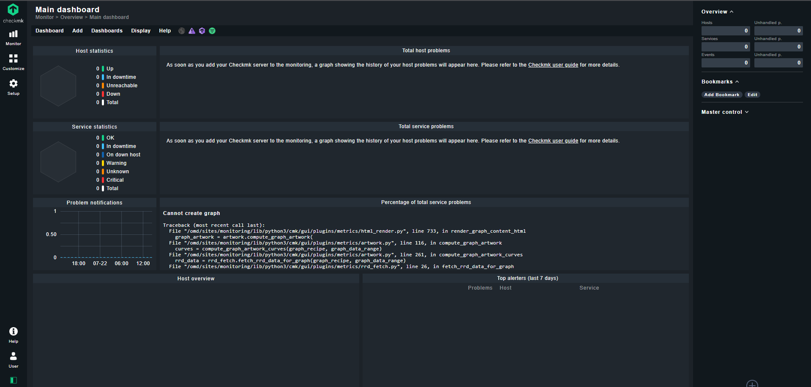

# Các bước cài đặt 
- Cài đặt gói wget
- yum install wget -y
- Khai báo repo
- yum install epel-release -y
- Sử dụng wget để download check_mk
- 
- Sau khi tải xong ta tiến hành cài đặt

- 
- Mở port 80 để sử dụng dịch vụ httpd:
- firewall-cmd --permanent --add-port=80/tcp
- firewall-cmd --reload
- Tắt selinux
- setenforce 0 
- Tạo và khởi động site:
- omd create monitoring
- omd start monitoring
- Đặt mật khẩu cho site
- su - monitoring
- htpasswd -m ~/etc/htpasswd omdadmin
-  Ta tiến hành truy cập vào web và đăng nhập tài khoản để kiểm tra :
- http://103.28.38.122/monitoring/check_mk/login.py
- 
- 
- 

