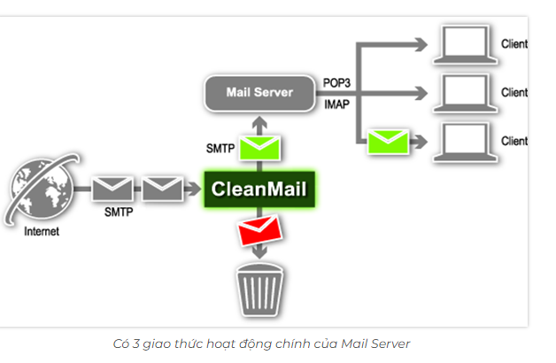

# I Mail server là gì?
## 1 . Mail server là gì?
- Mail Server là hệ thống máy chủ được cấu hình riêng theo tên miền của doanh nghiệp để gửi và nhận mail.
- Bên cạnh tính năng lưu trữ và sắp xếp các Email trên internet , mail server là một giao thức chuyên để giao tiếp thư tín, quản lý và truyền thông nội bộ, giao dịch thương mại,...
- Không chỉ thao tác với tốc độ nhanh chóng và ổn định, nó còn đảm bảo tính an toàn với khả năng khôi phục dữ liệu cao.

## 2. Các thức hoạt động 

- Mail server hoạt động dựa trên 3 giao thức cơ bản :

- Outgoing Mail Server hay  Mail Server gửi đi  sử dụng giao thức SMTP (Simple Mail Transfer Protocol). Đây là giao thức dịch chuyển mail đơn giản được dùng liên lạc với server từ xa. Đồng thời cho phép gửi nhiều thư cùng 1 lúc tới các server khác.
- Incoming Mail server 
+ Giao thức này còn được biết đến 2 hình thức:
+ POP3 (Post Office Protocol phiên bản 3) chuyển email tới lưu ở máy tính chứa Mail Client, là nội bộ máy tính của người dùng thông qua 1 ứng dụng email như Outlook, Mac Mail, Windows Mail…
+ IMAP (Internet Message Access Protocol) là phương thức phức tạp hơn cho phép nhiều  client cùng lúc kết nối tới một mailbox. Email từ mailbox sẽ được sao chép tới máy client và bản gốc của email vẫn sẽ được lưu trên mail server.
## 3. Tính năng nổi bật của mail server

- Cho phép người dùng khi gửi email hay nhận mail có thể thông qua interner trực tiếp với những tên miền cụ thể của từng tổ chức.
- Hạn chế tối đa các thư spam hoặc chứa virus. 
- Đảm bảo sự bảo mật thông tin nội bộ 1 cách chặt chẽ.
- Có thể thiết lập dung lượng tối đa cho từng người dùng mail server.
- Quản lý được toàn bộ nội dung mail của tất cả các thành viên thuộc hệ thống.
- Thiết lập được chức năng saoo lưu dữ liệu tự động. Đảm bảo thông tin cần thiết luôn tồn tại.
## 4. Các loại mail server
- Mail server Microsoft và google là 2 đại diện lớn cho dịch vụ này. Nền tảng xây dựng loại server mail này có quy mô lớn, hệ thống bảo mật chặt chẽ.Có thể quản lý tốt những dữ liệu hiện có.Người dùng có thể sử dụng được nhiều tiện ích khác nhau.
- Mail server độc lập là hệ thống mail server được thiết kế cho các tổ chức hoặc ISP xử lý khối lượng thư lớn, yêu cầu kiểm soát và linh hoạt hơn đối với các dịch vụ thư. Nó bổ sung các tính năng như hợp tác, đồng bộ hóa OUTLOOK , quản trị từ xa, Webmail và quản trị web nâng cao hơn và kết nối cơ sở dữ liệu, cung cấp cho bạn sức mạnh và kiểm soát cần thiết cho các hoạt động quy mô lớn.