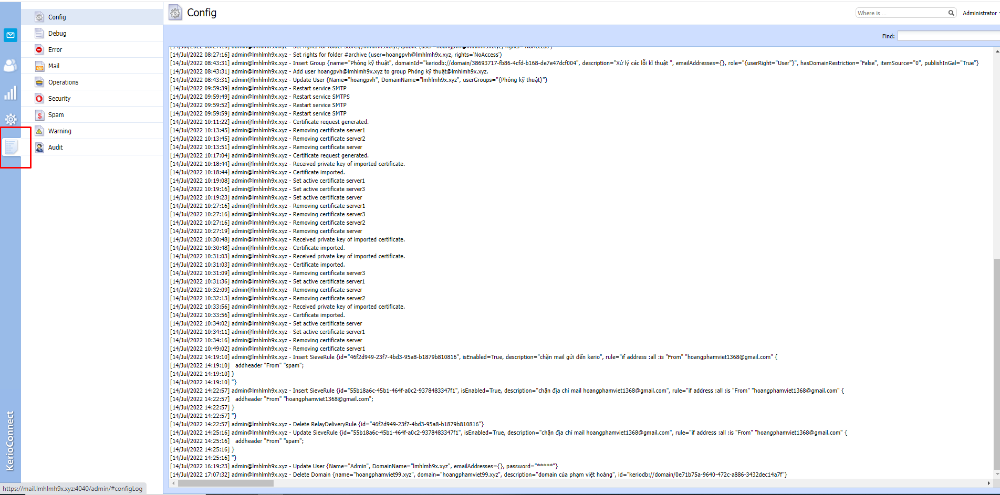
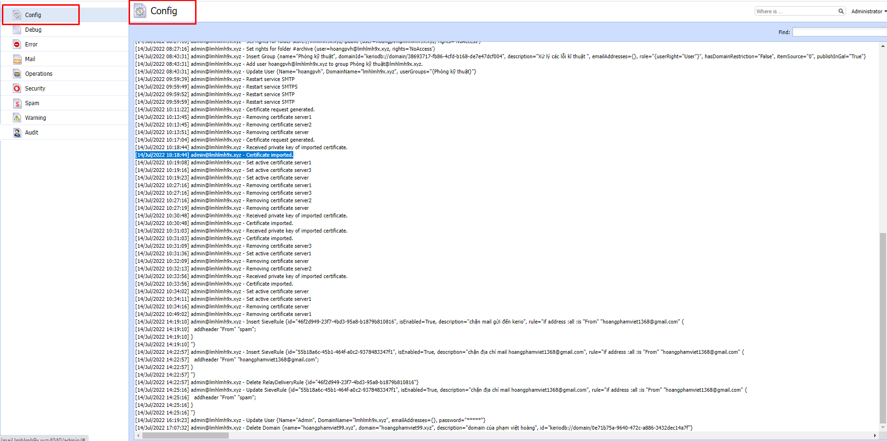
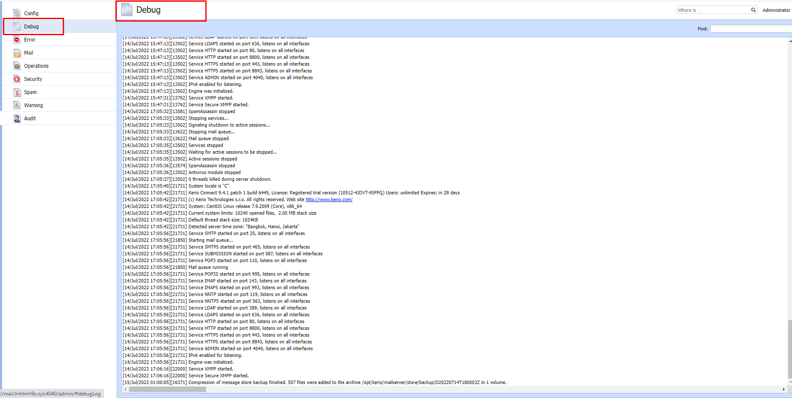
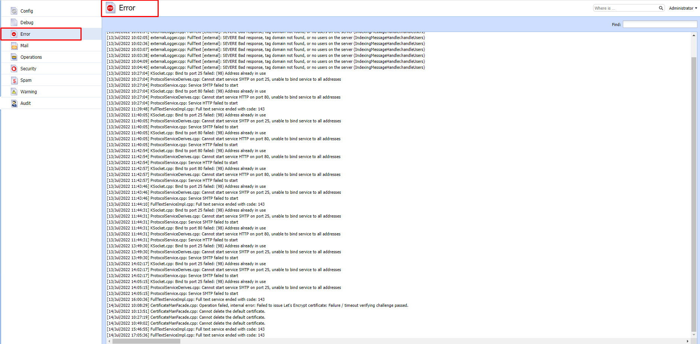
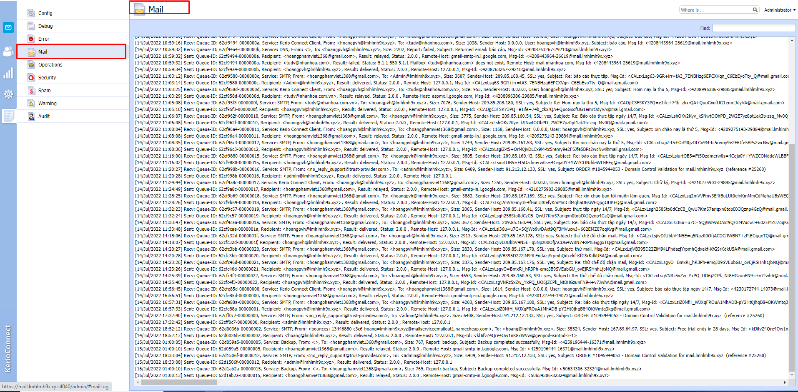
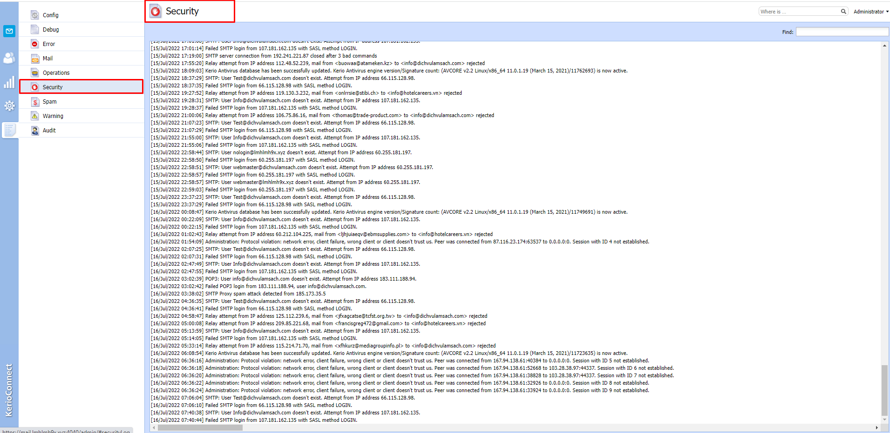
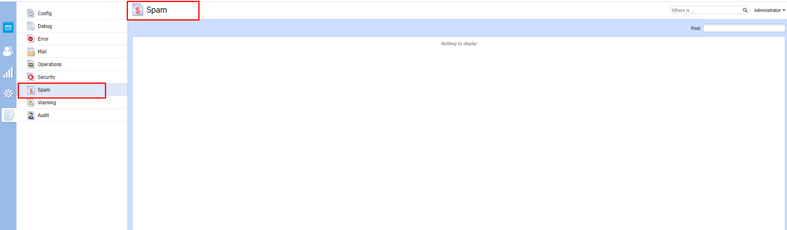
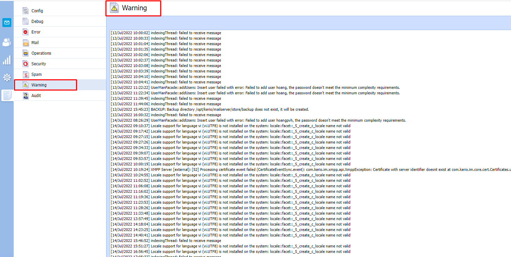
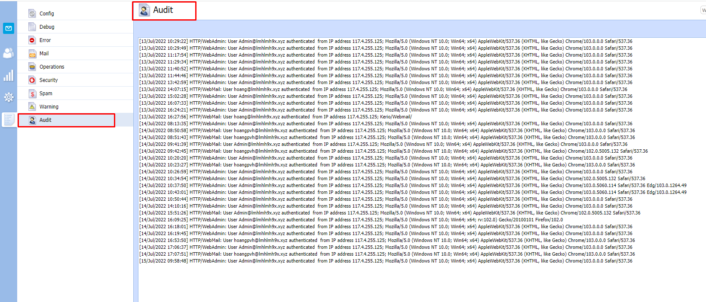

# Task Logs
- Ở kerio control có task log cung cấp cho người quản trị việc theo dõi các log , nhật ký ghi lại về hệ thống mục đích các nguyên nhân gây ra lỗi hệ thống để người dùng có thể xử lý các vấn đề liên quan.

- 

### Config
- 

- Hiển thị tất cả các hành động thao tác của người quản trị trong quá trình cấu hình hệ thống kerio connect
### Debug 

- 

- Hiển thị log ghi lại trạng thái hoạt động của các services để debug lỗi hệ thống khi xảy ra sự cố xem dịch vụ nào bị lỗi

### Error 
- 

- Lỗi trong quá trình quản trị thao tác .
### Mail
- 
- Ghi lại nhật ký gửi nhận mail trong hệ thống.
### Security
- 

- Ghi lại thông tin trong quá trình đăng nhập , xác thực account 
### Spam 

- 
 - Ghi lại thông tin về các email bị coi là spam khi gửi nhận qua kerio connect

 ###  Warning 
- 

- Ghi lại cảnh báo về các lỗi nhỏ , sự kiện gây ra không làm ảnh hưởng đến hoạt động của hệ thống.

### Audit 
- 

- Ghi lại, kiểm toán lại thông tin của user trong quá trình đăng nhập xác thực thành công từ các 

