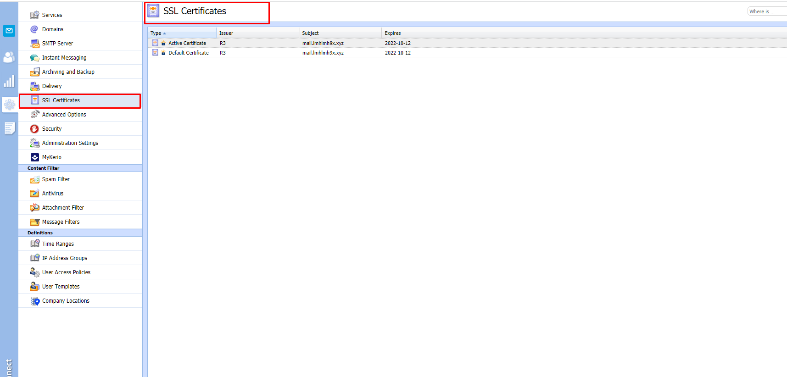
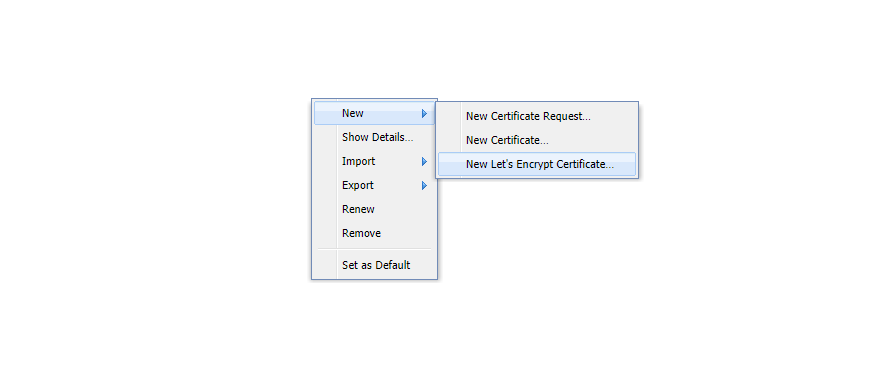
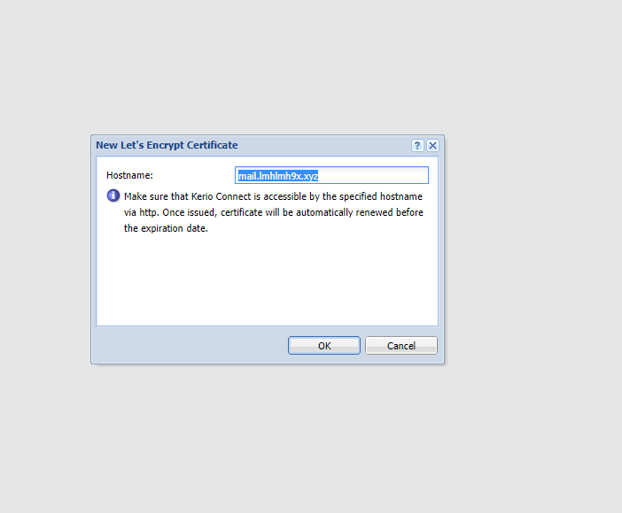
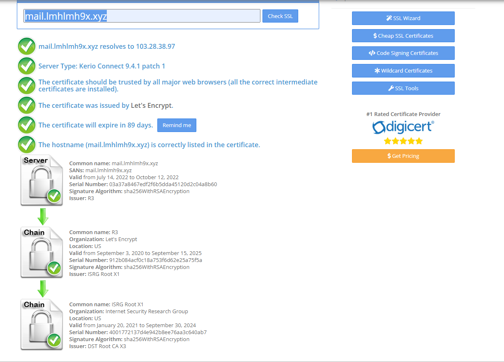

# Cài đặt chứng chỉ SSL free
- Đầu tiên ta vào phần cấu hình chọn SSl certificates
- 
- Ta click chuột phải chọn New -> New Let's Encrypt Certificate 
- 

- Sau đó ta điền tên miền ấn ok là xong các thao tác cài đặt kerio tự cài
- 

- Kiểm tra  
- 
