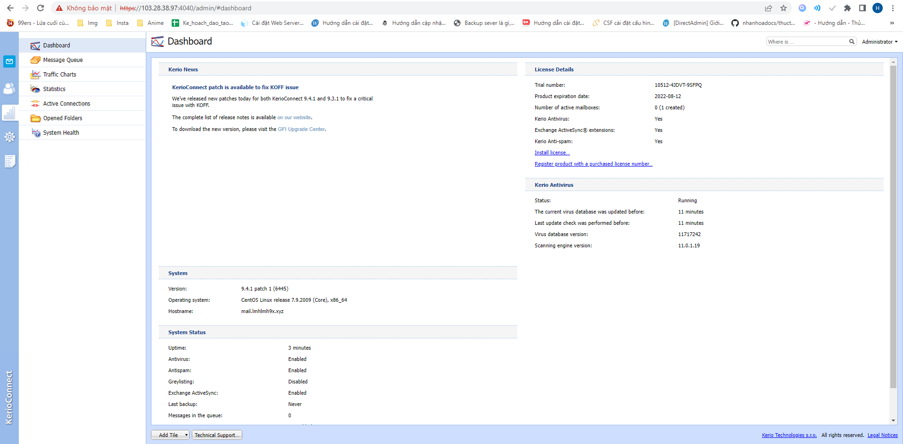

# Cài đặt kerio
## Tải file cài đặt và đăng ký giấy phép dùng thử
- Đầu tiên ta đăng nhập vào trang web của kerio sau đó đăng ký để tải bản miễn phí và đăng kí giấy phép dùng thử trong 30 ngày
- Tại đây ta tải bản cài đặt cho centos 
-  
- Sau khi đăng ký thì giấy phép dùng thử cũng sẽ gửi về mail ta đăng ký 
-  
## Cài đặt 
- Sau khi tải file cài đặt ta chuyển file đó lên máy chủ muốn cài đặt bằng mobaxterm
-  
- Đầu tiên ta cài đặt thời gian cho hệ thống 
- ln -sf /usr/share/zoneinfo/Asia/Ho_Chi_Minh /etc/localtime
- Ta kiểm tra và tắt các dịch vụ mail thường được cài sẵn trên centos như sendmail và postfix
- /etc/init.d/sendmail stop && /sbin/chkconfig sendmail off
- /etc/init.d/postfix stop && /sbin/chkconfig postfix off
- Sau đó ta cài đặt kerio-connect
- rpm -i kerio-connect-9.4.1-6445-p1-linux-x86_64.rpm
-  
- Sau khi cài đặt thành công ta vào địa chỉ máy chủ với cổng 4040 để cấu hình  https://103.28.38.97:4040
- Sau khi truy cập ta được giao diện như sau :
-  
- Tại ta có thể tùy chỉnh ngôn ngữ mặc định là tiếng anh sau đó chọn next
-  
- Ta chọn accept để đồng ý với các điều khoản có kerio sau đó chọn next
-  
- Ta điền hostname và domain
-  
- Bước này ta thiết lập tài khoản mật khẩu cho kerio sau 
-  
- Chọn tiếp next
-  
- Chọn tiếp nơi lưu trữ cấu hình cài đặt
-  
- Tiếp theo ta nhập giấy phép thử nghiệm lấy ở mail 
-  
- Chọn tiếp next
-  
- Ta chọn hoàn tất quá trình cấu hình và cài đặt 
- Kiểm tra ta đăng nhập vào kerio bằng tài khoản mật khẩu đã tạo trong quá trình cấu hình 
-  
-  
- Ta thấy giao diện như trong hình là đã cài đặt thành công.

