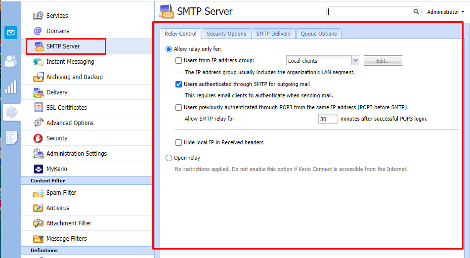
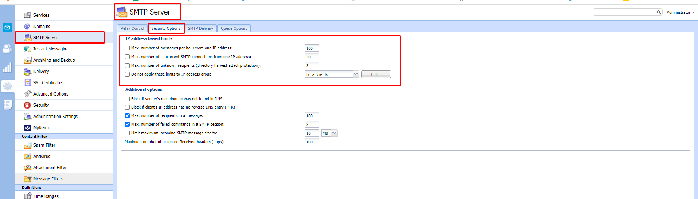
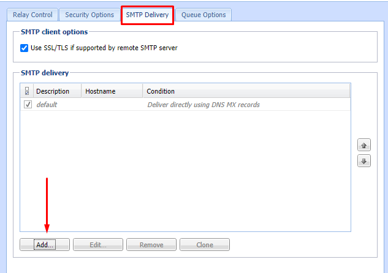
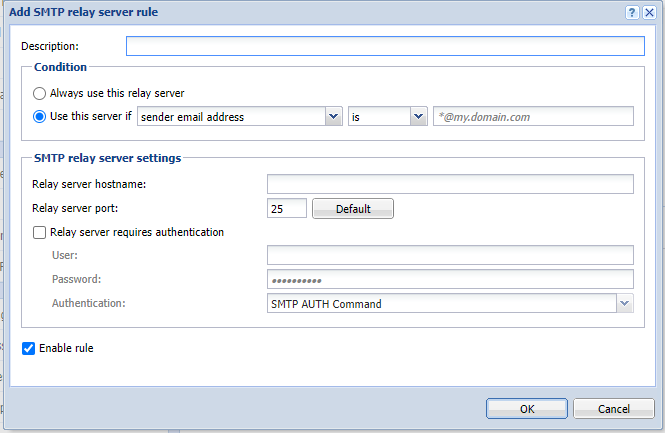

# Cấu hình mail liên quan đến việc gửi nhận 

## Relay Control 
- Để chỉ định ai có thể gửi mail từ bên ngoài  máy chủ thao tác:
- Allow relay only for
+ Để chỉ định 1 nhóm các địa chỉ IP mà từ địa chỉ đó có thể gửi các tin nhắn đi theo lựa chọn:
- Users from IP address group tùy chọn thêm , sửa , xóa các địa chỉ IP, dải địa chỉ IP.
- Để luôn yêu cầu xác thực khi gửi message đi lựa chọn Users authenticated through SMTP  for outgoing mail. Khi bật lựa chọn này , người dùng từ nhóm địa chỉ IP cho phép cũng phải chứng thực. 
- Để cho phép người dùng xác thực qua POP3 để gửi message từ cùng 1 địa chỉ IP lựa chọn Users previously authenticated through POP3 và xác định thời gian cho phép chuyển tiếp SMTP
- 

## Security Options
- Configuration -> SMTP server 
- 

- IP address based limits
+ Max,number of messages per hour : Tối đa số tin nhắn mỗi nhớ sẽ bị loại bỏ khi bất kỳ tin nhắn nào được gửi tới từ 1 địa chỉ IP sau khi đạt tới giới hạn.
+ Max, number of concurrent SMTP connections : Tối đa số kết nối SMTP đồng thời cho phép thực hiện từ 1 IP , giúp bảo vệ 1 số tấn công DoS 
+ Max, number of unknown recipients : Tối đa số người nhận không xác định được kerio bảo vệ từ thư mục tấn công 
+ Bật chế độ Do not apply these limits to IP address group cho phép tùy chọn nhóm địa chỉ IP và chọn 1 nhóm địa chỉ IP tin cậy không bị ảnh hưởng bởi các cấu hình trên. 

- Additional options 

+ Block if sender's domain was not found in DNS  : Chặn người gửi có địa chỉ email ảo 

+ Block messages if client's IP address has no reverse DNS entry (PTR): Chặn các truy nhập DNS xác định là được cấu hình không đúng.
+ Max, number of recipients in a message : Chặn tin nhắn spam được gửi đến một số lượng lớn người nhận 
+ Người gửi spam thường gửi tin nhắn bằng cách sử dụng các ứng dụng kết nối với máy chủ SMTP và bỏ qua các thông báo lỗi.
+ Max. number of failed commands in a SMTP session bảo vệ chống lại các ứng dụng này bằng cách đóng lại các kết nối SMTP tự động sau khi xác định số lượng các lệnh không thành công.
+ Limit maximum incoming SMTP mesage size to : Chặn tin nhắn với tệp đính kèm lớn làm quá tải máy chủ.

## SMTP Delivery :
- Kerio Connection có thể gửi message :
+ Trực tiếp tới domain đích sử dụng bản ghi MX của nó
+ Thông qua nhiều máy chủ

- Định nghĩa máy chủ chuyển tiếp SMTP 
- 
- 
 - Nhập mô tả thông tin cho máy chủ 
 - Để chi sử dụng 1 máy chủ SMTP duy nhất để gửi tin nhắn chọn Always use this relay server
 - Xác định rule cho máy chủ SMTP
 - Chọn Use this server if 
 - Xác định 1 rule cho người gửi hoặc nhận
 - Ta điền server hostname và server port 
 - Nếu máy chủ yêu cầu xác thực , lựa chọn Relay server requires authentication và nhập user pass , lựa chọn phương thức xác thực . 