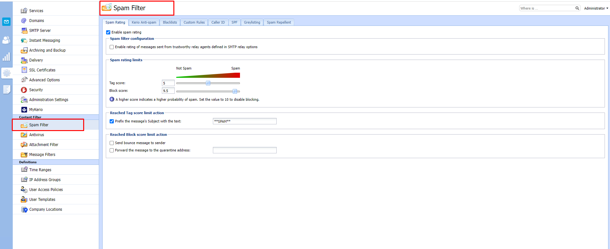
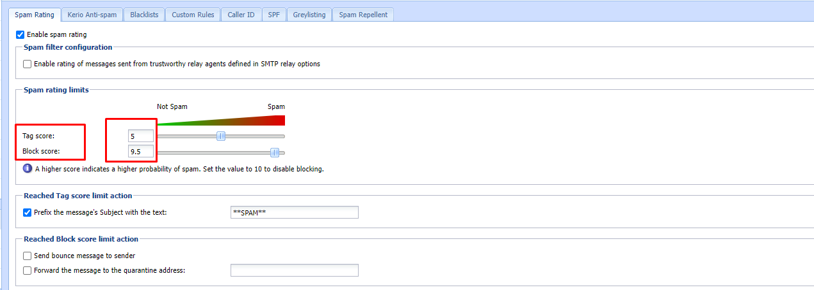
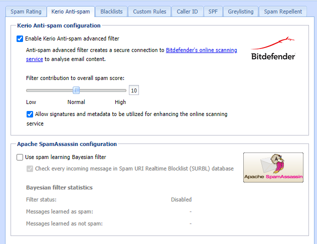

# Spam filter 

- Để phát hiện và loại bỏ thư rác , Kerio sử dụng các phương pháp sau :
- Spam Rating : Kerio kiểm tra từng tin nhắn với tất cả các kiểm tra và bộ lọc đã bật . Dựa trên điểm số spam thu được , nó đánh dấu tin nhắn spam.
- Kerio Anti-Spam : Bộ lọc nâng cao các tin nhắn  spam bằng các dịch vụ quét trực tuyến của Bitdefender
- Blacklists : Ta có thể tạo danh sách địa chỉ IP và đưa vào Blacklists  để chặn tất cả các thư từ các địa chỉ đó
- Custom Rules : Trong kerio connect , ta có thể tạo các quy tắc chống thư rác của riêng mình. Các quy tắc lọc tiêu đề email hoặc nội dung mail.
- Caller ID và SPF : có thể lọc ra các thư có địa chỉ giả
- Greylisting : Phương pháp Greylisting chỉ gửi tin nhắn từ những người đã biết.
- Spam Repellent: Đặt SMTP greeting trì hoãn để ngăn việc gửi thư được gửi từ máy chủ thư rác
## Spam Rating 

- Kerio Connect đặt giới hạn cho việc đánh dấu thư là thư rác hay không là thư rác dựa trên Spam Rating. Để thiết lập cho Spam filter ta làm như sau:

- Tag Score - Nếu tin nhắn đạt đến điểm thẻ, Kerio Connect sẽ đánh dấu nó là thư rác
- Block Score - Nếu tin nhắn đạt đến điểm khối, Kerio Connect sẽ hủy tin nhắn đó

## Kerio antispam 
- Tiện ích mở rộng Kerio Anti-spam sử dụng dịch vụ quét trực tuyến Bitdefender và cung cấp mức lọc thư rác nâng cao đối với các thư đến Hoạt động của Kerio Anti-spam:

- Khi Kerio Anti-spam được bật:
+ Kerio Connect gửi dữ liệu được mã hóa tới dịch vụ quét trực tuyến Bitdefender
- Bitdefender quét dữ liệu và gửi kết quả đến cho Kerio Connect. Điểm số có thể là:
+ 0: Không phải là thư rác
+ 1-9: Cho các mức độ spam khác nhau
+ Kerio Connect tính toán điểm thư rác bằng cách sử dụng một thuật toán đặc biệt và thêm điểm vào Spam Rating
+ Nếu Bitdefender nhận ra phần mềm độc hại hoặc tin nhắn lừa đảo, Kerio Connect sẽ tự động chặn tin nhắn bất kể các cài đặt trên Kerio Connect có sẵn ví dụ "Whitelists"

