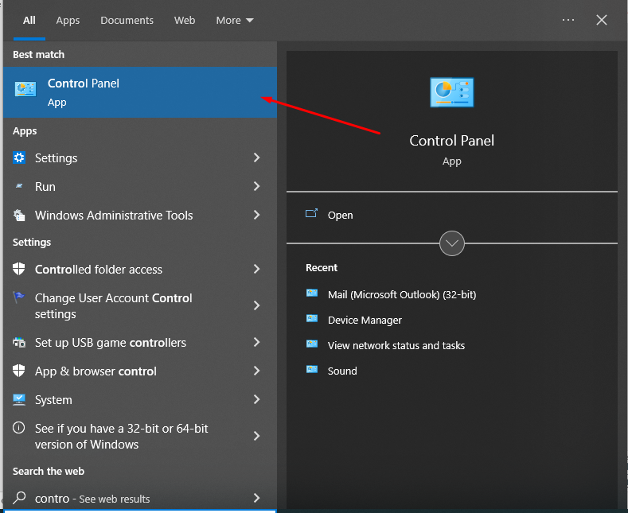
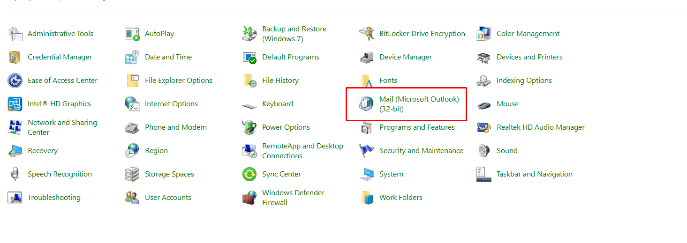
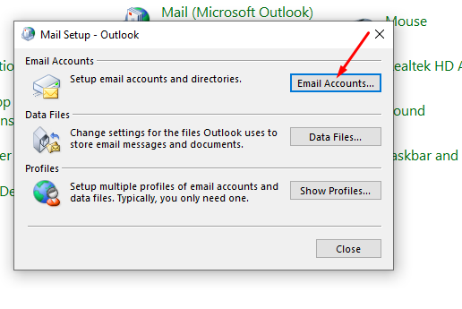
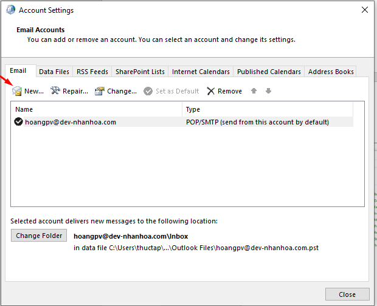
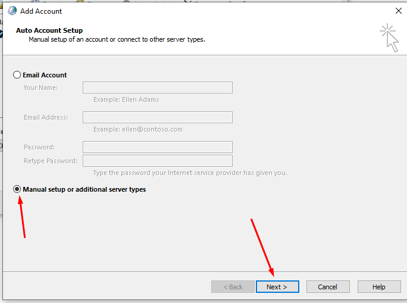
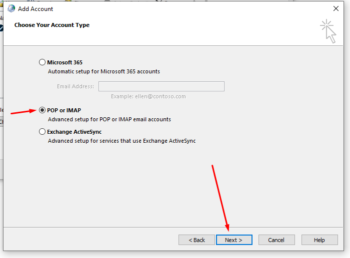
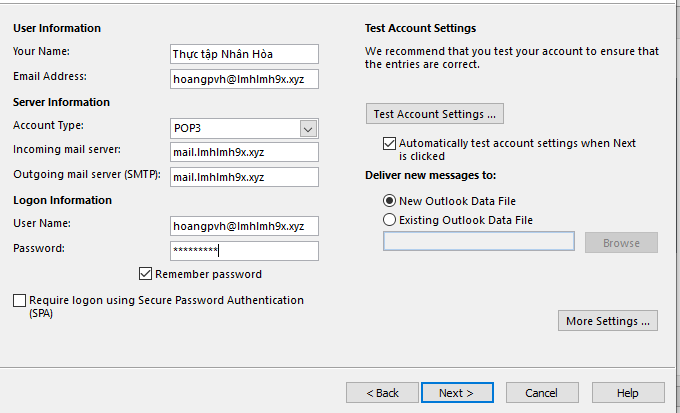
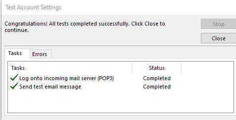
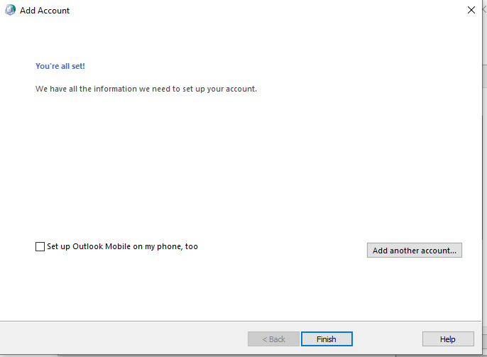
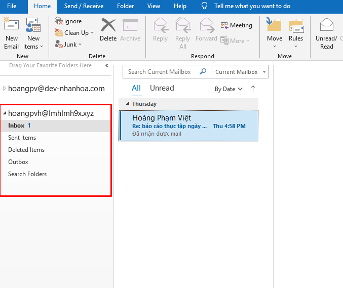

# Cài mail lên outlook

- Ta vào control panel
- 
- Ta chọn vào mail 
- 
- Ta chọn vào mail accounts 
- 
- Ta chọn new để thêm tài khoản mail 
- 
- Ta chọn Manual rồi chọn tiếp next như trong hình
- 
- Ta chọn POP or IMAP
- 
- Ta điền thông tin tài khoản như trong hình 
- 
- Sau đó ta đợi quá trình cài đặt thành công ấn finish
- 
- 
-  Kiểm tra ta thấy tài khoản mail đã cài thành công lên outlook
- 
-