# Tìm hiểu giao diện quản trị
## Giao diện  Dashboard
### - Tại giao diện này hiển thị các thông tin:
- Kerio News : Giới thiệu về các chức năng mới trong phiên bản hiện tại
- System : Hiển thị thông tin phiên bản kerio-connect, hệ điều hành, hostname
- System status: hiển thị trạng thái của hệ thống 
- License Details: Giấy phép 
- Kerio Antivirus : Hiển thị trạng thái của Kerio Antivirus
- System Health: Hiển thị RAM, CPU, Disk của hệ thống dưới dạng biểu đồ (%, time)
- Disk Storage Info: Hiển thị dung lượng Disk tổng và dung lượng Disk đang được sử dụng

## Giao diện Message Queue

- Messages in Queue: Hiển thị các thư đang được chờ trên hàng đợi để được gửi ra bên ngoài
- Message Queue Processing: Tiến trình xếp hàng thư

## Traffic Chart

- Tracffic Chart cho phép hiển thị các thông tin Connection hoặc các Message trong một khoảng thời gian (có thể tùy chỉnh tối đa 30 ngày).

##  Statistics

- Hiển thị các thông số của hệ thống 

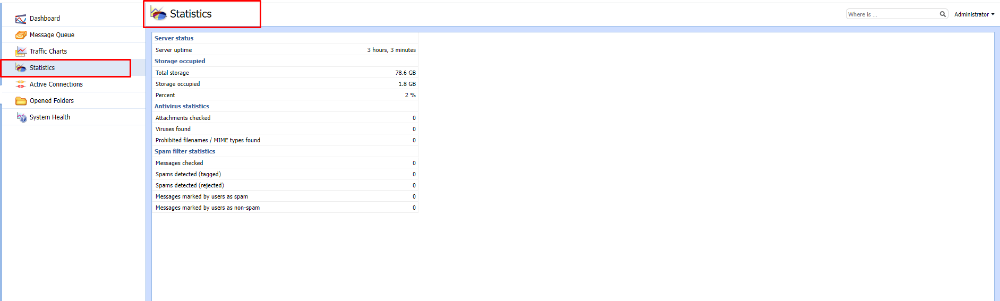

##  Active Connections

-  Hiển thị các Connection và các Session đang hoạt động.

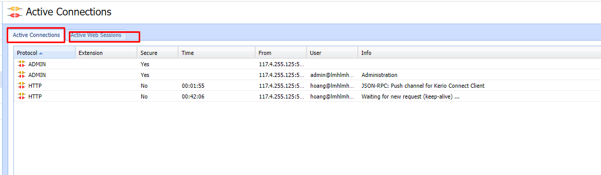

## Opened Folders
- Hiển thị các thư mục đã mở

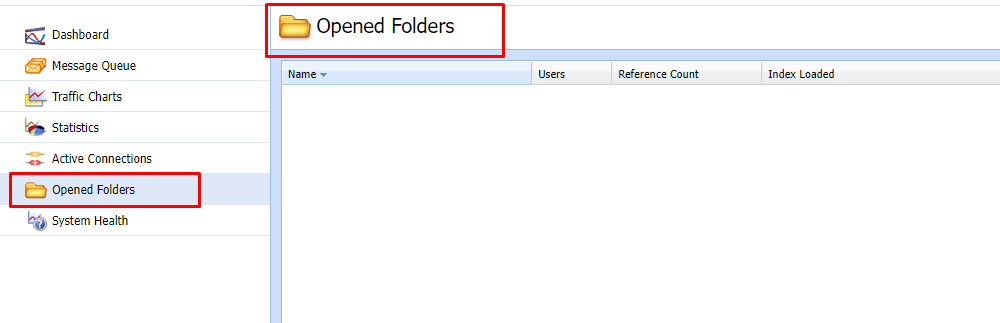

# Configuration

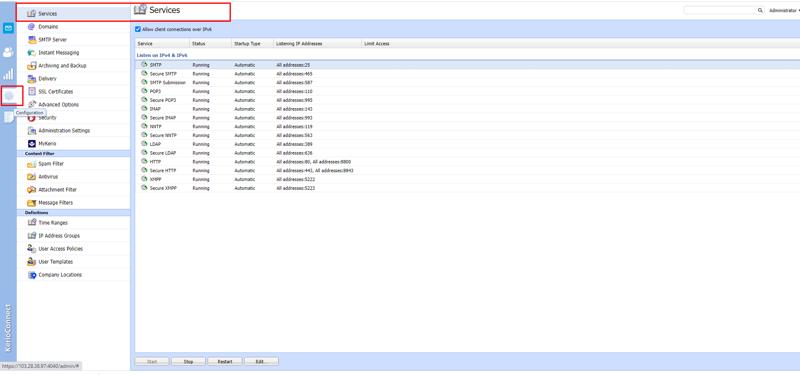

- Tại đây ta cấu hình của hệ thống

## Services

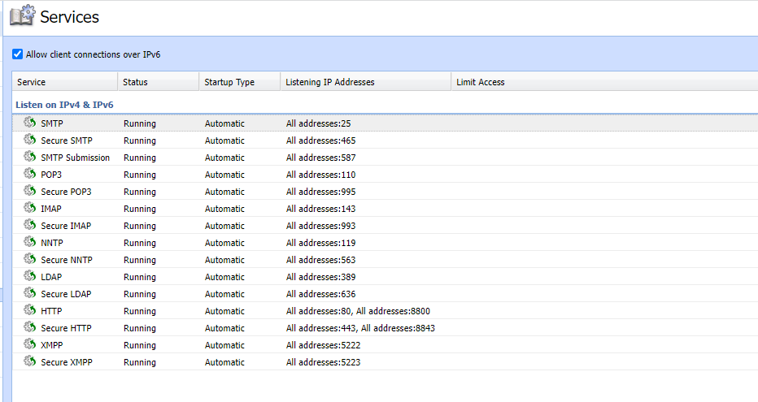

- Ta thấy được các trạng thái dịch vụ của hệ thống , các cổng ,....
##  Domains

- Hiển thị các domain đã được tạo. 
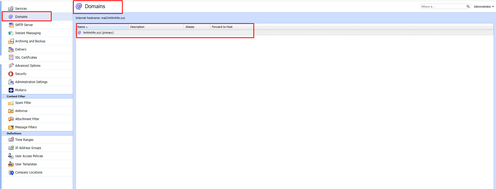
- Tại đây có thể tạo, sửa, xóa domain và thiết lập các tùy chọn cho domain đó bằng cách click chuột phải rồi tùy chọn các tùy chỉnh
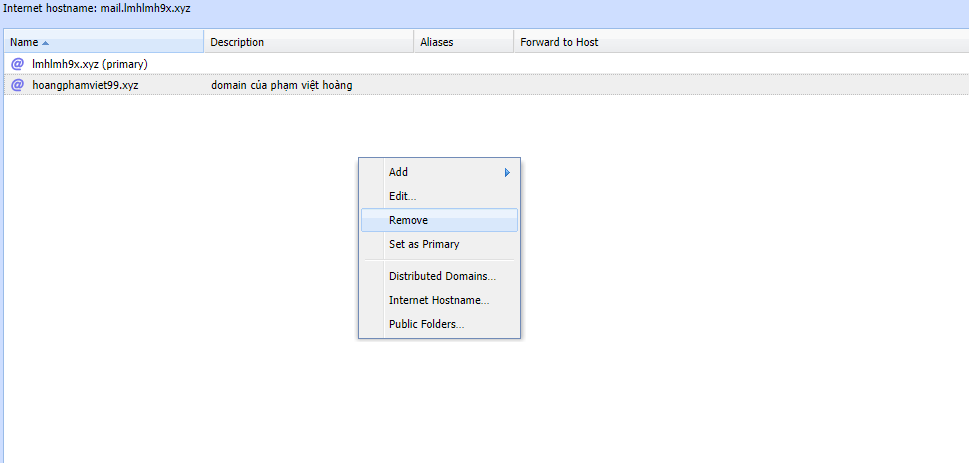
 
 ## SMTP server
- Máy chủ SMTP xác định ai có thể gửi thư đi qua Kerio Connect và họ có thể thực hiện những hành động nào.
-Để thiết lập gửi tin nhắn từ bên ngoài server Kerio Connect ta làm như sau
- Trong giao diện Configuration chọn SMTP server -> Relay Control
-Nhấp vào option Allow relay only for:
-Để chỉ định một nhóm địa chỉ IP mà từ đó người dùng có thể gửi đi, chọn Users from IP address group và thiết lập như mong muốn
- Để cho phép người dùng đã xác thực gửi thư đi, chọn User authenticated through SMTP for outgoing mail
-Để cho phép người dùng đã xác thực trước đó qua POP3 gửi thư đi từ cùng một địa chỉ IP, chọn Users previously authenticated through POP3 from the same IP address
- Nhấp vào Apply để lưu thiết lập
## Instant Messaging

- Dịch vụ trò chuyện tức thời trên Kerio-connect

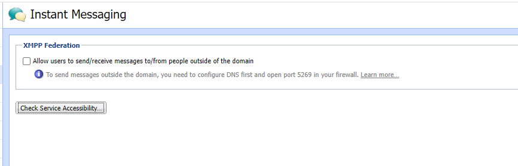

##  Archiving and Backup
- Kerio-connect hỗ trợ Full Backup và nó cũng hỗ trợ Differential Backup, lưu các tệp đã được thêm vào hoặc thay đổi kể từ lần sao lưu đầy đủ nhất
- Ta có thể lên lịch sao lưu như sau:
- Trong giao diện quản trị, vào Configuration -> Archiving and Backup -> Backup
- Chọn Enable message store and configuration recovery backup
- Chọn Add
- Nhập mô ta cho bản sao lưu trong Description
- Chọn thời gian và loại sao lưu và nhấp vào ok
- 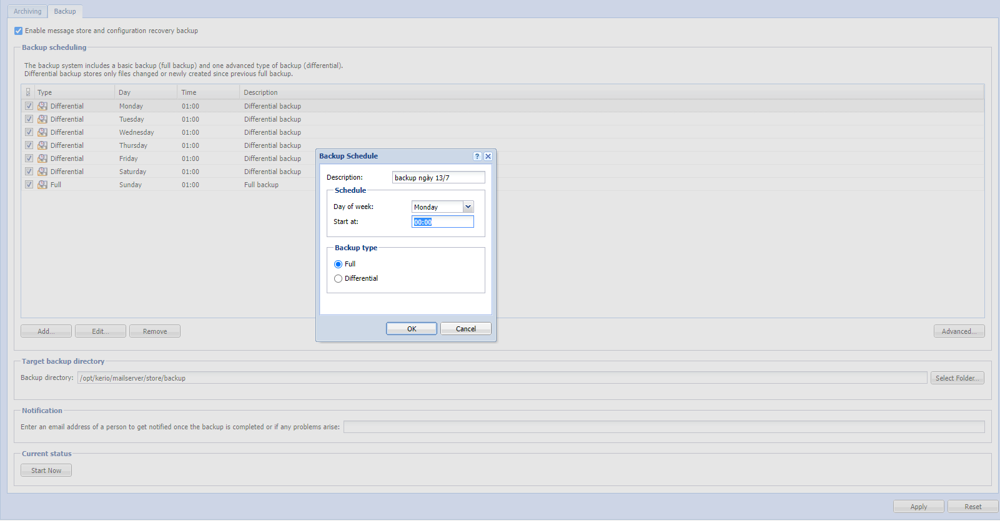
- Ta có thể tùy chỉnh kích thước bản lưu tối đa
- Ta chọn chuột phải vào bản backup muốn thay đổi sau đó chọn advanced
- 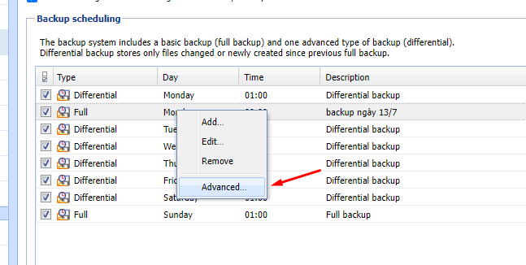
- 
- Target backup directory, chỉ định thư mục nơi lưu trữ tất cả các bản sao lưu
- Notification, nhập địa chỉ email để nhận thông báo về các bản sao lưu
. Cuối cùng nhấn vào Apply để lưu các tùy chọn
- 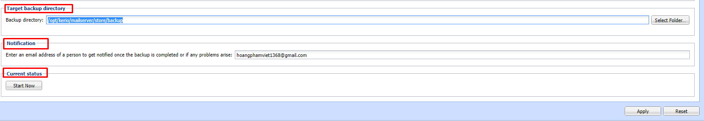

- Khôi phục dữ liệu Current status nhấp vào Start Now để tạo một bản sao lưu đầy đủ (chọn đường dẫn lưu bản sao lưu /mnt/backup)
- 
- 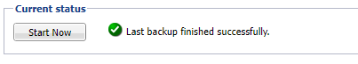
- Thông báo như trong hình là thành công
- Tiếp theo đó ta restore
-  Stop Kerio Connect
- Vào thư mục cài đặt Kerio Connect 
- cd /opt/kerio/mailserver
- Chạy lệnh
- ./kmsrecover /opt/kerio/mailserver/store/
- 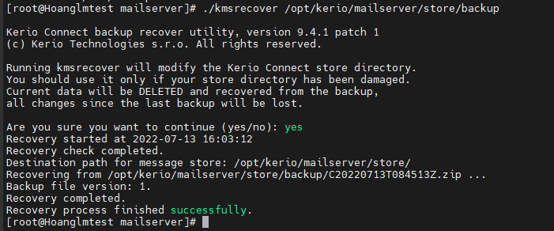
## Delivery
- Trong Kerio-connect, ta có thể lên lịch để
- Tải xuống thư từ máy chủ POP3 từ xa
- Nhận thông báo bằng lệnh ETRN đến các máy chủ đã xác định
- Gửi tin nhắn từ hàng đợi tin nhắn
- Cấu hình Scheduling, để add scheduling ta làm như sau:
- Trong giao diện quản trị chọn Configuration -> Delivery -> Scheduling
- Chọn Add
- Chỉ định Time condition
- Để giới hạn việc lập lịch trong một phạm vi thời gian cụ thể, hãy chọn Valid only at time và chọn một phạm vi thời gian
- Chỉ định Action. Có thể lên lịch cho bất kỳ hoạt động nào sau đây
- Gửi tin nhắn từ hàng đợi tin nhắn
- Tải xuống tin nhắn qua POP3
- Gửi lệnh ETRN
- Bấm ok
- 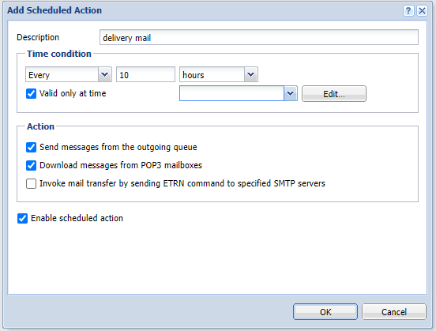

- 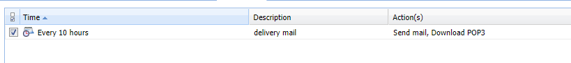

##  SSL Certificates
- SSL hỗ trợ việc cài đặt chứng chỉ SSL miễn phí Let's Encrypt cho mail.domain. Tại đây ta có thể tạo mới và xóa chứng chỉ.
## Advanced Options
- Tại đây ta có thể thiết lập các tùy chọn nâng cao hơn phù hợp với nhu cầu 
 ## Security
-  Kerio-connect cung cấp chức năng yêu cầu xác thực Require secure authentication. Người dùng phải xác thực an toàn khi họ truy cập Kerio-connect
- Có thể chọn bất cứ phương thức xác thực nào sau đây
- CRAM-MD5: Xác thực mật khẩu bằng cách sử dụng thông báo MD5
- DIGEST-MD5: Xác thực mật khẩu sử dụng thông báo MD5
- LOGIN
- PLAIN
- Nếu mật khẩu của người dùng được lưu ở định dạng SHA, chọn LOGIN hoặc PLAIN. Nếu chọn nhiều phương pháp, Kerio sẽ thực hiện phương pháp khả dụng đầu tiên

- 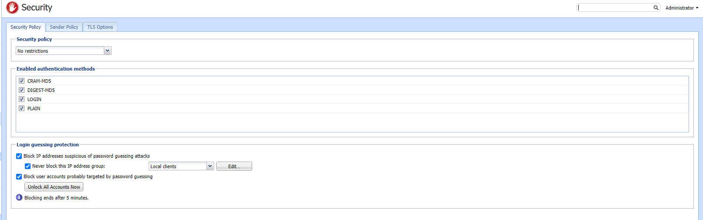

## Administration Settings
- Trong Kerio-connect, có thể kích hoạt một tài khoản quản trị viên đặc biệt. Tài khoản này được tích hợp sẵn để truy cập giao diện quản trị.
- Để kích hoạt giao diện quản trị ta làm như sau:
- Đi tới phần Configuration -> Administration Settings
- Chọn Enable built-in administrator account
- Nhập password cho tài khoản. Tên tài khoản mặc định là Admin và không thể thay đổi
- 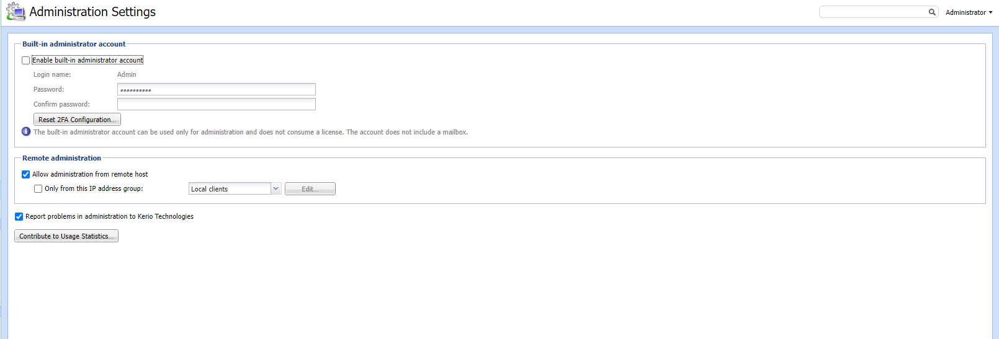
## MyKerio
- MyKerio là dịch vụ đám mây cho phép quản lý nhiều phiên bản của các thiết bị Kerio Connect thông qua giao diện web tập trung Thêm Kerio-connect và MyKerio

## Spam Filter
- Để phát hiện và loại bỏ thư rác, Kerio Connect sử dụng các phương pháp sau:

- Kerio Anti-Spam: Bộ lọc nâng cao các tin nhắn spam bằng các dịch vụ quét trực tuyến của Bitdefender
- Blacklists: Ta có thể tạo danh sách địa chỉ IP và đưa vào Blacklists để chặn tất cả các thư từ các địa chỉ đó
- Caller ID và SPF: Có thể lọc ra các thư có địa chỉ gửi giả
- Greylisting: Phương pháp Greylisting chỉ gửi tin nhắn từ những người đã biết
- Spam Repellent: Đặt SMTP greeting trì hoãn để ngăn việc gửi thư được gửi từ máy chủ thư rác
- Để đặt giới hạn cho việc đánh dấu thư là thư rác hay không phải thư rác ta làm như sau:

- Tag Score - Nếu tin nhắn đạt đến điểm thẻ, Kerio Connect sẽ đánh dấu nó là thư rác.
- Block Score - Nếu tin nhắn đạt đến điểm khối, Kerio Connect sẽ hủy tin nhắn đó

- 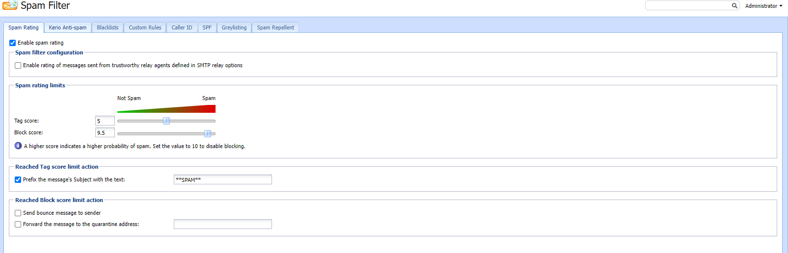

## Antivirus
- Kerio Connect bao gồm Kerio Antivirus, một biện pháp bảo vệ tích hợp chống lại các email độc hại có chứa virus. Virus có thể lây nhiễm vào máy tính gây hại cho các tệp hoặc cho hệ thống máy tính
- Cấu hình Antivirus
- Trong giao diện quản trị, chuyển đến Configuration -> Antivirus
- Để tự động cập nhật cơ sở dữ liệu virus, hãy chọn Check for update every [hours]. Nếu có bất kỳ bản cập nhật nào, nó sẽ tự động được tải xuống
- Chọn hành động cho các thư có chứa virus. Kerio Connect có thể Discard the message(Hủy tin nhắn) hoặc Deliver the message with the malicious code removed(Gửi tin nhắn đã khi đã loại bỏ mã độc hại)
- Ngoài ra, ta có thể chọn 2 tùy chọn để chuyển tiếp tin nhắn. Chọn Forward the original message to an administrator address(Chuyển tiếp thư gốc đến địa chỉ quản trị viên) hoặc Forward the filtered message to an administrator address(Chuyển tiếp thư đã lọc tới địa chỉ quản trị viên)
- Đối với bất kỳ thông báo nào mà Kerio Antivirus không thể quét, Kerio Connect có thể Deliver the original message with a warning prefixed(Gửi tin nhắn gốc có cảnh báo) hoặc Reject the message as if it was a virus(Chuyển tiếp thư đã lọc tới địa chỉ quản trị viên)
- 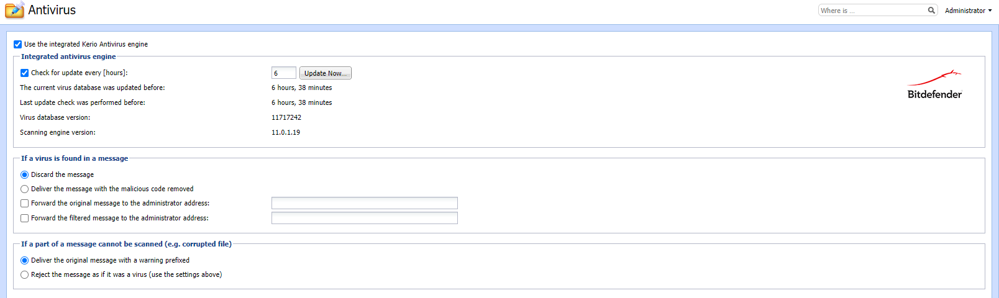
## Attachment Filter
- Nhiều loại virus được ẩn dưới dạng tập tin đính kèm. Kerio Connect có thể lọc ra các tập tin đính kèm email theo cài đặt . Nếu Kerio Connect phát hiện một tập tin đính kèm có vấn đề, nó sẽ xóa tập tin đính kèm và gửi thông báo mà không có tệp đó

- 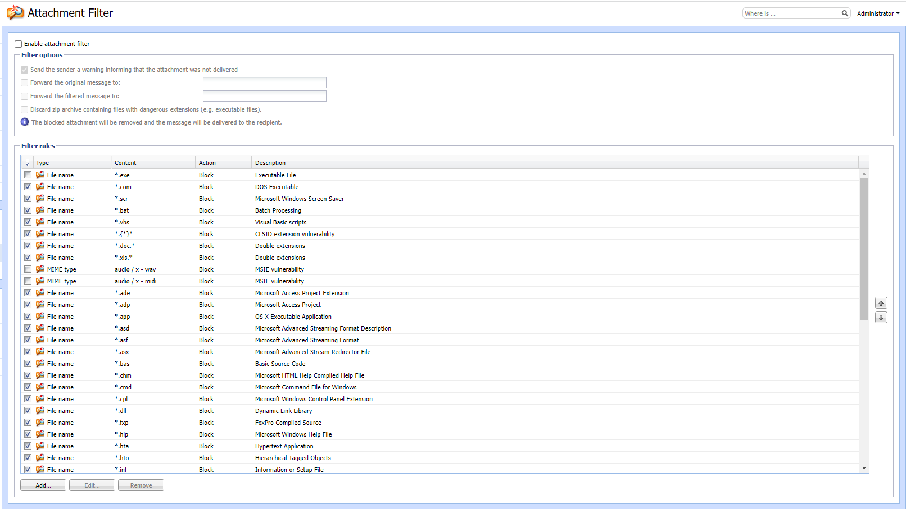

## Message Filter

 

