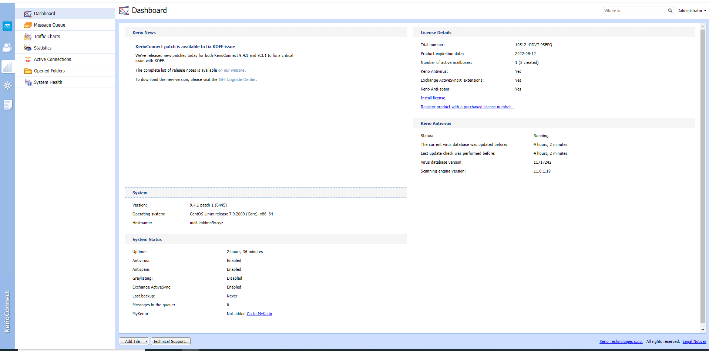
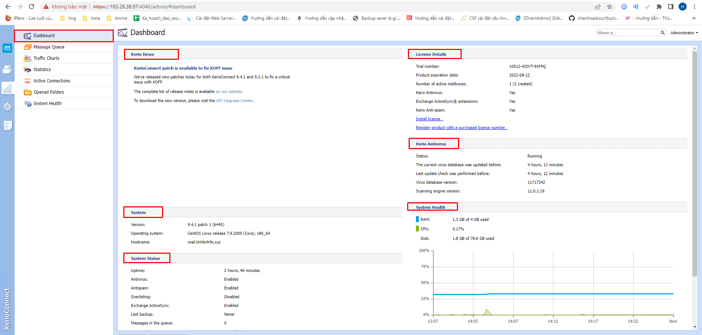
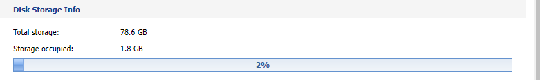
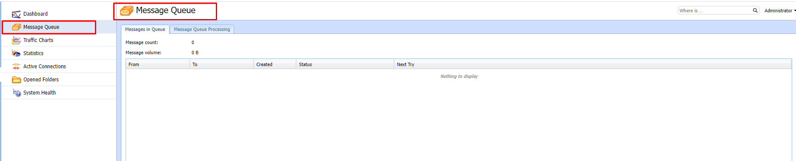
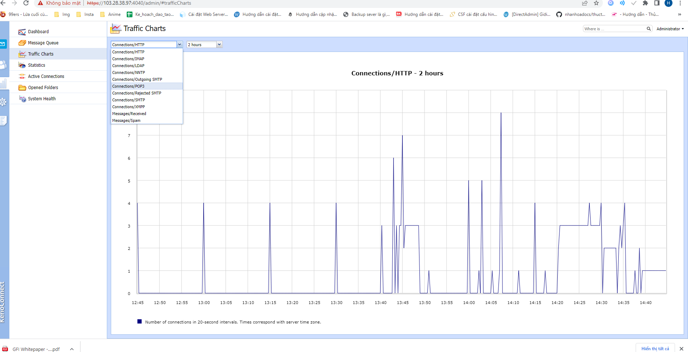
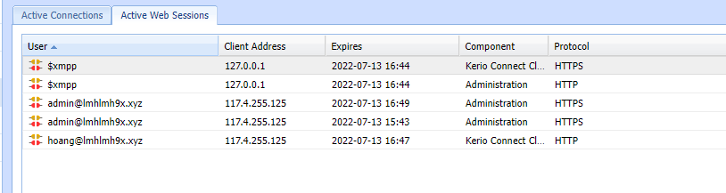

# Tìm hiểu giao diện quản trị
## Giao diện  Dashboard
### - Tại giao diện này hiển thị các thông tin:
- Kerio News : Giới thiệu về các chức năng mới trong phiên bản hiện tại
- System : Hiển thị thông tin phiên bản kerio-connect, hệ điều hành, hostname
- System status: hiển thị trạng thái của hệ thống 
- License Details: Giấy phép 
- Kerio Antivirus : Hiển thị trạng thái của Kerio Antivirus
- System Health: Hiển thị RAM, CPU, Disk của hệ thống dưới dạng biểu đồ (%, time)
- Disk Storage Info: Hiển thị dung lượng Disk tổng và dung lượng Disk đang được sử dụng

## Giao diện Message Queue

- Messages in Queue: Hiển thị các thư đang được chờ trên hàng đợi để được gửi ra bên ngoài
- Message Queue Processing: Tiến trình xếp hàng thư

## Traffic Chart

- Tracffic Chart cho phép hiển thị các thông tin Connection hoặc các Message trong một khoảng thời gian (có thể tùy chỉnh tối đa 30 ngày).

##  Statistics

- Hiển thị các thông số của hệ thống 

##  Active Connections

-  Hiển thị các Connection và các Session đang hoạt động.

## Opened Folders
- Hiển thị các thư mục đã mở

# Configuration

- Tại đây ta cấu hình của hệ thống

## Services

- Ta thấy được các trạng thái dịch vụ của hệ thống , các cổng ,....
##  Domains

- Hiển thị các domain đã được tạo. 

- Tại đây có thể tạo, sửa, xóa domain và thiết lập các tùy chọn cho domain đó bằng cách click chuột phải rồi tùy chọn các tùy chỉnh

 
 ## SMTP server
- Máy chủ SMTP xác định ai có thể gửi thư đi qua Kerio Connect và họ có thể thực hiện những hành động nào.
-Để thiết lập gửi tin nhắn từ bên ngoài server Kerio Connect ta làm như sau
- Trong giao diện Configuration chọn SMTP server -> Relay Control
-Nhấp vào option Allow relay only for:
-Để chỉ định một nhóm địa chỉ IP mà từ đó người dùng có thể gửi đi, chọn Users from IP address group và thiết lập như mong muốn
- Để cho phép người dùng đã xác thực gửi thư đi, chọn User authenticated through SMTP for outgoing mail
-Để cho phép người dùng đã xác thực trước đó qua POP3 gửi thư đi từ cùng một địa chỉ IP, chọn Users previously authenticated through POP3 from the same IP address
- Nhấp vào Apply để lưu thiết lập

