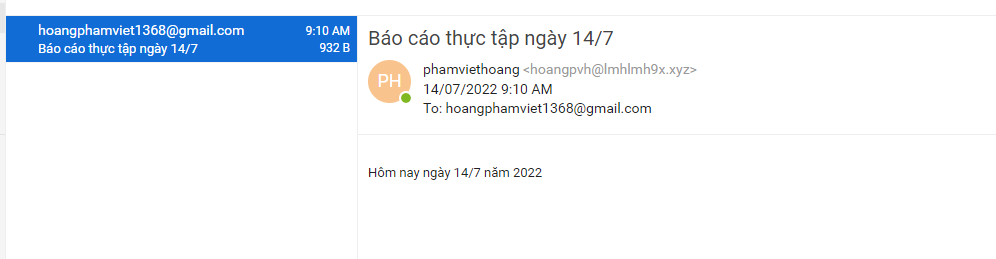

# Tạo bản ghi DKIM
- Đầu tiên ta vào phần Configuration -> Domains -> Exit 

- Tại tab General -> DomainKeys Identified Mail (DKIM) click như hình dưới và Show public key để lấy thông tin giá trị và tên bản ghi DKIM

- Như trong hình ta thấy được tên bản ghi vào giá trị bản ghi
- Sau đó ta tạo bản ghi

- Sau khi tạo thành công ta tiến hành gửi nhận 1 mail 

- Ta thấy thư đã được gửi thành công
- Tiếp theo ta sẽ gửi lại thư xem mail kerio có nhận thành công .

