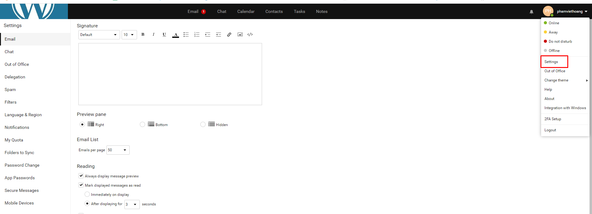
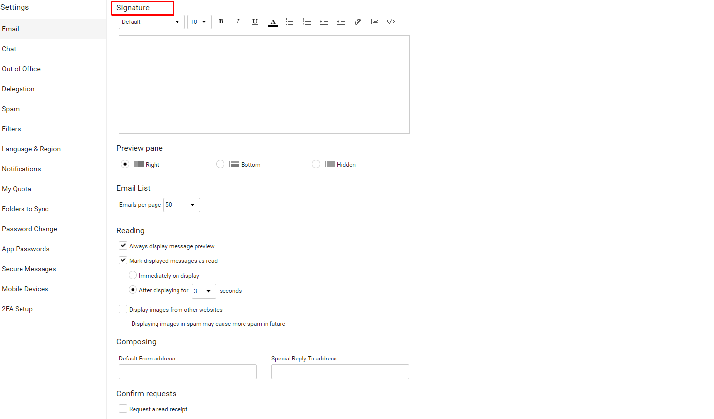
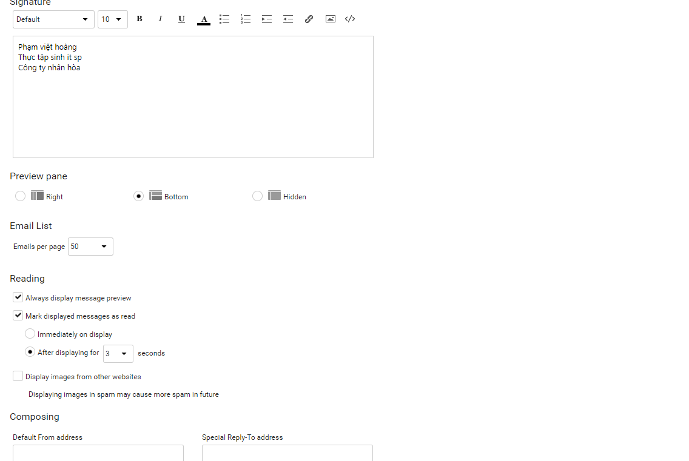
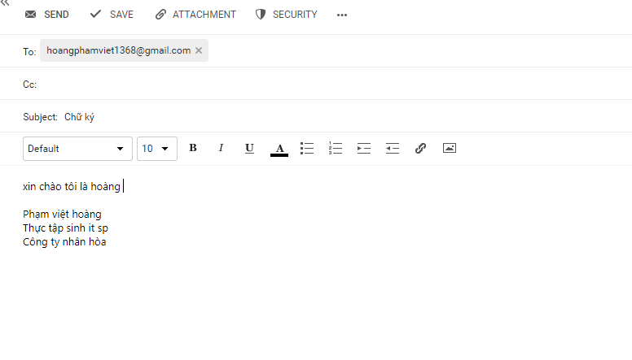

# Tạo chữ ký 
- Đầu tiên ta đăng nhập vào tài khoản mail muốn tạo chữ ký

- Chọn phần settings như trong hình

- Tiếp đến ta chọn Signature.

- Ta điền thông tin chữ ký sau đó lưu lại

- Tiến hành kiểm tra 

- Ta thấy mail gửi đi đã có chữ ký

