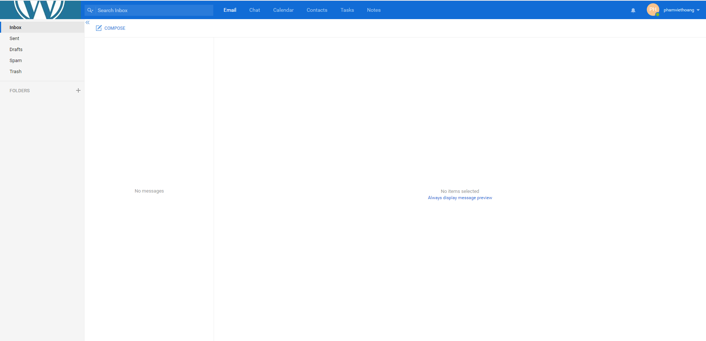

# User trong kerio
## Thêm user trong kerio 
- Ta vào phần accounts chọn mục user 

- 

- Ta click chuột phải vào màn hình rồi chọn add để thêm user

- 

- Tại đây ta điền thông tin cần thiết cho việc thêm 1 user mới như tài khoản , mật khẩu ,... sau đó ta ấn ok .

- 

- Như ta thấy trong hình user đã được thêm thành công
- 

- Kiểm tra ta sẽ đăng nhập tài khoản vừa tạo vào mail kerio
- 
- 

- 
# Group 
## Thêm group 
- Group đại diện cho 1 nhóm gồm các user có chung 1 mục đích chức năng
- Ta cũng tương tự vào phần accounts chọn mục group
- 
- Ta click chuột phải vào màn hình rồi chọn add để thêm group
- 
- Tại đây ta nhập tên , các mô tả của group muốn tạo
- Tiếp theo ta sẽ thêm những user vào trong group 
- 
- Muốn chọn user nào ta ấn vào đó và chọn ok
- 
- Sau khi thêm thành công ta thấy group đã được tạo
- 
- Thêm user thành công vào trong group
- 

