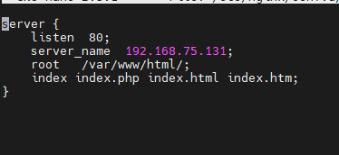
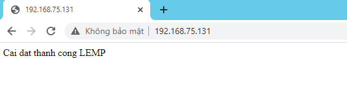

# I Tìm hiểu và cấu hình về LEMP
- LEMP server là một server chạy Linux, Nginx (đọc là Engine x), MySql và PHP (hoặc Perl/Python). Nó tương tự như LAMP server ngoại trừ việc web server nền tảng được giám sát bằng Nginx thay vì Apache.

- Bước 1: Cài đặt Nginx Web Server
- Vì NGINX không có sẵn repository của CentOS vì vậy chúng ta phải cài repository EPEL​ với câu lệnh sau: 
+ yum install epel-release -y
- Cài đặt Nginx  :
+ yum install nginx -y

- Bước 2: Cài đặt MariaDB
- yum install -y mariadb mariadb-server(Tương tự như với LAMP)
- Bước 3: Cài đặt PHP-FPM và các Module(Tương tự như với LAMP)
-  Bước 4: Cầu hình NGINX
- nano /etc/nginx/conf.d/default.conf

- Khởi động lại Ngixn
+ systemctl restart nginx

- Bước 5: Kiểm tra hoạt động website :
- Sau khi đã cấu hình hoàn tất Virtual Host và tạo folder website hoàn tất, các bạn kiểm tra nhanh xem website của mình có hoạt động hay không bằng cách tạo thử file index.php bằng lệnh sau
- touch /var/www/html/index.html | echo 'Cai dat thanh cong LEMP' >  /var/www/html/index.html

