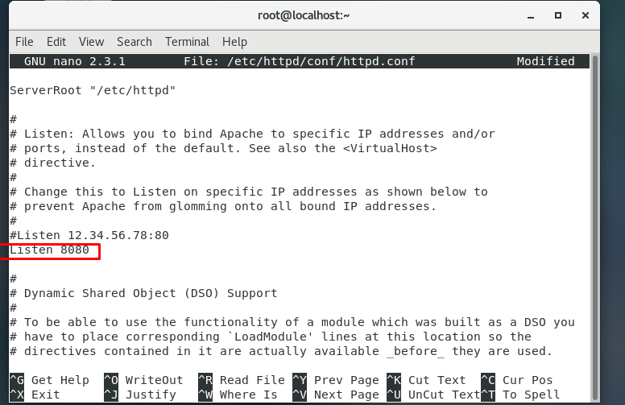
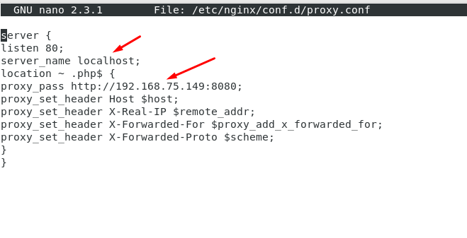
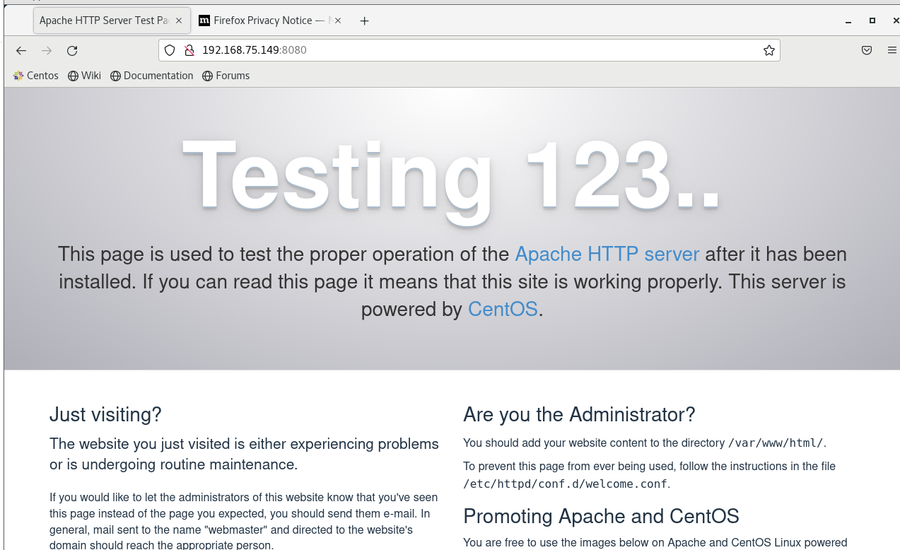
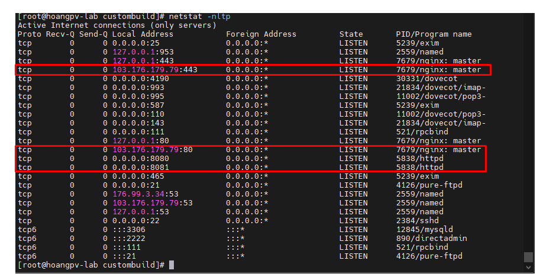

# I  Cài đặt cấu hình Nginx Reverse Proxy Apache trên centos 7 .
### Ta cài đặt web server apache
- yum install httpd -y
- Ta cấu hình lại máy chủ để nó nghe cổng 8080 (thay cổng mặc định 80)
- nano /etc/httpd/conf/httpd.conf

- Sau đó ta khởi động  apache

- systemctl start apache
### Cài đặt và cấu hình nginx 
- Cài đặt nginx
- yum install epel-release -y
- yum install nginx -y
- Sau khi cài xong ta cấu hình proxy
- nano /etc/nginx/conf.d/proxy.conf
- server {
listen 80;
server_name localhost ;
location ~ .php$ {
proxy_pass http://192.168.75.149:8080;
proxy_set_header Host $host;
proxy_set_header X-Real-IP $remote_addr;
proxy_set_header X-Forwarded-For $proxy_add_x_forwarded_for;
proxy_set_header X-Forwarded-Proto $scheme;
}
}

- 
- 

 - Sau đó ta khởi động nginx 
 - sudo systemctl start nginx

 - Kiểm tra : NGINX đang lắng nghe cổng 80 và Apache đang lắng nghe cổng 8080. Nên ta  mở trình duyệt và trỏ nó đến http: // SERVER: 8080 /  (trong đó SERVER là địa chỉ IP của máy chủ lưu trữ) . Ta thấy giao diện cài đặt web apache như hình là thành công.

 - 

 # II Cài đặt cấu hình Nginx Reverse Proxy Apache trên Direct admin
 - Ta SSH vào hệ thống Direct admin 
 - Cài đặt, chúng ta chạy lệnh sau
 - Di chuyển đến thư mục custombuild.
 - cd /usr/local/directadmin/custombuild
 - Điều chỉnh cấu hình webserver thành nginx_apache.
 - ./build set webserver nginx_apache
 - Cập nhật lại custombuild script.
 - ./build update
 - Cài đặt reverse-proxy NGINX_Apache Directadmin.
 - ./build nginx_apache
 - ./build rewrite_confs
 - Kiểm tra lại cấu hình sau khi cài đặt thành công.
 - 
 - Như hình ta thấy http đều do nginx đảm nhiệm còn apache , còn apache xử lý công việc khác.

